# Chapter 01 확장 실습 답안 템플릿

> **과제:** AI 시대에 데이터베이스를 왜 배워야 하는가  
> **사용 방법:** 이 파일을 내려받아 **본인의 GitHub 저장소**에 `chapter01_answer.md`라는 이름으로 저장한 뒤 답안을 작성합니다.  
> **제출 방법:** LMS에는 파일을 업로드하지 않고, **본인 GitHub 저장소의 `chapter01_answer.md` 파일 URL**을 제출합니다.

---

## 0. 학생 정보

| 항목 | 작성 내용 |
| --- | --- |
| 학번 |20140651(대학학번)|
| 이름 |조영우|
| GitHub 계정 |cyw0927|
| 과제 작성일 |2026-09-02|
| 사용한 AI 도구 |chat GPT|

> 실제 비밀번호, API Key, 전체 DB 접속 URL, 개인정보는 이 파일이나 캡처 화면에 기록하지 않습니다.

---

# 1. SQL 실행 환경

## 1-1. 실행한 SQL

```sql
SELECT version();
SELECT current_database();
SELECT current_user; 
SELECT CURRENT_TIMESTAMP; 
```

## 1-2. 실행 결과 기록

```text
PostgreSQL 버전: PostgreSQL 18.4 (64-bit)
현재 데이터베이스: postgres
현재 사용자: postgres
현재 시각: 2026-09-02 14:32:56.902 +0900
```

## 1-3. 내가 확인한 내용

1. SQL을 작성하는 프로그램과 PostgreSQL은 같은 프로그램인가요?

```text
나의 답: 아니요, SQL을 작성하는 프로그램은 DBeaver이고 PostgresSQL은 DBeaver에서 구동하는
실제 데이터를 저장하고 SQL을 실행하는 프로그램 입니다.
```

2. `current_database()` 결과는 무엇을 의미하나요?

```text
나의 답: 현재 실행중인 데이터베이스
```

3. SQL이 실행되었다는 사실만으로 데이터 내용도 올바르다고 할 수 있나요?

```text
나의 답: 아니요. 데이터 이상한거 집어넣어도 실행 가능합니다. 
데이터 내용은 결과 의미를 보고 판단해야 합니다

```

## 1-4. 증거 화면

아래 경로에 캡처 이미지를 저장하는 것을 권장합니다.

```text
assignments/chapter01/images/step01_environment.png
```

이미지를 저장했다면 아래 링크의 파일명을 실제 파일명에 맞게 수정합니다.

```markdown
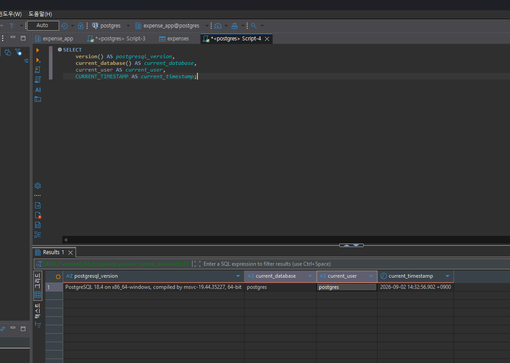
```

**이미지 삽입 위치:**


---

# 2. Chapter 01 핵심 내용 복습

교재 문장을 그대로 복사하지 말고 자신의 말로 작성합니다.

| 본문의 핵심 | 나의 설명 |
| --- | --- |
| AI가 SQL을 만들어도 DB를 배워야 한다 | AI가 SQL을 만들어줄수는 있지만 판단하는건 결국 사람이기 때문 |
| 데이터 구조가 중요하다 | 데이터가 어떤 기준으로 정렬되어 있는지 알아야 결과를 분석할수 있다 |
| SQL 결과를 검증해야 한다 | 데이터가 오류가나도 SQL은 실행된다, 반드시 결과를 확인해야 한다  |
| 데이터 품질이 AI 답변 품질에 영향을 준다 | AI도 무에서 유는 창조하지 못한다, 소도 밥을 먹어야 일을한다 |
| 저장 방식은 데이터 양만 보고 선택하지 않는다 | 데이터 정확성을 위해, 단순 양만이 아닌 데이터 사이의 관계, 여러사람의 동시 사용 유무, 권한 & 백업 유무등을 판단하고 선택해야 한다.  |

## 가장 중요하다고 생각한 한 문장

```
SQL이 정상적으로 작동한거랑, 데이터 정확성이랑은 별개다
```

---

# 3. 실행 성공과 결과 정확성의 차이

## 3-1. SQL 실행 전 예상

학생 A는 질문 2개, 학생 B는 질문 1개, 학생 C는 질문이 없습니다.

```text
전체 학생 수: ___3___ 명
전체 질문 수: ____3__ 개
질문이 있는 학생 수: ___2___ 명
질문이 없는 학생 수: ____1__ 명
```

## 3-2. 임시 테이블 생성 및 데이터 입력 완료 확인

- [O] `ch01_students` 생성
- [O] `ch01_questions` 생성
- [O] 학생 3명 입력
- [O] 질문 3건 입력
- [O] 두 테이블의 데이터를 직접 조회

## 3-3. 잘못된 학생 수 SQL 실행 결과

실행한 SQL:

```sql
SELECT COUNT(*) AS student_count
FROM ch01_students AS s
INNER JOIN ch01_questions AS q
    ON q.student_id = s.student_id;
```

실행 결과:

```text
student_count: 3

```

## 3-4. JOIN 상세 결과 관찰

```text
학생 A가 나타난 행 수: 2행
학생 B가 나타난 행 수: 1행
학생 C가 나타난 행 수: 0행
```

다음 질문에 답합니다.

### Q1. 학생 C가 왜 결과에서 사라졌나요?

```text
학생 C는 질문 응답을 안했으니까
```

### Q2. 학생 A가 왜 여러 행으로 나타났나요?

```text
학생 A 한명의 정보가, 응답한 2개의 질문과 연결되면서 여러행으로 나타났다
```

### Q3. 위 `COUNT(*)`가 실제로 세고 있었던 것은 무엇인가요?

```text
학생수를 샌게 아니라, Inner join 실행후 만들어진 결과에서 두 행으로 나왔다
```

### Q4. 결과 숫자가 우연히 실제 학생 수와 같아도 바로 믿으면 안 되는 이유는 무엇인가요?

```text
숫자가 같다고 해도 그것이 의미하는 대상이 다를 수 있다
이번 결과가 3인 것은 학생수가 3을 의미하는 것이 아니라, 행이 3개라는 의미였다
데이터가 조금만 다르면 다른 결과가 나온다
```

## 3-5. 질문 한 건을 추가한 뒤 다시 실행

추가한 데이터:

```text
INSERT INTO ch01_questions (question_id, student_id, question_text)
VALUES (104, 1, '네 번째 질문');

```

다시 실행한 결과:

```text
AI SQL 결과: 4
실제 학생 수: 3
```

### 결과 해석

```text
데이터가 바뀐 뒤 무엇이 달라졌는지: 학생 A의 질문이 하나 더 추가되면서 결과 행이 하나 늘었다

실제 학생 수는 왜 그대로인지: 학생수는 그대로 냅두고 질문수만 늘렸기 때문

이 실험을 통해 알게 된 점: 결과 숫자가 유사하더라도 그 결과가 어떤 의미인지, 무엇을 세고 있는지 확인해야한다
```

## 3-6. 학생 테이블을 직접 센 결과

```sql
SELECT COUNT(*) AS student_count
FROM ch01_students;
```

결과:

```text
3
```

### 두 SQL의 차이를 내 말로 설명

```text
첫 번째 SQL은 첫 번째 SQL은 INNER JOIN을 한 뒤 만들어진 결과 행의 수를 세고 있었다.

두 번째 SQL은 두 번째 SQL은 ch01_students 테이블에 저장된 실제 학생 행의 수를 세고 있었다.


따라서 SQL을 검토할 때는 문법보다 먼저
SQL이 실제로 무엇을 세고 있는지 확인해야 한다.
```

## 3-7. 증거 화면

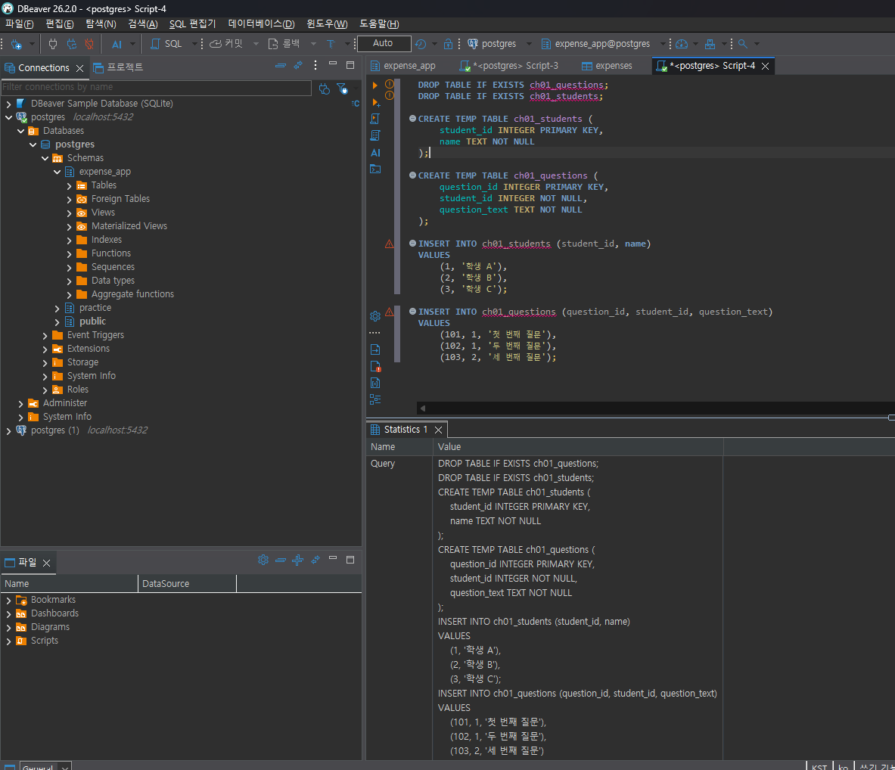
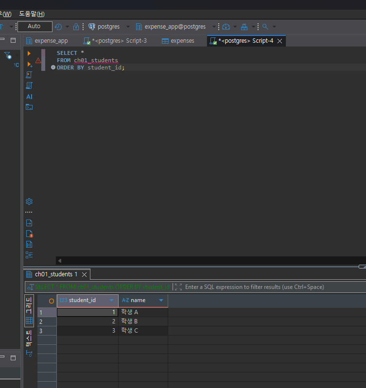
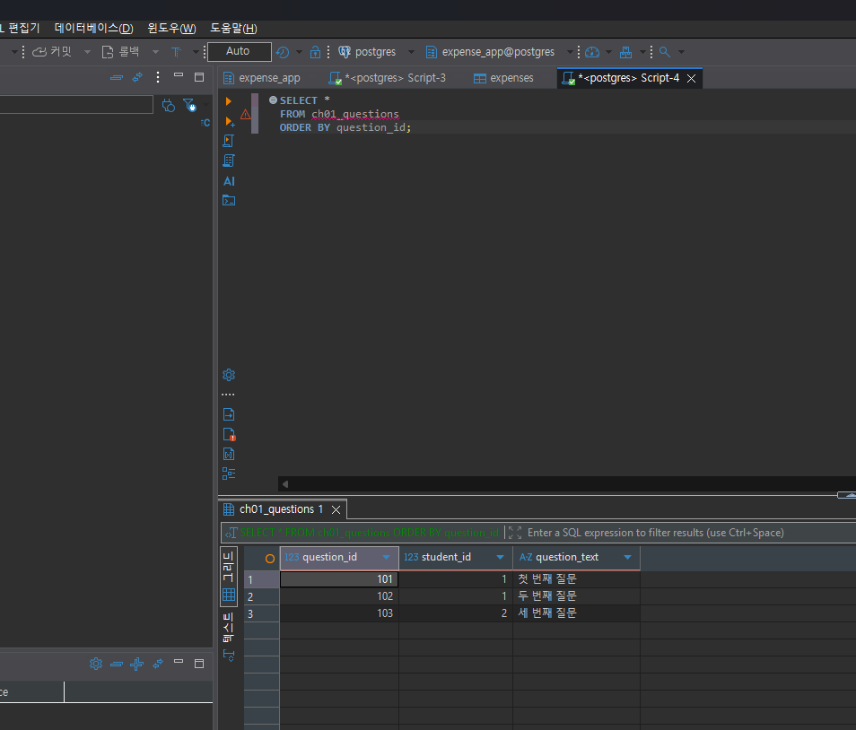
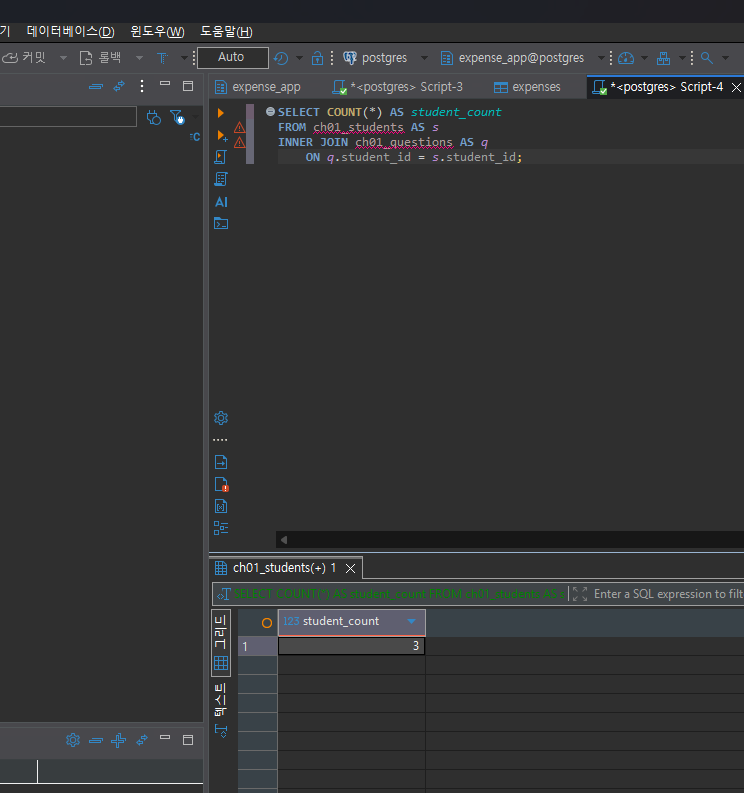
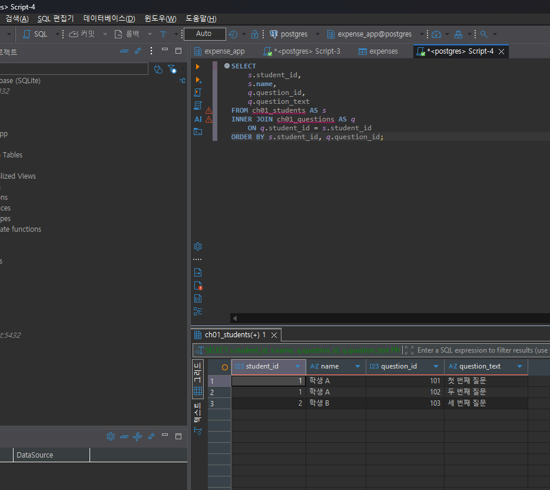
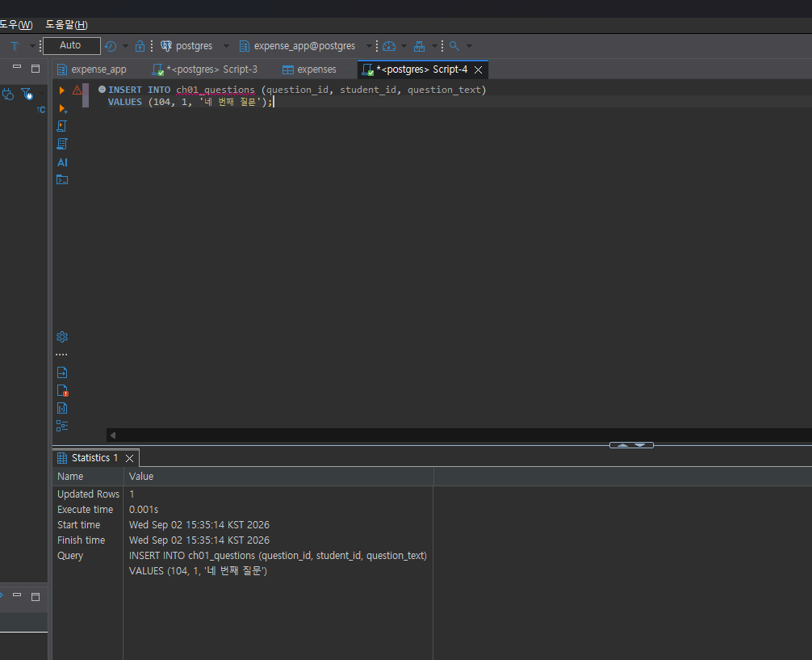
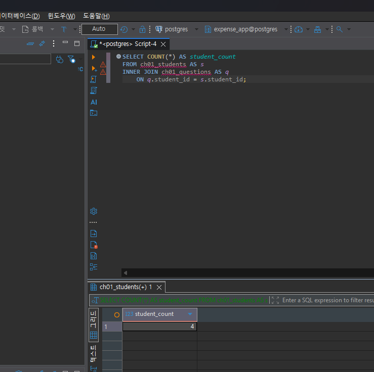
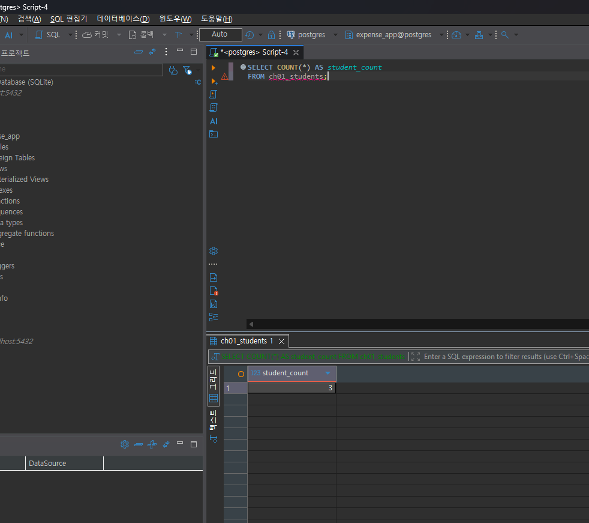

---

# 4. 잘못된 데이터가 결과를 바꾸는 과정

## 4-1. 주문 데이터 확인

다음 데이터를 입력한 뒤 실제 결과를 확인합니다.

```text
ORD-001, 100000
ORD-002, 200000
ORD-002, 200000
```

## 4-2. 실행 전 예상

업무적으로 주문이 `ORD-001`, `ORD-002` 두 건이고 `order_code`가 주문을 고유하게 구분한다고 **가정할 경우** 예상 합계:

```text
300000 원
```

> 위 가정 자체가 실제 업무 규칙인지 확인해야 한다는 점도 기억합니다.

## 4-3. SQL 합계

```sql
SELECT SUM(amount) AS total_amount
FROM ch01_orders;
```

실제 결과:

```text
500,000 원
```

## 4-4. 결과 해석

### `SUM` 문법 자체가 잘못된 것인가요?

```text
그건 아니다, SUM 자체는 정상적으로 작동했다
다만 테이블에 있는 세 값을 모두 더했다
```

### 결과 차이의 원인은 무엇인가요?

```text
ORD-002가 중복으로 두번 저장하게 되어있었다
```

### SQL이 정확하게 실행되어도 업무 숫자가 잘못될 수 있는 이유를 설명하세요.

```text
SQL은 데이터베이스에 저장된 값을 입력하기에
그 값이 틀리더라도 SQL자체는 정상적으로 실행될 수 있다
따라서 SQL 작동 뿐만 아니라 데이터 무결성도 검사해야한다.
```

## 4-5. AI에게 같은 데이터를 분석시킨 결과

AI가 계산한 합계:

```text
500000원
```

AI가 중복 가능성을 언급했나요?

```text
예. ORD-002가 동일한 주문 코드와 금액으로 두 번 존재하므로
중복 데이터일 가능성이 있다고 판단했다.
```

AI가 `ORD-002` 두 행이 실제 두 주문인지 중복 입력인지 스스로 확정할 수 있나요? 이유도 적으세요.

```text
확정할 수 없다.
주문 코드가 같은 두 행이 실제로 별개의 주문인지,
실수로 중복 입력된 것인지는 데이터만 보고 판단하기 어렵기 때문이다.
업무 규칙이나 원본 주문 기록을 추가로 확인해야 한다.
```

추가로 확인해야 할 업무 규칙:

```text
1. order_code는 주문 한 건마다 반드시 고유한 값인지 확인해야 한다.
2. 같은 주문 코드가 여러 번 저장될 수 있는 경우가 있는지 확인해야 한다.
3. 중복 주문이 발견되었을 때 어떤 기준으로 제거하거나 처리하는지 확인해야 한다.
```

내가 최종적으로 내린 판단:

```text
현재 데이터만 보면 ORD-002가 중복일 가능성이 높지만 확정할 수는 없다.
따라서 업무 규칙과 원본 데이터를 먼저 확인한 뒤 실제 주문 금액을 판단해야 한다.
```

## 4-6. 증거 화면

권장 경로:

```text
assignments/chapter01/images/step04_duplicate_result.png
```

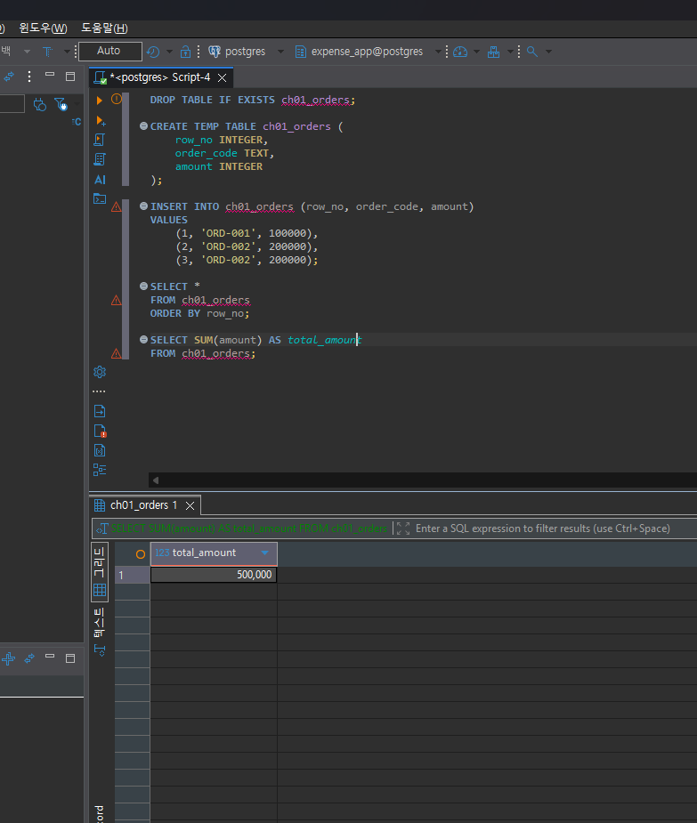

---

# 5. 파일·스프레드시트·DBMS 선택 연습

각 사례에 대해 **AI에게 묻기 전에 먼저 본인의 판단을 작성**합니다.

## 사례 A. 개인 독서 기록

```text
나의 선택: 파일
선택 이유: 한사람만의 기록이라 여러사람의 편집권한 없이 csv 파일로 관리하면 편할 것 같다.
어떤 조건이 추가되면 다른 방식으로 바꿀 것인지: 여러사람이 같이 작성해야 한다면 스프레드시트를 쓰겠다
```

## 사례 B. 동아리 행사 신청 명단

```text
나의 선택: 스프레드시트
선택 이유: 운영진 여러명이 같이 관리해야한다. 
어떤 조건이 추가되면 다른 방식으로 바꿀 것인지: 조건이 복잡해지면 DBMS를 사용하겠다
```

## 사례 C. 온라인 강의 서비스

```text
나의 선택: DBMS
선택 이유: 조건이 복잡하다. 여러 학생, 여러 강사, 복잡한 권한, 복구기능 등등 스프레드시트나 파일보다 관리할게 많다. 데이터도 많고 조건도 복잡하고 그 관계도 복잡하다.
어떤 조건이 추가되면 다른 방식으로 바꿀 것인지: 관리자가 한명이라면 스프레드시트도 가능할 것 같다.
```

## 판단 기준 체크

- [O] 데이터 증가
- [O] 여러 사용자의 동시 수정
- [O] 데이터 사이의 관계
- [O] 반복 조회와 집계
- [O] 정확성·일관성
- [O] 변경 이력
- [O] 권한 구분
- [O] 백업·복구
- [O] 웹·앱에서 지속 사용

### 데이터가 적으면 무조건 스프레드시트를 사용해야 하나요?

```text
아니다. 데이터가 적더라도 여러 사람이 동시에 수정하거나
데이터 사이의 관계가 복잡하고 권한이나 백업이 중요하다면
DBMS를 사용하는 것이 더 적합할 수 있다.
```

---

# 6. 나만의 서비스 데이터 구조 초안

> 이 내용은 이후 Chapter에서 계속 확장할 수 있으므로 신중하게 작성합니다.

## 6-1. 서비스 정의

```text
서비스 이름: 개인 자산·지출 관리 서비스

이 서비스는
개인 자산·지출 관리를 하기 위한 서비스이다.
```

## 6-2. 관리할 데이터 후보

```text
1. 사용자
2. 지출 내역
3. 지출 카테고리
4. 수입 내역
5. 예산
```

## 6-3. 한 행의 의미

| 데이터 후보 | 한 행의 의미 |
| --- | --- |
| 사용자 | 사용자 한 명 |
| 지출 내역 | 지출 한 건 |
| 지출 카테고리 | 카테고리 한 종류 |
| 수입 내역 | 수입 한 건 |
| 예산 | 일정 기간의 예산 한 건 |

## 6-4. 관계를 자연어로 설명

```text
1. 한 사용자는 여러 개의 지출 내역을 가질 수 있다.
2. 한 사용자는 여러 개의 수입 내역을 가질 수 있다.
3. 하나의 지출 내역은 하나의 지출 카테고리에 속한다.
```

## 6-5. 아직 결정하지 않은 정책

```text
Q1. 사용자가 매달 예산 상한을 설정해서 초과할 경우 알림이 뜨게 할 것인가?
Q2. 지출 카테고리를 정해진 항목만 사용할 것인가? 사용자 임의로 추가하거나 수정할 수 있게 할 것인가?
Q3. 잘못 입력한 수입이나 지출 내역을 수정·삭제했을 때 이전 기록도 남겨둘 것인가?
```

> 확정되지 않은 정책을 AI가 임의로 결정한 경우 그대로 받아들이지 않습니다.

---

# 7. AI를 검토자로 활용하기

## 7-1. 내가 AI에게 전달한 핵심 프롬프트

개인정보나 비밀번호 등 민감한 내용은 제거한 뒤 기록합니다.

```text
내가 만들 서비스는 일종의 가계부야
한눈에 내가 쓴 돈을 확인 할 수 있고 얼마나 돈이 빠져나갔는지 알 수 있는 그런게 필요해

마음만 같아선 카드사 앱들 다 합쳐서 데이터 받아오고 싶은데
그럼 권한이 필요할거고.. 굉장히 프로젝트가 커질거 같어

일단 개인이나 관리자가 직접 입력하도록 하자
솔직히 이 기능 토스나 카카오뱅크에 이미 있는 기능이라 내가 잘하는건지 모르겠지만

일단 프로토타입이니 생각해봤어
현실적으로 실현 가능한, 입문자가 만들만한 그런 프로그램 구상해보자

일단 생각해본 데이터는

사용자
지출 내역
지출 카테고리
수입 내역
예산

이거고

관계는

한 사용자는 여러 개의 지출 내역을 가질 수 있다.
한 사용자는 여러 개의 수입 내역을 가질 수 있다.
하나의 지출 내역은 하나의 지출 카테고리에 속한다.

일단 이렇게 작성했어

아직 안정한건

사용자가 매달 예산 상한을 설정해서 초과할 경우 알림이 뜨게 할 것인가?
지출 카테고리를 정해진 항목만 사용할 것인가? 사용자 임의로 추가하거나 수정할 수 있게 할 것인가?
잘못 입력한 수입이나 지출 내역을 수정·삭제했을 때 이전 기록도 남겨둘 것인가?

이거야

추가할거 있으면 너도 20$치 요금먹었으니 생각해봐
아 구글로 하니 2$ 더 붙더라?

너무 거대하게 하지말고
일단 내가 초보가 할만하게 구상해보자

너가 생각하기 힘들면 코덱스 돌려도 좋긴한데
내 코인도 좀 생각해줘

여기에 내가 빠뜨린점 있는지
뭐 이상하거나 중복된거 있는지
파일, 스프레드시트, dbms중 어떤게 적당한지

너가 한번 생각해봐

```

## 7-2. AI의 주요 제안과 나의 판단


AI의 답장


좋아. **Codex까지 돌릴 필요는 없어. 이 정도 범위면 입문 프로젝트로 충분히 정리 가능해.** 그리고 지금 구상에서 방향이 크게 잘못된 부분도 없어. 오히려 카드사 연동을 과감히 빼고 수동 입력으로 제한한 게 범위 조절을 잘한 편이야.

내가 보기엔 이 서비스의 핵심을 이렇게 잡으면 돼.

> 사용자가 수입과 지출을 직접 기록하고, 월별로 얼마를 벌고 얼마를 썼는지 한눈에 확인하며, 카테고리별 소비와 예산 사용 현황을 볼 수 있는 가계부 서비스.

### 지금 생각한 데이터 검토

| 데이터     | 판단 | 이유                     |
| ------- | -- | ---------------------- |
| 사용자     | 유지 | 누구의 가계부인지 구분하기 위해 필요   |
| 지출 내역   | 유지 | 서비스의 핵심 데이터            |
| 지출 카테고리 | 유지 | 식비, 교통비 등의 소비 분석에 필요   |
| 수입 내역   | 유지 | 실제 남은 돈을 계산하려면 필요      |
| 예산      | 유지 | 월별 목표와 실제 소비를 비교할 수 있음 |

**지금 단계에서 서로 겹치는 데이터는 딱히 없어.** 다섯 개 정도면 입문 프로젝트 시작점으로 적당해.

다만 내가 빠졌다고 보는 건 **새로운 테이블보다는 각 데이터에 들어갈 세부 정보**야. 예를 들어 지출 내역에는 최소한 `금액`, `사용 날짜`, `카테고리` 정도가 있어야 하고, 필요하면 `메모`를 추가할 수 있어. 수입 내역에도 `금액`, `수입 날짜`가 필요해. 예산도 그냥 숫자 하나가 아니라 **어느 달의 예산인지** 구분할 수 있어야 해.

그리고 한 가지는 지금 미리 알아두면 좋아. **“이번 달 총 지출”, “이번 달 남은 돈” 같은 값을 별도의 원본 데이터로 저장할 필요는 없어.** 예를 들어 이번 달 수입이 300만 원이고 지출이 180만 원이면 남은 돈 120만 원은 수입·지출 데이터를 이용해서 계산할 수 있잖아. 이런 값은 나중에 SQL로 계산하는 쪽이 자연스럽다.

네가 정하지 않은 세 정책도 잘 잡았어. 특히 카테고리를 사용자가 추가할 수 있게 할지는 DB 구조에도 영향을 줄 수 있고, 수정·삭제 이력을 남길지도 나중에 데이터 관리 방식에 영향을 준다. **지금은 어느 쪽이 정답이라고 확정하지 않는 게 맞다.**

추가로 결정해볼 만한 것도 몇 개 있어. 우선 **수입에도 월급, 용돈, 환급 같은 카테고리를 둘 것인지**가 있고, 하나의 사용자가 **월별 전체 예산 하나만 설정할지 아니면 식비 30만 원, 교통비 10만 원처럼 카테고리별 예산까지 설정할지**도 나중에 결정할 수 있다. 다만 이건 처음부터 구현하지 말고 확장 기능으로 남겨두는 게 좋겠다.

### 초보자용으로 범위를 자르면

처음 버전은 이 정도면 충분해.

```text
회원 또는 사용자 등록

수입 입력 / 수정 / 삭제
지출 입력 / 수정 / 삭제

지출 카테고리 선택

이번 달 총 수입 확인
이번 달 총 지출 확인
이번 달 남은 금액 확인

카테고리별 지출 확인

월 예산 설정
예산 대비 현재 지출 확인
```

여기까지만 제대로 만들어도 상당히 괜찮은 프로토타입이야.

반대로 처음에는 **카드사 API 연동, 은행 계좌 자동 연동, 결제 문자 자동 분석, AI 소비 추천, 복잡한 관리자 권한, 푸시 알림** 같은 건 빼는 게 좋겠어. 이런 기능들은 가계부 DB 자체보다 인증·외부 API·보안 작업이 더 커질 수 있다.

### 파일 / 스프레드시트 / DBMS 중에서는

나는 **관계형 DBMS**를 추천해.

혼자 아주 간단한 가계부만 쓸 거라면 CSV나 스프레드시트로도 충분하다. 그런데 네 프로젝트는 사용자와 지출, 수입, 카테고리, 예산이 서로 연결되고 앞으로 월별·카테고리별 조회도 해야 한다. 수정·삭제 기능도 넣으려고 하고 있고.

게다가 **데이터베이스 학습용 프로젝트**니까 PostgreSQL 같은 관계형 DBMS로 만드는 게 가장 적합해 보여.

현재 구상을 크게 뜯어고칠 필요는 없고, 나는 **“수동 입력 가계부”를 1차 목표로 잡고 나중에 필요한 기능을 하나씩 확장하는 방향**을 추천한다.

그리고 가장 중요한 건 처음부터 토스나 카카오뱅크 수준을 목표로 잡지 않는 거야. 완성된 금융서비스와 경쟁하려는 프로젝트가 아니라, **사용자 → 수입/지출 기록 → 카테고리 → 예산 → 집계라는 데이터 흐름을 직접 구현해 보는 학습용 서비스**로 보면 충분히 좋은 주제야.


최소 5개를 작성합니다.

| AI의 제안 | 수용 / 수정 / 거절 | 나의 판단 근거 |
| AI의 제안                                | 수용 / 수정 / 거절 | 나의 판단 근거                                          |
| ------------------------------------- | ------------ | ------------------------------------------------- |
| 지출 내역에 금액, 사용 날짜, 카테고리 같은 세부 정보가 필요하다 | 수용           | 세부정보 없으면 100% 문제생긴다 |
| 수입 내역에도 금액과 날짜 정보가 필요하다               | 수용           | 당연한 이야기 |
| 수입에도 월급, 용돈 같은 카테고리를 만들 수 있다          | 수정           | 일단 보류 |
| 월 전체 예산뿐 아니라 카테고리별 예산도 설정할 수 있다       | 수정           | 추후 반영하면 좋겠다 |
| 파일이나 스프레드시트보다 관계형 DBMS를 사용하는 것이 적합하다  | 수용           | 다양한 데이터들이 반목하기 때문에 본인도 DBMS 선호 |

## 7-3. AI에게 자기 답변을 다시 비판하도록 요청한 결과

첫 번째 답변과 달라진 점:

```
처음에는 사용자, 예산 등의 데이터가 당연히 필요하다고 생각했지만
다시 검토해 보니 개인용 서비스인지 여러 사용자가 사용하는 서비스인지에 따라
필요한 데이터와 권한 구조가 달라질 수 있다는 점을 알게 되었다.

또한 예산 알림이나 수정 이력 같은 기능은 처음부터 모두 구현하기보다
기본 기능을 먼저 만든 뒤 확장하는 것이 현실적이라고 판단했다.
```

AI가 처음에 임의로 가정했던 내용:

```
사용자 테이블이 반드시 필요하다고 가정한 점,
월별 예산의 구조가 이미 정해진 것처럼 생각한 점,
남은 금액을 단순히 수입에서 지출을 뺀 값이라고 본 점이 있었다.
```

추가로 업무 담당자에게 확인해야 한다고 판단한 내용:

```
1. 이 서비스는 한 명만 사용하는 개인용인지 여러 사용자가 사용하는 서비스인지
2. 예산은 월 전체 예산만 관리할지 카테고리별 예산도 관리할지
3. 남은 금액을 단순 수입-지출로 계산할지 실제 자산 잔액까지 관리할지
4. 삭제한 수입·지출 기록의 이력을 남길지
5. 예산 초과 시 화면 표시만 할지 실제 알림까지 제공할지

```

## 7-4. AI 활용에 대한 나의 평가

```text
가장 유용했던 부분: 나의 꿈, 본인이 빠트리거나 애매한 부분을 다시 검토해준 점이 유용했다.
혼자 했으면 방향을 못잡아 해매었을 것인데, 많은 도움이 됐다.

수정하거나 거절한 부분: 딱히 없다, 그나마 찾는다면 한번에 모든 기능을 넣지 않고
프로토 타입에는 가동 가능한것 부터 시행하고 추후에 기능을 넣어보려고 했다

그렇게 판단한 근거: 입문자가 만드는 프로젝트이기 때문에 처음부터 기능을 너무 많이 넣으면
분명 문제가 생길거기 때문이다

AI가 없었다면 놓쳤을 가능성이 있는 질문: 서비스의 범위를 어디까지 할지, 처음 구현 가능할 기능이 어디까지일지 감이 안왓을거다.
```

## 7-5. AI 활용 증거 화면


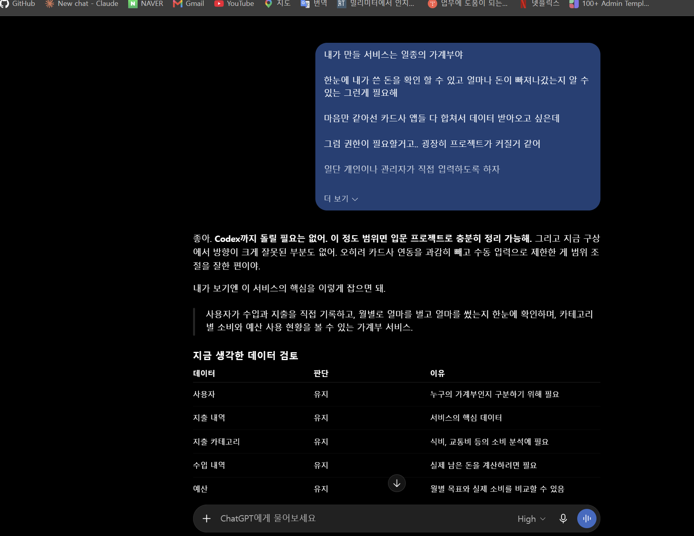

---

# 8. 기준 데이터·파생 데이터·AI 생성 결과 구분

| 구분 | 내 서비스의 예 | 판단 이유 |
| --- | --- | --- |
| 기준 데이터 | 사용자가 직접 입력한 수입·지출 내역 | 실제로 발생한 거래를 기록한 원본 데이터이기 때문 |
| 파생 데이터 | 이번 달 총 지출, 카테고리별 지출 합계 | 원본 수입·지출 데이터를 계산하거나 집계해서 만든 값이기 때문 |
| AI 생성 결과 | AI가 분석한 이번 달 소비 패턴이나 지출 조언 | 원본 데이터를 바탕으로 AI가 해석해서 만든 결과이기 때문 |

### 기준 데이터가 변경되면 파생 데이터는 어떻게 해야 하나요?

```
다시 계산해야한다

```

### AI 결과만 있고 원본 데이터가 없다면 결과를 충분히 검증할 수 있나요?

```
아니요. AI가 무슨 데이터를 가지고 결과값을 냈는지 모르기 때문에 안된다.

```

---

# 9. 최종 성찰

아래 세 문장은 반드시 **본인의 말**로 작성합니다.

```text
1. SQL이 실행되어도 결과를 바로 믿으면 안 되는 이유는
   _잘못된 데이터로도 SQL 자체는 돌아가기 때문에 반드시 데이터를 검증해야하기 때문이다._

2. AI를 데이터베이스 학습에 활용할 때 가장 중요한 것은
   _AI에게 모든 판단을 맡기면 안된다_ 

3. 이번 실습 이후 내가 더 확인하고 싶은 것은
   _AI 특히 코덱스에게 모든일을 맡기지 말고 수동으로 만들어보자_
```

## 이번 Chapter에서 새롭게 알게 된 점 3가지

```text
1. AI는 언제나 답을 말해야 하기 때문에 할루시네이션이 발생한다, 데이터를 엉망으로 줘도 일단 답을 준다
2. INNER JOIN을 사용하면 연결되는 데이터가 없는 행은 빠질 수 있고,
하나의 데이터가 여러 데이터와 연결되면 행이 늘어날 수 있다는 것을 알게 되었다.
3. SQL이 정확하더라도 원본 데이터에 중복이나 오류가 있으면
최종 결과도 잘못될 수 있다는 것을 알게 되었다.
```

## 아직 이해가 명확하지 않은 부분

```text
1. 여러 테이블을 실제 서비스에서 어떤 기준으로 나눠야 하는지 아직 완전히 이해하지 못했다.
2.테이블끼리 관계를 만들 때 어떤 키를 사용하고 어떻게 연결해야 하는지 더 공부해야 할 것 같다.
```

---

# 10. 제출 전 자기 점검

- [O] PostgreSQL 실행 화면을 확인했다.
- [O] SQL 실행 전에 예상 결과를 먼저 작성했다.
- [X] `INNER JOIN` 예제에서 누락과 반복을 설명할 수 있다.
- [O] 숫자가 우연히 같아도 의미가 다를 수 있음을 설명했다.
- [O] 중복 데이터가 집계 결과에 미치는 영향을 확인했다.
- [O] 저장 방식을 데이터 양만으로 판단하지 않았다.
- [O] 개인 서비스 주제를 하나 정했다.
- [O] 데이터 후보와 한 행의 의미를 작성했다.
- [O] 미확정 정책을 최소 3개 작성했다.
- [X] AI 제안을 수용·수정·거절로 구분했다.
- [O] AI 제안에 대한 판단 근거를 작성했다.
- [X] 기준 데이터·파생 데이터·AI 결과를 구분했다.
- [X] 핵심 증거 이미지가 Markdown에서 정상적으로 보인다.
- [O] 비밀번호·API Key·개인정보가 노출되지 않았다.

---

# 11. LMS 제출 정보

## 내 GitHub 답안 파일 URL

아래에는 **교수자 템플릿 URL이 아니라 본인이 작성한 답안 파일의 GitHub URL**을 기록합니다.

```text
https://github.com/cyw0927/ai-database-study/tree/main/assignments/chapter01
```

내 실제 제출 URL:

```text
https://github.com/cyw0927/ai-database-study/blob/main/assignments/chapter01/chapter01_answer.md
```

> LMS에는 위 **본인 저장소의 `chapter01_answer.md` 파일 URL 하나**를 제출합니다.

---

## 권장 학생 저장소 구조

```text
<본인-저장소>/
└── assignments/
    └── chapter01/
        ├── chapter01_answer.md
        └── images/
            ├── step01_environment.png
            ├── step03_join_result.png
            ├── step04_duplicate_result.png
            └── step07_ai_review.png
```

이 구조를 사용하면 이후 Chapter 02, Chapter 03도 같은 방식으로 계속 추가할 수 있습니다.
