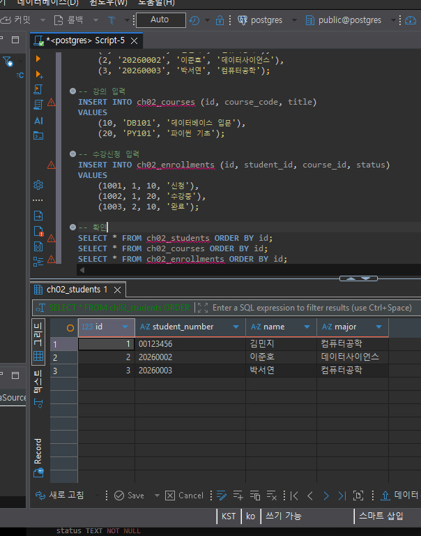
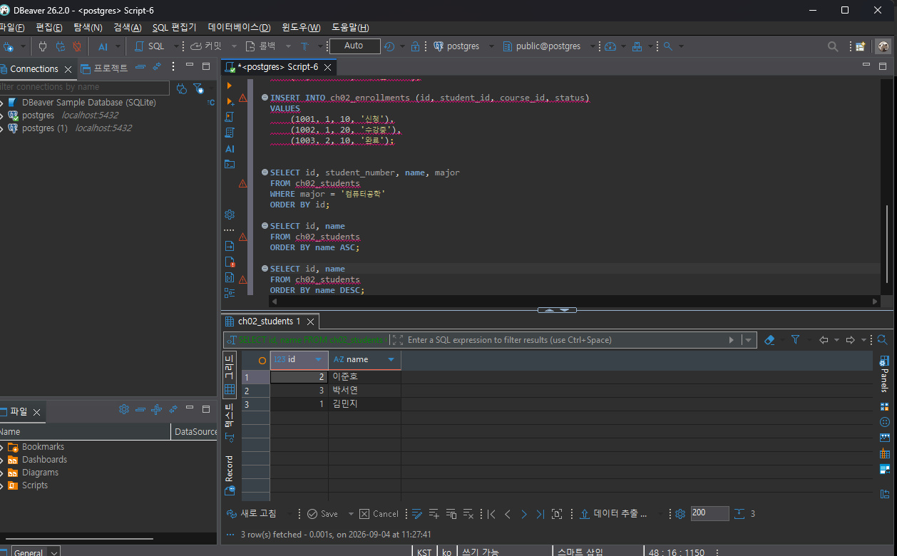

# Chapter 02 확장 실습 답안 템플릿

> **과제:** 데이터와 DBMS의 기본 개념  
> **사용 방법:** 이 파일을 내려받아 본인의 GitHub 저장소에 `chapter02_answer.md`라는 이름으로 저장한 뒤 실습하면서 바로 작성합니다.  
> **제출 방법:** LMS에는 파일을 직접 업로드하지 않고, **본인 GitHub 저장소의 `chapter02_answer.md` 파일 URL**을 제출합니다.

---

## 제출 전 개인정보 주의

LMS에서 제출자를 확인할 수 있으므로 이 공개 Markdown 파일에 학번이나 실명을 반드시 적을 필요는 없습니다.

```text
GitHub 계정 또는 별칭: cyw0927
과제 작성일: 2026-09-04
사용한 AI 도구: ChatGPT
```

> 실제 비밀번호, API Key, 전체 DB 접속 URL, 개인정보가 포함된 화면은 올리지 않습니다.

---

# 1. PostgreSQL에서 현재 위치 확인

## 1-1. 실행한 SQL

```sql
SELECT version();
SELECT current_database();
SELECT current_user;
SELECT current_schema();
SHOW search_path;
```

## 1-2. 실행 결과 기록

```text
PostgreSQL 버전: PostgreSQL 18.4 on x86_64-windows, 64-bit
현재 데이터베이스: postgres
현재 사용자: postgres
현재 스키마: public
search_path: public, "$user"
```

## 1-3. 구조를 내 말로 설명

```text
PostgreSQL은: 데이터를 저장하고 관리하는 DBMS이다.

현재 접속한 데이터베이스는: PostgreSQL이 관리하는 여러 데이터베이스 중 지금 연결해서 사용하는 논리적 공간이다.

스키마는: 데이터베이스 안에서 테이블 같은 객체를 묶어 구분하는 공간이다.

DBeaver 또는 psql 같은 도구는: PostgreSQL에 접속해서 SQL을 실행하는 클라이언트 프로그램이다.
```

## 1-4. 계층 구조 완성

```text
사용자
→ DBeaver / psql 같은 클라이언트
→ PostgreSQL DBMS
→ 데이터베이스
→ 스키마
→ 테이블
→ 행 / 열
```

## 1-5. 증거 화면


---

# 2. 데이터베이스 안의 스키마와 테이블 관찰

## 2-1. 스키마 조회 결과

실행한 SQL:

```sql
SELECT schema_name
FROM information_schema.schemata
ORDER BY schema_name;
```

관찰한 스키마 이름 중 3개 이내를 적습니다.

```text
1. public
2. information_schema
3. pg_catalog
```

### `public`은 무엇인가요?

```text
나의 설명: public은 현재 데이터베이스 안에 있는 스키마 이름이다.
```

### 데이터베이스와 스키마는 같은 것인가요?

```text
나의 설명: 아니다. 데이터베이스 안에 여러 스키마가 존재할 수 있고, 스키마 안에 테이블 같은 객체가 들어간다.
```

## 2-2. 현재 보이는 테이블 조회

```sql
SELECT table_schema, table_name
FROM information_schema.tables
WHERE table_type = 'BASE TABLE'
  AND table_schema NOT IN ('pg_catalog', 'information_schema')
ORDER BY table_schema, table_name;
```

```text
조회된 사용자 테이블 수 또는 눈에 띈 테이블: 환경에 따라 거의 없거나 기존 실습 테이블이 보일 수 있다.

아직 테이블이 거의 없어도 괜찮은 이유: PostgreSQL 설치가 완료되었다고 해서 수업용 테이블이 자동으로 만들어지는 것은 아니기 때문이다.
```

## 2-3. 관찰 정리

```text
PostgreSQL 서버 안에는 여러 데이터베이스가 있을 수 있다.
한 데이터베이스 안에는 여러 스키마가 있을 수 있다.
스키마 안에는 테이블과 같은 객체가 존재한다.
```

---

# 3. TEMP TABLE로 테이블·행·열·키 직접 확인

## 3-1. 임시 테이블 생성 완료 확인

- [x] `ch02_students` 생성
- [x] `ch02_courses` 생성
- [x] `ch02_enrollments` 생성

| 테이블 | 한 행의 의미 |
| --- | --- |
| `ch02_students` | 학생 한 명 |
| `ch02_courses` | 강의 한 개 |
| `ch02_enrollments` | 특정 학생이 특정 강의를 신청한 사건 한 건 |

## 3-2. 열의 의미 확인

### `ch02_students`

| 열 | 값의 의미 | 내부 식별자 / 업무 식별자 / 일반 속성 |
| --- | --- | --- |
| `id` | 학생 행을 DB 내부에서 구분 | 내부 식별자 |
| `student_number` | 학교에서 사용하는 학번 | 업무 식별자 |
| `name` | 학생 이름 | 일반 속성 |
| `major` | 학생 전공 | 일반 속성 |

### `ch02_enrollments`

| 열 | 값의 의미 | PK / FK / 일반 속성 |
| --- | --- | --- |
| `id` | 수강신청 행을 구분 | PK |
| `student_id` | 신청한 학생 | FK |
| `course_id` | 신청한 강의 | FK |
| `status` | 신청 상태 | 일반 속성 |

## 3-3. 입력된 행 수

```text
students 행 수: 3
courses 행 수: 2
enrollments 행 수: 3
```

## 3-4. 내부 식별자와 업무 식별자

```text
students.id가 필요한 이유: DB 안에서 학생 한 명의 행을 안정적으로 구분하기 위해서이다.

student_number가 필요한 이유: 학교 업무에서 사용하는 학번을 기록하기 위해서이다.

둘을 항상 같은 값으로 사용하지 않아도 되는 이유: 내부 ID는 DB 관리용이고 학번은 학교 정책에 따라 형식이 바뀔 수 있는 업무용 값이기 때문이다.
```

## 3-5. 숫자처럼 보이는 학번을 문자열로 저장한 이유

```text
나의 설명: 학번은 계산용 숫자가 아니고 앞자리 0도 의미가 있기 때문에 문자열로 저장하는 것이 맞다.
```

### STEP 3 증거 화면



---

# 4. 테이블과 조회 결과는 다르다

## 4-1. 원본 테이블 행 수

```text
ch02_students 전체 행 수: 3
```

## 4-2. 일부 열만 조회

```sql
SELECT name, major
FROM ch02_students
ORDER BY id;
```

```text
원본 테이블의 열 수와 조회 결과의 열 수가 다른 이유: SELECT에서 name과 major 두 열만 골라서 보여줬기 때문이다. 원본 테이블의 다른 열이 삭제된 것은 아니다.
```

## 4-3. 조건을 적용한 조회

```sql
SELECT id, student_number, name, major
FROM ch02_students
WHERE major = '컴퓨터공학'
ORDER BY id;
```

```text
원본 테이블 행 수: 3
조회 결과 행 수: 2
원본 테이블의 데이터가 삭제된 것인가?: 아니다.
그렇게 판단한 이유: WHERE 조건에 맞는 행만 조회 결과에 보였을 뿐 원본 테이블에는 3행이 그대로 남아 있기 때문이다.
```

## 4-4. 정렬 결과 비교

```sql
SELECT id, name
FROM ch02_students
ORDER BY name ASC;

SELECT id, name
FROM ch02_students
ORDER BY name DESC;
```

```text
ASC 결과의 첫 학생: 김민지
DESC 결과의 첫 학생: 이준호

이 실험을 통해 ORDER BY에 대해 알게 된 점: 화면에 보이는 현재 순서를 원래 테이블 순서라고 생각하면 안 되고, 순서가 중요하면 ORDER BY를 명시해야 한다.
```

## 4-5. 증거 화면



---

# 5. PK와 FK를 실제로 관찰

## 5-1. 정상 데이터의 관계 읽기

```text
한 행이 의미하는 것: 학생 한 명이 강의 한 개를 신청한 수강신청 한 건이다.

같은 student_id가 여러 enrollment 행에서 반복될 수 있는 이유: 학생 한 명이 여러 강의를 신청할 수 있기 때문이다.

같은 course_id가 여러 enrollment 행에서 반복될 수 있는 이유: 강의 한 개를 여러 학생이 신청할 수 있기 때문이다.
```

## 5-2. 기본키 중복 오류 관찰

```text
실행 성공 / 실패: 실패
오류 메시지에서 확인한 핵심 내용: SQL Error [23505], ch02_students_pkey, (id)=(1) 키가 이미 있음
왜 실패했다고 생각하는가: id=1은 이미 기존 학생 행에서 PK로 사용 중이고, PK는 같은 테이블에서 중복될 수 없기 때문이다.
```

## 5-3. 존재하지 않는 학생을 참조하는 FK 오류 관찰

```text
실행 성공 / 실패: 실패
오류 메시지에서 확인한 핵심 내용: SQL Error [23503], ch02_enrollments_student_id_fkey, foreign key 제약조건 위반, student_id=999
왜 실패했다고 생각하는가: ch02_students 테이블에 id=999인 학생이 없는데 수강신청 행에서 그 학생을 참조하려고 했기 때문이다.
```

## 5-4. PK와 FK의 차이 정리

```text
PK는 같은 테이블 안에서 각 행을 고유하게 구분하기 위한 키이다.

FK는 다른 테이블의 행과 관계를 연결하기 위한 키이다.

FK 값이 여러 행에서 반복될 수 있는 이유는 1:N 관계에서 부모 한 행이 여러 자식 행과 연결될 수 있기 때문이다.
```

---

# 6. 관계와 카디널리티를 자연어로 설명

```text
학생 한 명은 여러 수강신청을 가질 수 있는가?: 그렇다.

강의 한 개는 여러 수강신청을 가질 수 있는가?: 그렇다.

수강신청 한 건은 학생 몇 명을 참조하는가?: 한 명.

수강신청 한 건은 강의 몇 개를 참조하는가?: 한 개.
```

```text
students 1 ── N enrollments N ── 1 courses
```

### 학생과 강의가 N:M 관계라고 볼 수 있는 이유

```text
나의 설명: 학생 한 명이 여러 강의를 들을 수 있고, 강의 한 개에도 여러 학생이 들어올 수 있기 때문이다. enrollments가 그 관계를 두 개의 1:N 관계로 풀어준다.
```

---

# 7. AI가 만든 테이블 구조 직접 검토

## 7-1. AI에게 묻기 전에 내가 먼저 찾은 문제

```text
문제 1. 각 행을 고유하게 구분할 PK가 없다.
문제 2. 학생 이름만으로 학생을 안정적으로 구분하기 어렵다.
문제 3. 강의 제목만으로 강의를 안정적으로 구분하기 어렵다.
문제 4. 학생, 강의, 강사 정보와 수강 사건 정보가 한 테이블에 섞여 있어 중복이 생길 가능성이 크다.
```

## 7-2. AI 검토 요청 및 결과

AI에게 다음 항목을 중심으로 검토를 요청했다.

```text
1. 한 행의 의미가 명확한가?
2. PK 후보가 필요한가?
3. 내부 식별자와 업무 식별자를 구분할 필요가 있는가?
4. FK로 표현해야 할 관계 후보는 무엇인가?
5. 중복 저장 위험이 있는가?
6. 현재 요구사항만으로 결정할 수 없는 정책은 무엇인가?
```

AI는 현재 테이블이 학생·강의·강사 정보를 한 행에 함께 저장하고 있어 한 행의 의미가 다소 모호하고, PK가 없으며, 학생 이름과 강의 제목은 식별자로 사용하기 불안정하다고 설명했다. 또한 학생·강의·강사를 별도 대상으로 관리한다면 `student_id`, `course_id`, `instructor_id` 같은 FK 후보가 생길 수 있고, 같은 학생 이메일이나 강의 제목이 여러 행에서 반복되는 중복 위험이 있다고 지적했다. 이메일의 고유성, 재수강 허용 여부, 강의당 강사 수, 삭제 정책 등은 현재 요구사항만으로 확정하면 안 된다고 설명했다.

### STEP 7 증거 화면


## 7-3. AI 제안과 나의 판단

| AI의 지적 또는 제안 | 동의 / 수정 / 보류 | 나의 근거 |
| --- | --- | --- |
| PK 후보가 필요하다 | 동의 | 행을 안정적으로 구분할 값이 필요함 |
| 학생과 강의는 별도 식별자가 필요하다 | 동의 | 이름과 제목은 바뀌거나 중복될 수 있음 |
| 관계는 FK 후보로 표현할 수 있다 | 동의 | 문자열 반복보다 관계를 명시하는 편이 안정적임 |
| 정규화까지 바로 확정한다 | 보류 | 아직 정규화를 정식으로 배우기 전이기 때문 |
| 삭제 정책을 지금 결정한다 | 보류 | 요구사항이 부족하기 때문 |

## 7-4. 본문과 대조한 항목

```text
AI가 설명한 내용: FK는 같은 값이 여러 행에서 사용될 수 있다.

본문에서 확인한 내용: 1:N 관계에서는 같은 FK 값이 여러 행에서 반복될 수 있고 자동으로 UNIQUE가 되는 것이 아니다.

일치 / 부분 일치 / 수정 필요: 일치

내가 최종적으로 이해한 내용: PK는 자신의 행을 고유하게 구분하고, FK는 다른 행과의 관계를 연결한다. 따라서 FK는 관계에 따라 반복될 수 있다.
```

---

# 8. Chapter 01의 개인 서비스 아이디어를 DB 용어로 다시 표현

## 8-1. 서비스 기본 정보

```text
서비스 이름: 개인 자산·지출 관리 서비스
서비스 목적: 사용자가 직접 수입과 지출을 기록하고 월별 소비와 예산 현황을 확인하는 서비스
```

## 8-2. PostgreSQL 구조 후보

```text
데이터베이스 이름 후보: ai_database_study
스키마 이름 후보: personal_finance
```

## 8-3. 테이블 후보와 한 행 의미

| 테이블 후보 | 한 행의 의미 | 내부 ID 후보 | 업무 식별자 후보 |
| --- | --- | --- | --- |
| users | 사용자 한 명 | users.id | 이메일 또는 확인 필요 |
| expenses | 지출 한 건 | expenses.id | 별도 업무 식별자 없음 또는 확인 필요 |
| expense_categories | 지출 카테고리 한 종류 | expense_categories.id | category_code 후보 |
| incomes | 수입 한 건 | incomes.id | 별도 업무 식별자 없음 또는 확인 필요 |
| budgets | 일정 기간의 예산 한 건 | budgets.id | 사용자+기간 조합 후보, 확인 필요 |

## 8-4. FK 후보

```text
1. expenses.user_id → users.id
   이유: 어떤 사용자의 지출인지 연결하기 위해서이다.

2. expenses.category_id → expense_categories.id
   이유: 지출 한 건이 어떤 지출 카테고리에 속하는지 연결하기 위해서이다.

3. incomes.user_id → users.id
   이유: 어떤 사용자의 수입인지 연결하기 위해서이다.

4. budgets.user_id → users.id
   이유: 어떤 사용자가 설정한 예산인지 연결하기 위해서이다.
```

## 8-5. 자연어 관계 문장

```text
1. 한 사용자는 여러 지출 내역을 가질 수 있다.
2. 한 사용자는 여러 수입 내역을 가질 수 있다.
3. 하나의 지출 카테고리는 여러 지출 내역에서 사용될 수 있다.
```

## 8-6. 아직 확정하지 않을 정책

```text
Q1. 사용자가 매달 예산 상한을 설정해서 초과 시 알림을 받을 것인가?
Q2. 지출 카테고리를 정해진 항목만 사용할지 사용자가 직접 추가할 수 있게 할 것인가?
Q3. 수정·삭제된 수입과 지출 기록의 이력을 남길 것인가?
```

---

# 10. 최종 개념 정리

```text
PostgreSQL은 데이터를 저장하고 관리하는 관계형 DBMS이다.

DBeaver 또는 psql은 PostgreSQL에 접속해 SQL을 작성하고 실행하는 클라이언트 도구이다.

데이터베이스와 스키마의 차이는 데이터베이스가 더 큰 논리적 공간이고 스키마는 그 안에서 객체를 묶어 구분하는 공간이라는 점이다.

테이블 한 행은 그 테이블이 표현하는 대상이나 사건 한 건이다.

조회 결과가 원본 테이블과 다른 이유는 SELECT가 필요한 열, 행, 순서를 골라 결과 집합으로 보여주기 때문이다.

내부 식별자와 업무 식별자의 차이는 내부 식별자는 DB 관리용이고 업무 식별자는 실제 업무에서 사용하는 값이라는 점이다.

PK는 같은 테이블 안에서 각 행을 고유하게 구분하는 키이다.

FK는 다른 테이블의 행을 참조해서 관계를 연결하는 키이다.
```

---

# 11. 이번 Chapter에서 새롭게 알게 된 점

```text
1. PostgreSQL과 DBeaver는 같은 프로그램이 아니라 DBMS와 클라이언트의 관계라는 점.
2. PK는 중복될 수 없지만 FK는 1:N 관계에서 같은 값이 여러 번 반복될 수 있다는 점.
3. SELECT 결과에 일부 행이나 열만 보인다고 해서 원본 테이블이 바뀐 것은 아니라는 점.
```

## 아직 헷갈리는 내용

```text
1. 실제 서비스에서 어떤 값을 업무 식별자로 정해야 하는지.
2. 삭제 정책과 복합키를 어떤 기준으로 정해야 하는지.
```

---

# 12. 제출 전 자기 점검

- [x] PostgreSQL에서 현재 database / schema / search_path를 확인했다.
- [x] DBMS, database, schema, table을 구분해서 설명할 수 있다.
- [x] TEMP TABLE 3개를 생성하고 직접 데이터를 조회했다.
- [x] 각 테이블의 한 행 의미를 작성했다.
- [x] 테이블과 조회 결과가 다르다는 것을 실제 SQL로 확인했다.
- [x] `ORDER BY`를 사용하지 않으면 업무 순서를 가정하면 안 된다는 점을 이해했다.
- [x] 내부 식별자와 업무 식별자의 차이를 설명할 수 있다.
- [x] PK 중복 입력 실패를 직접 확인했다.
- [x] 존재하지 않는 FK 참조 실패를 직접 확인했다.
- [x] FK 값이 반복될 수 있는 이유를 설명할 수 있다.
- [x] AI가 만든 테이블을 내가 먼저 검토했다.
- [x] AI 설명 중 최소 하나를 본문과 대조했다.
- [x] 개인 서비스의 테이블 후보를 3개 이상 작성했다.
- [x] 개인 서비스의 FK 후보와 미확정 정책을 기록했다.
- [x] 실제 비밀번호·API Key·민감한 접속 정보가 포함되지 않았는지 확인했다.
- [x] 이미지 링크가 GitHub에서 정상적으로 보이는지 확인했다.

---

# 13. GitHub 제출 정보

```text
https://github.com/cyw0927/ai-database-study/blob/main/assignments/chapter02/chapter02_answer.md
```