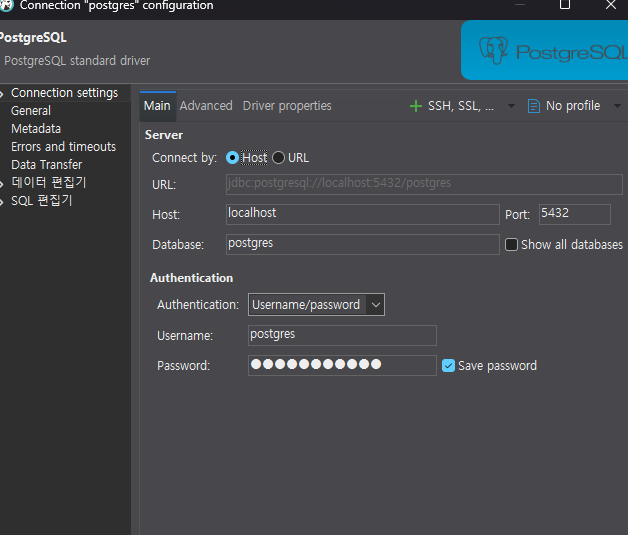
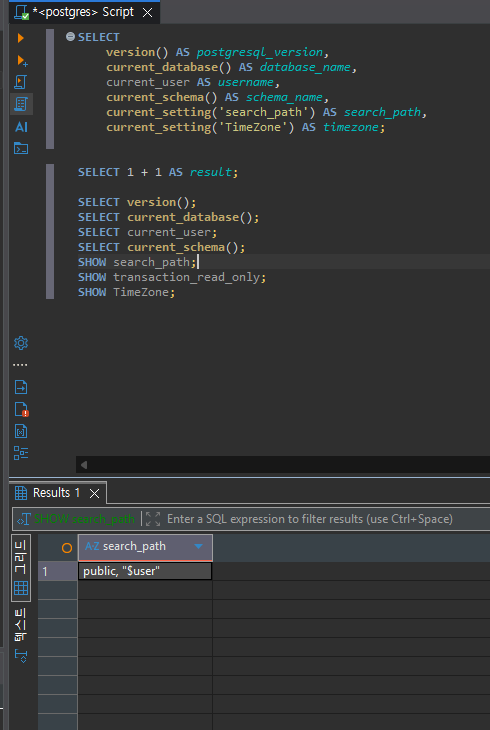

# Chapter 03 확장 실습 답안 템플릿

> **과제:** PostgreSQL과 DBeaver로 실습 환경 검증하기  
> **사용 방법:** 이 파일을 내려받아 본인의 GitHub 저장소에 `chapter03_answer.md`라는 이름으로 저장한 뒤 실습하면서 바로 작성합니다.  
> **제출 방법:** LMS에는 파일을 직접 업로드하지 않고, **본인 GitHub 저장소의 `chapter03_answer.md` 파일 URL**을 제출합니다.

---

## 제출 전 보안 주의

이 과제 파일과 캡처 화면에는 다음 정보를 올리지 않습니다.

```text
실제 PostgreSQL 비밀번호
전체 DB 접속 URL
API Key / Token
개인정보
공개할 필요가 없는 사내 서버 주소
```

LMS에서 제출자를 확인할 수 있으므로 공개 저장소의 답안 파일에 학번이나 실명을 반드시 적을 필요는 없습니다.

```text
GitHub 계정 또는 별칭:
과제 작성일:
사용한 AI 도구:
```

---

# 1. PostgreSQL과 DBeaver 환경 확인

## 1-1. 내 환경

| 항목 | 작성 내용 |
| --- | --- |
| 운영체제 | Windows |
| PostgreSQL 버전 | PostgreSQL 18.4 |
| DBeaver 버전 | 26.20 |
| Host | localhost |
| Port | 5432 |
| Database | postgres |
| Username | postgres |

> 비밀번호는 기록하지 않습니다.

## 1-2. PostgreSQL과 DBeaver 역할 설명

```text
PostgreSQL은: 데이터를 저장하고 SQL을 처리하는 DBMS(DataBase Management System)

DBeaver는: PostgreSQL 서버에 접속해 데이터베이스를 보고 SQL을 실행하는 클라이언트 프로그램

두 프로그램의 차이는: PostgreSQL은 서버 쪽 프로그램이고 DBeaver는 그 PostgreSQL에 접속해서 명령을 내리는 도구다
```

---

# 2. 연결 테스트와 첫 SQL

## 2-1. DBeaver 연결 결과

- [X] PostgreSQL 연결 유형 선택
- [X] Host 확인
- [X] Port 확인
- [X] Database 확인
- [X] Username 확인
- [X] Test Connection 성공

### 연결 성공 화면

권장 이미지 경로:

```text
assignments/chapter03/images/step02_connection.png
```

`여기에 연결 성공 화면을 삽입하세요.`




## 2-2. 첫 SQL 실행

```sql
SELECT 1 + 1 AS result;
```

실행 전 예상:

```text
2
```

실제 결과:

```text
2
```

이 결과가 의미하는 것:

```text
postgreSQL이 정상 작동되고 있다

```

---

# 3. 현재 연결 위치를 SQL로 검증

다음 SQL을 실행합니다.

```sql
SELECT version();
SELECT current_database();
SELECT current_user;
SELECT current_schema();
SHOW search_path;
SHOW transaction_read_only;
SHOW TimeZone;
```

## 3-1. 결과 기록

| 확인 항목 | 실제 결과 | 내가 이해한 의미 |
| --- | --- | --- |
| `version()` | PostgreSQL 18.4 | 현재 PostgreSQL 서버의 버전이다 |
| `current_database()` | postgres | 현재 세션이 접속해 있는 데이터베이스 이름이다 |
| `current_user` | postgres | 현재 PostgreSQL에 접속한 사용자 계정이다 |
| `current_schema()` | public | 현재 기본적으로 사용되는 스키마를 확인한다 |
| `search_path` | public, "$user" | 테이블 이름에 스키마를 생략했을 때 PostgreSQL이 검색하는 스키마 순서다 |
| `transaction_read_only` | off | 현재 세션이 읽기 전용 상태가 아니라는 뜻이다 |
| `TimeZone` | Asia/Seoul | 현재 PostgreSQL 세션의 시간대 설정이다 |

## 3-2. 반드시 설명할 것

### DBeaver 연결 이름과 `current_database()`는 왜 같은 개념이 아닌가요?

```text
DBeaver의 연결 이름은 사용자가 보기 편하려고 쉽게 붙힌 이름이고, 
current data base는 postgreSQL 서버가 실제 접속중이라고 알려주는 데이터베이스 이름이다. 
따라서 연결 이름만 가지고 현재 데이터베이스를 판단하며 안된다

```

### `current_schema()`와 `search_path`는 어떤 관계가 있나요?

```text
search_path는 스키마 이름을 생략했을때 PostgreSQL이 어떤 스키마부터 찾을 지 정한 순서고
current_schema()는 그 검색 경로에서 현재 기본적으로 사용되는 스키마를 보여준다
```

### `transaction_read_only = off`라는 결과만으로 모든 테이블을 만들 권한이 있다고 단정할 수 있나요?

```text
아니다, off는 현재 세션이 읽기 전용이 아니라고만 보여주는 의미다.
실제 테이블 편집권한은 해당 데이터베이스와 스키마에 대한 권한을 별도 확인해야한다
```

## 3-3. 증거 화면

권장 경로:

```text
assignments/chapter03/images/step03_location_check.png
```

`여기에 현재 DB/사용자/스키마/search_path 결과 화면을 삽입하세요.`



---

# 4. `ai_database_book` 데이터베이스 확인

## 4-1. 현재 데이터베이스

```sql
SELECT current_database();
```

실제 결과:

```text
ai_database_book

```

- [X] 결과가 `ai_database_book`이다.
- [X] 다른 DB라면 올바른 연결로 전환했다.

## 4-2. 연결을 바꾼 뒤 다시 검증

```text
전환 전 데이터베이스: postgres
전환 후 데이터베이스: ai_database_book
전환 여부를 판단한 근거: SELECT current_database(); 확인 결과 ai_database_book으로 전환된걸 확인했다
```

### 화면에서 보이는 연결 이름만 믿지 않고 SQL을 다시 실행해야 하는 이유

```text
DBeaver에 표시되는 연결 이름은 사용자가 붙인 이름일 수 있기 때문에 실제 접속 중인 데이터베이스와 다를 수 있다
따라서 SELECT current_database();를 실행해 PostgreSQL 서버가 반환하는 실제 데이터베이스 이름을 확인해야 한다
```

---

# 5. SQL 실행 범위 실험

SQL Editor에 다음 세 문장을 입력합니다.

```sql
SELECT 'A' AS step;
SELECT 'B' AS step;
SELECT 'C' AS step;
```

## 5-1. 한 문장 실행

```text
내가 실행한 문장: SELECT 'A' AS step
실제 결과: A
```

## 5-2. 선택 영역 실행

```text
선택한 문장:SELECT 'A' AS step;
SELECT 'B' AS step;
실제 결과: A,B가 각각 실행됐고 DBeaver에 별도의 탭으로 표시되었다
```

## 5-3. 전체 스크립트 실행

```text
실제 결과: A,B,C가 각각 실행됐다
결과 탭 또는 실행 순서에서 관찰한 점: 모두 다 별도의 탭으로 표시됐다
```

## 5-4. 결과 해석

```text
한 문장 실행과 전체 스크립트 실행의 차이:

한 문장 실행은 선택한 SQL 한 문장만 실행하지만,
전체 스크립트 실행은 작성된 여러 SQL 문장이 모두 실행될 수 있다.

변경 SQL에서 실행 범위를 잘못 선택하면 위험한 이유:
```
SELECT만 실행하려고 했는데 UPDATE나 DELETE 같은 SQL까지 함께 실행하면
원하지 않는 데이터 수정이나 삭제가 발생할 수 있기 때문이다.

### 증거 화면

권장 경로:

```text
assignments/chapter03/images/step05_execution_scope.png
```

`여기에 실행 범위 비교 화면을 삽입하세요.`


---

# 6. 제공된 환경 확인 SQL 실행

Public 저장소의 Chapter 03 파일을 사용합니다.

```text
code/chapter03/setup_check.sql
code/chapter03/setup_validate_local.sql
```

## 6-1. `setup_check.sql`

실행 결과에서 확인한 항목:

```text
PostgreSQL 버전: PostgreSQL 18.4
현재 DB: ai_database_book
현재 사용자: postgres
현재 스키마: public
search_path: public, "$user"
읽기 전용 여부: off
TimeZone: Asia/Seoul
1 + 1 결과: 2
public 스키마 존재 여부: true
public USAGE 권한: true
public CREATE 권한: true
```

### 이 파일을 여러 번 실행해도 비교적 안전한 이유

```text
setup_check.sql은 SELECT와 SHOW처럼 정보를 조회하는 SQL 위주로 구성되어 있고,
INSERT, UPDATE, DELETE, DROP 같은 데이터 변경 명령이 없기 때문에
여러 번 실행해도 기존 데이터에 영향을 주지 않아 비교적 안전하다.
```

## 6-2. `setup_validate_local.sql`

```text
실행 결과: Chapter 03 recommended local environment validation passed
PASS / FAIL: PASS
```

실패했다면 실패 항목:

```text
없음
```

그 실패가 실제 문제인지 환경 차이인지 판단한 근거:

```text
검증조건을 모두 통과했으니 값은 정상이다
```

---

# 7. 안전한 오류 진단 실습

실제 오류가 있었다면 그 오류를 사용합니다. 오류가 없었다면 **데이터를 삭제하거나 서버를 강제로 중지하지 말고**, 안전한 SQL 문법 오류를 하나 만들어 관찰합니다.

예:

```sql
SELEC 1;
```

> 오류를 확인한 뒤 올바른 `SELECT 1;`로 복구합니다.

## 7-1. 오류 기록

```text
오류 메시지 핵심 문장:
SELEC 1;에서 SQL 문법 오류가 발생했다.

내가 먼저 생각한 원인 1:
PostgreSQL 서버에 문제가 생긴 것일 수 있다고 생각했다.

내가 먼저 생각한 원인 2:
SELECT 문법을 잘못 입력했을 수 있다고 생각했다.

실제로 확인한 방법:
오류 메시지에서 SELEC와 syntax 관련 내용을 확인하고 SQL 문장을 다시 살펴봤다

실제 원인:
SELECT에서 마지막 T를 빠뜨린 SQL 문법 오류였다

수정한 내용:
SELEC 1;을 SELECT 1;로 수정했다
```

## 7-2. 수정 후 재검증

```sql
SELECT 1;
SELECT current_database();
```

```text
재검증 결과: SELECT 1은 정상적으로 1을 반환
SELECT current_database(); 결과는 ai_database_book으로 확인
문법 오류 수정후 정상상태로 복구 완료

```

## 7-3. 오류를 유형으로 분류

- [ ] 서버 실행 문제
- [ ] Host 문제
- [ ] Port 문제
- [ ] Database 문제
- [ ] Username/인증 문제
- [X] SQL 문법 문제
- [ ] 권한 문제
- [ ] 기타

선택 이유:

```text
서버는 정상적으로 작동했고 오타때문에 발생했기 때문
```

---

# 8. AI를 오류 분석 보조 도구로 사용

## 8-1. AI에게 전달한 프롬프트

비밀번호·개인정보·전체 접속 URL은 제거하고 기록합니다.

```text
PostgreSQL이랑 DBeaver만지다가 오류가 떳어 
왜 떳는지 너가 한번 읽어보고 분석해봐
나 잘 모르니까 쉽게 쉽게 설명해줘

내가 직접할거니까 확인방법과 수정방법좀 말해줘
답은 바로 말하지 말고

이상한 프로그램 깔거나 지우라는 말도 하지마
```

## 8-2. AI 답변 검토

| AI가 제안한 확인 방법 | 실제로 확인했는가? | 결과 | 수용 / 수정 / 거절 |
| --- | --- | --- | --- |
| SQL 문법 확인 | 예 | `SELEC`에서 `T`가 빠진 것을 확인함 | 수용 |
| `SELECT 1;`로 수정 후 실행 | 예 | 정상적으로 1이 출력됨 | 수용 |
| 현재 데이터베이스 확인 | 예 | `ai_database_book`으로 정상 연결됨 | 수용 |

### AI가 오류 원인을 너무 빨리 단정한 부분이 있었나요?

```text
이번 실수는 너무 명백한 오타라서 크게 그런 부분은 없었다

```

### 오류 메시지와 실제 환경 중 무엇을 확인해서 최종 판단했나요?

```text
오류가 난 문장을 다시 확인했고, 오타수정후 재실행 해봤다
```

### AI 활용에서 가장 유용했던 점

```text
어디가 잘못됐는지 순서를 쉽게 알려주었다
```

### AI 답변을 그대로 실행하지 않고 확인해야 하는 이유

```text
AI로 말해주면 바로 답을 알 수 있어 학습이 안되고
로컬 환경과 AI 인식환경이 다를 수 있어 환경이 호환되는지 확인하고 실행해야 한다
```

---

# 9. Chapter 01~02 개인 서비스와 연결

앞에서 선택한 개인 서비스가 PostgreSQL을 사용한다고 가정합니다.

```text
서비스 이름: 개인 예산관리 시스템

사용할 데이터베이스 이름 후보:
ai_database

사용할 스키마 이름 후보:

앞으로 만들고 싶은 테이블 후보 3개:
1.
2.
3.
```

### 아직 SQL을 만들지 않고 이름과 역할만 정하는 이유

```text

```

### Chapter 02에서 정리했던 한 행의 의미 중 수정할 부분이 있나요?

```text

```

---

# 10. 초보자용 연결 가이드 작성

친구가 자신의 PC에서 같은 실습을 시작한다고 가정합니다. 아래 순서를 자신의 말로 작성합니다.

```text
1. PostgreSQL 서버가 실행되는지 확인하는 방법:

2. DBeaver에서 PostgreSQL 연결을 만드는 방법:

3. Host / Port / Database / Username의 의미:

4. ai_database_book에 연결되었는지 확인하는 방법:

5. 현재 위치를 확인하는 SQL:

6. 한 문장과 전체 스크립트 실행을 구분해야 하는 이유:

7. 비밀번호를 GitHub나 AI 프롬프트에 넣으면 안 되는 이유:
```

---

# 11. 최종 성찰

아래 문장은 반드시 본인의 말로 작성합니다.

```text
1. DBeaver와 PostgreSQL의 가장 중요한 차이는
   ____________________________________________________________ 이다.

2. 내가 지금 어느 데이터베이스에 연결되어 있는지 확인할 때
   화면 이름만 보지 않고 ______________________________________ 해야 한다.

3. PostgreSQL 오류가 발생했을 때 가장 먼저 해야 할 일은
   ____________________________________________________________ 이다.

4. AI를 오류 해결에 사용할 때 가장 중요한 것은
   ____________________________________________________________ 이다.
```

---

# 12. 제출 체크리스트

- [ ] `chapter03_answer.md`의 빈 필수 항목을 작성했다.
- [ ] PostgreSQL과 DBeaver의 역할 차이를 설명했다.
- [ ] `current_database/current_user/current_schema/search_path`를 실제로 확인했다.
- [ ] `ai_database_book` 연결 여부를 SQL로 검증했다.
- [ ] SQL 실행 범위 세 가지를 비교했다.
- [ ] `setup_check.sql`을 실행했다.
- [ ] `setup_validate_local.sql` 결과를 확인했다.
- [ ] 오류 원인을 먼저 스스로 추정한 뒤 AI를 사용했다.
- [ ] AI 제안을 실제 환경에서 검증했다.
- [ ] 핵심 캡처 3~4장만 골라 넣었다.
- [ ] 캡처에 비밀번호·개인정보·전체 접속 URL이 없다.
- [ ] Markdown 이미지가 GitHub 웹 화면에서 실제로 보인다.
- [ ] 최종 답안 파일을 commit/push했다.

---

# 13. LMS 제출 URL

아래 형식의 **본인 GitHub 파일 URL**을 LMS에 제출합니다.

```text
https://github.com/<본인-GitHub-ID>/<본인-저장소>/blob/main/assignments/chapter03/chapter03_answer.md
```

내 제출 URL:

```text

```

> 저장소 메인 URL, 교수자 템플릿 URL, Raw URL이 아니라 **작성 완료된 본인 `chapter03_answer.md` 파일 화면 URL**을 제출합니다.
