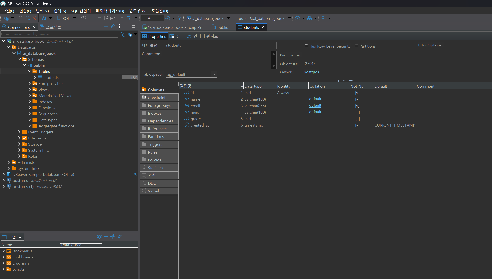
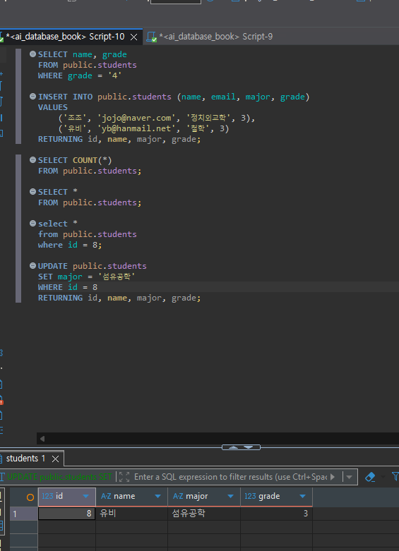
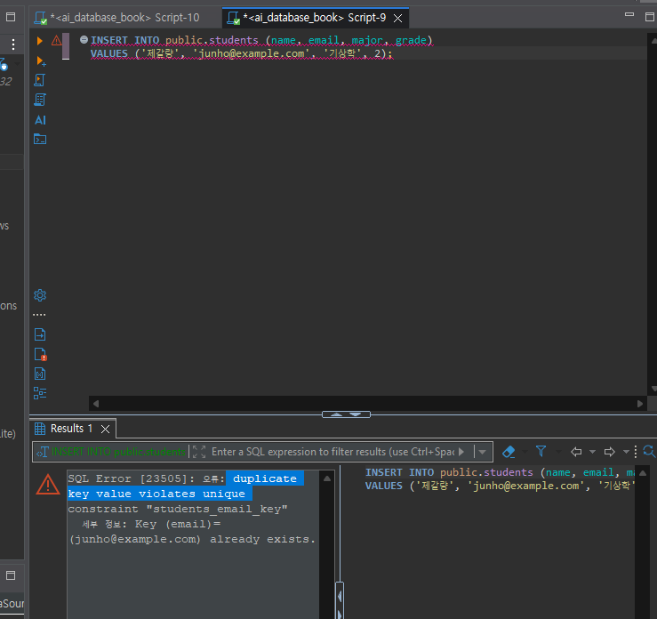
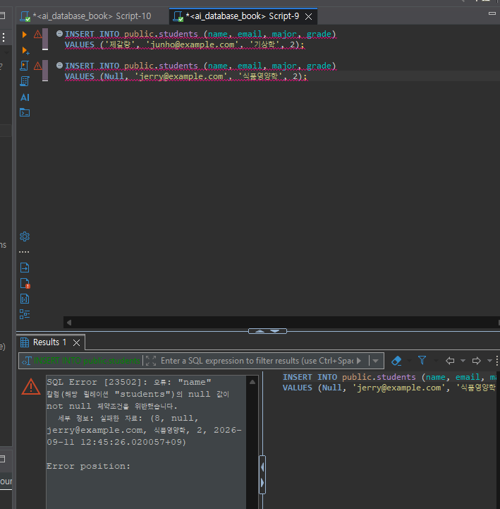

# Chapter 04 확장 실습 답안 템플릿

> **과제:** 관계형 데이터베이스와 SQL 시작하기  
> **사용 방법:** 이 파일을 내려받아 본인의 GitHub 저장소에 `chapter04_answer.md`라는 이름으로 저장한 뒤 실습하면서 바로 작성합니다.  
> **제출 방법:** LMS에는 파일을 직접 업로드하지 않고, **본인 GitHub 저장소의 `chapter04_answer.md` 파일 URL**을 제출합니다.

---

## 제출 전 주의

이 파일과 캡처 화면에는 실제 비밀번호, 전체 DB 접속 URL, API Key, 개인정보를 기록하지 않습니다.

```text
GitHub 계정 또는 별칭: cyw0927
과제 작성일: 2026-09-11
사용한 AI 도구: chat GPT
```

---

# 1. 실습 환경과 시작 상태 확인

다음을 실행합니다.

```sql
SELECT current_database();
SELECT current_user;
SELECT current_schema();
SHOW search_path;
SHOW transaction_read_only;
```

| 확인 항목 | 실제 결과 | 의미 |
| --- | --- | --- |
| current_database() | ai_database_book | 현재 작업 중인 데이터베이스 |
| current_user | postgres | 현재 DB에 접속한 사용자 계정 |
| current_schema() | public | 현재 기본으로 사용하는 스키마 |
| search_path | "$user", public | 테이블 등을 찾을 때 확인하는 스키마 순서 |
| transaction_read_only | off | 읽기 전용이 아니므로 데이터 변경 가능 |

- [X] 현재 DB가 `ai_database_book`이다.
- [X] 변경 가능한 연결인지 확인했다.
- [X] 실행할 SQL 범위를 확인했다.
- [X] Auto-commit 상태를 확인했다.

### 변경 SQL을 실행하기 전에 현재 DB와 실행 범위를 확인해야 하는 이유

```text
잘못된 DB범위에서 실행하면 이상한 테이블이나 값이 나올수도 있기 때문이다

```

---

# 2. `public.students` 구조 생성

## 2-1. 실행 전 예상

```text
테이블 이름: student
한 행의 의미: 학생 1명 정보
예상 행 수: 0
기본키: id
필수 열: name, email, age
중복을 막는 열: email
자동 생성 열: student_id
```

## 2-2. 실행 파일

```text
code/chapter04/01_create_students.sql
```

## 2-3. 실행 후 확인

```text
테이블 생성 성공 여부: 성공
실제 행 수: 0
DBeaver에서 확인한 위치: ai_database_book > Schemas > public > Tables > students
```

### 각 열의 역할

| 열 | 타입 | NULL 가능? | 역할 |
| --- | --- | --- | --- |
| id | int4 | 불가능 | 학생 데이터를 구분하는 고유 번호 |
| name | varchar(100) | 불가능 | 학생 이름 |
| email | varchar(255) | 불가능 | 학생 이메일 |
| major | varchar(100) | 가능 | 학생 전공 |
| grade | int4 | 가능 | 학생 학년 |
| created_at | timestamp | 불가능 | 데이터 생성 시간을 자동으로 저장 |

### `id`를 학번이나 학생 수로 해석하면 안 되는 이유

```text
id는 자동 생성되는 고유 pk일 뿐 학번 학생과 무관하다
```

### 증거 화면

권장 경로:

```text
assignments/chapter04/images/step02_table.png
```

`여기에 테이블 구조 확인 화면을 삽입하세요.`

---

# 3. 샘플 데이터 6명 입력

## 3-1. 실행 전 예상

```text
현재 행 수: 0
실행 후 예상 행 수: 6
예상되는 NULL 포함 학생: 0
```

## 3-2. 실행 파일

```text
code/chapter04/02_insert_students.sql
```

## 3-3. 실제 결과

```text
실제 행 수: 6
이준호 grade: 3
박서연 존재 여부: 존재
윤서진 major: NULL
윤서진 grade: NULL
```

### 예상과 실제 비교

```text
예상과 실제가 일치했는가: X
다르다면 이유: NULL 값이 없을거라 예상했지만 윤서진의 전공과 학년이 NULL처리 됐다
```

### `created_at` 값이 여러 행에서 같을 수 있는 이유

```text
여러 학생을 동시에 입력했기 때문에 같을 수 있다
```

---

# 4. SELECT 복습과 결과 검증

각 문제는 **SQL 실행 전에 예상 행 수를 먼저 작성**합니다.

| 번호 | 조회 문제 | 예상 행 수 | 실제 행 수 | 일치? | 다르면 이유 |
| ---: | --- | ---: | ---: | --- | --- |
| 1 | 전체 학생 | 6 | 6 | O | |
| 2 | 이름·이메일만 조회 | 6 | 6 | O | |
| 3 | 특정 전공 | 1 | 1 | O | |
| 4 | 특정 학년 이상 | ? | ? | ? | |
| 5 | 두 전공 중 하나 | ? | ? | ? | |
| 6 | grade IS NULL | 1 | 1 | O | |
| 7 | 전공 DISTINCT | 4 | 4 | O | |
| 8 | 정렬 후 상위 3명 | 3 | 3 | O | |

## 4-1. 내가 직접 작성한 SQL 2개

```sql
-- SQL 1
SELECT name, major
FROM public.students
WHERE major = '데이터사이언스'
```

```text
이 SQL의 한 행 의미: 데이터사이언스 전공 학생의 이름과 전공
예상 행 수: 1
실제 행 수: 1
```

```sql
-- SQL 2
SELECT name, grade
FROM public.students
WHERE grede = '4'

```

```text
이 SQL의 한 행 의미: 4학년 학생 이름과 전공
예상 행 수: 1
실제 행 수: 1
```

## 4-2. `= NULL` 대신 `IS NULL`을 사용하는 이유

```text
NULL은 일반적인 값이 아니라 값이 없다는 의미이기 때문에 `=`로 비교하지 않고 `IS NULL`을 사용해야한다
```

## 4-3. `ORDER BY` 없이 결과 순서를 믿으면 안 되는 이유

```text
정력 기능없이는 데이터가 어떤 순서로 조회된다는 보장이 없다
```

## 4-4. `DISTINCT`가 원본 데이터를 삭제하는 기능인가요?

```text
아니요. 'distinct'는 조회결과에 중복된 값을 한번만 보여주는 기능이다.
```

### 증거 화면

권장 경로:

```text
assignments/chapter04/images/step04_select.png
```

`여기에 SELECT 핵심 결과 화면을 삽입하세요.`

---

# 5. 내 가상 학생 2명 추가

실명·실제 이메일 대신 가상 데이터를 사용합니다.

## 5-1. 실행 전 계획

```text
학생 A
이름: 조조
이메일: jojo@naver.com
전공: 정치외교학
학년: 3

학생 B
이름: 유비
이메일: yb@hanmail.net
전공: 철학
학년 또는 NULL: 3

현재 행 수: 6
추가 후 예상 행 수: 8
```

## 5-2. 내가 실행한 INSERT

```sql
INSERT INTO public.students (name, email, major, grade)
VALUES
    ('조조', 'jojo@naver.com', '정치외교학', 3),
    ('유비', 'yb@hanmail.net', '철학', 3)
RETURNING id, name, major, grade;

```

## 5-3. 실제 결과

```text
RETURNING 또는 확인 SELECT 결과: 조조 id7, 유비 id8
실제 전체 행 수: 8
예상과 일치 여부: 일치
```

### 내가 일부 값을 NULL로 둔 이유 또는 NULL을 사용하지 않은 이유

```text
두 학생 다 전공과 학년을 입력했기 때문에 NULL을 사용하지 않음
```

---

# 6. 안전한 UPDATE

내가 추가한 가상 학생 한 명만 수정합니다.

## 6-1. 먼저 대상 확인 SELECT

```sql
SELECT *
FROM public.students
WHERE id = 8;
```

```text
예상 대상 행 수: 1
실제 대상 행 수: 1
```

## 6-2. UPDATE

```sql
UPDATE public.students
SET major = '섬유공학'
WHERE id = 8
RETURNING id, name, major, grade;
```

```text
예상 영향 행 수: 1
실제 영향 행 수: 1
RETURNING 결과: id 8, 유비, 섬유공학, 3
```

## 6-3. UPDATE 후 재조회

```sql
select *
from public.students
where id = 8;
```

### `WHERE` 없는 UPDATE를 실행하면 위험한 이유

```text
where 조건이 없으면 특정 학생 한명이 아니라 테이블의 모든 행이 수정된다
```

### 증거 화면

권장 경로:

```text
assignments/chapter04/images/step06_update.png
```

`여기에 UPDATE 전/후 결과 화면을 삽입하세요.`


---

# 7. 안전한 DELETE

내가 추가한 가상 학생 한 명을 삭제합니다.

## 7-1. 삭제 전 확인

```sql
SELECT *
FROM public.students
WHERE id = 7;
```

```text
예상 대상 행 수: 1
실제 대상 행 수: 1
```

## 7-2. DELETE

```sql
DELETE FROM public.students
WHERE id = 7
RETURNING id, name, email;
```

```text
예상 영향 행 수: 1
실제 영향 행 수: 1
RETURNING 결과: id 7, 조조, jojo@naver.com
```

## 7-3. 삭제 후 재조회

```sql
SELECT *
FROM public.students
WHERE id = 7;
```

```text
삭제 후 같은 조건의 SELECT 결과 행 수: 0
```

### `DELETE` 성공 메시지만 보고 끝내지 않고 다시 SELECT해야 하는 이유

```text
원하는 행이 정확히 삭제되었는지 알 수 없기 때문에 다시 확인해야 한다
```

---

# 8. 본문 기준 UPDATE·DELETE 상태 검증

`04_update_delete_students.sql`을 본문 시작 상태에서 실행했다면 다음을 확인합니다.

```text
최종 학생 수: 5
이준호 grade: 4
박서연 존재 여부: 있음
```

본문 기준 기대 상태와 비교합니다.

```text
학생 수 = 5
이준호 grade = 4
박서연 = 0행
```

### 내 실제 결과가 기준과 다르다면 원인

```text
7장까지 진행된 상태 (임의로 학생을 추가된 상황)으로 돌렸더니 에러 발생
리셋 코드 작동후 다시 creat -> insert -> update_delete 실행하니 동일하게 나옴
```

---

# 9. 의도한 실패 2개 관찰

> 실패 테스트는 데이터베이스 규칙이 실제로 데이터를 보호하는지 확인하는 실험입니다.

## 9-1. 중복 이메일 `UNIQUE` 오류

내가 사용한 SQL:

```sql
INSERT INTO public.students (name, email, major, grade)
VALUES ('제갈량', 'junho@example.com', '기상학', 2);
```

```text
오류 메시지 핵심 단서:  duplicate key value violates unique 
왜 실패해야 맞는가: 이메일 중복
어떤 규칙이 작동했는가: email 열의 unique 조건
실패 후 기존 데이터가 어떻게 유지되었는가: 중복데이턴는 추가되지 않음
```

## 9-2. 이름 `NULL` 입력 `NOT NULL` 오류

내가 사용한 SQL:

```sql
INSERT INTO public.students (name, email, major, grade)
VALUES (Null, 'jerry@example.com', '식품영양학', 2);
```

```text
오류 메시지 핵심 단서: "name" 칼럼(해당 릴레이션 "students")의 null 값이 not null 제약조건을 위반했습니다.
왜 실패해야 맞는가: name에는 반드시 값이 있어야 한다
어떤 규칙이 작동했는가: name열의 not null 제약조건
```

### 실패한 INSERT 뒤 자동 생성 `id` 번호에 빈 구간이 생길 수 있어도 문제라고 단정할 수 없는 이유

```text
insert를 실행할 때 마다 하나씩 소비될 수도 있기 때문
```

### 증거 화면

권장 경로:

```text
assignments/chapter04/images/step09_constraint_error.png
```

`여기에 제약조건 오류 화면을 삽입하세요.`

---



# 10. `verify_students.sql`로 최종 상태 확인

실행 파일:

```text
code/chapter04/verify_students.sql
```

```text
현재 전체 학생 수: 5
NULL 개수: major 1개, grade 1개
이준호 grade: 4
박서연 존재 여부: 없음
현재 데이터 상태에서 예상과 다른 부분: 없음
```

### 검증 SQL을 따로 두면 좋은 이유

```text
현재데이터가 예상한 결과와 맞는지 확인할수있다
```

---

# 11. AI를 SQL 작성자가 아니라 검토자로 활용

먼저 본인이 SQL을 작성한 뒤 AI에게 검토를 요청합니다.

## 11-1. 내가 작성한 SQL

```sql
UPDATE public.students
SET grade = 3
WHERE email = 'junho@example.com'
RETURNING id, name, email, grade;
```

## 11-2. AI에게 전달한 핵심 요청

```text
SQL이 이준호만 수정해주는지 확인해주고, 3학년으로 제대로 수정하는지 확인해달라고 했다
```

## 11-3. AI 검토 결과

| AI 제안 | 수용 / 수정 / 거절 | 실제 검증 결과 | 나의 이유 |
| --- | --- | --- | --- |
| WHERE 조건으로 이준호만 선택되는지 확인하기 | 수용 | 이준호 1명만 수정됨 | 다른 학생까지 수정되는 것을 막기 위해 |
| grade가 3으로 변경되는지 확인하기 | 수용 | grade가 3으로 변경됨 | 원하는 값으로 수정되었는지 확인하기 위해 |
| RETURNING으로 수정 결과 확인하기 | 수용 | 수정된 이준호 정보가 바로 출력됨 | 수정 결과를 바로 확인할 수 있기 때문 |

### AI가 예상한 영향 행 수와 실제 결과가 같았나요?

```text
같았다. 이준호 1명만 수정될 것으로 예상했고 실제로도 1행만 수정되었다
```

### AI 답변을 실행 전에 검토해야 하는 이유

```text
AI가 작성하거나 검토한 SQL도 조건이나 대상이 잘못될 수 있기 때문에 실행 전에 직접 확인해야 한다
```

---

# 12. 내 서비스 테이블 하나 확장 설계

Chapter 01~03에서 정한 개인 서비스에서 **테이블 하나**를 선택합니다.

```text
서비스 이름: 개인 예산관리 시스템
테이블 이름: expenses
한 행의 의미: 사용자가 지출한 내역 1건
```

| 열 이름 | 저장할 값 | 타입 후보 | NULL 가능? | UNIQUE 후보? | 이유 |
| --- | --- | --- | --- | --- | --- |
| expense_id | 지출 번호 | INTEGER | 불가능 | 예 | 각 지출 내역을 구분하기 위해 |
| user_id | 사용자 번호 | INTEGER | 불가능 | 아니오 | 한 사용자가 여러 지출을 할 수 있기 때문에 |
| category | 지출 분류 | VARCHAR(50) | 불가능 | 아니오 | 식비, 교통비 등 같은 분류가 반복될 수 있기 때문에 |
| amount | 지출 금액 | INTEGER | 불가능 | 아니오 | 같은 금액의 지출이 여러 번 있을 수 있기 때문에 |
| spent_at | 지출 날짜 | DATE | 불가능 | 아니오 | 같은 날 여러 지출이 있을 수 있기 때문에 |

```text
PK 후보: expense_id
업무 식별자 후보: 아직 따로 정하지 않음
아직 미확정인 규칙: 지출 금액의 최소값과 카테고리를 고정된 목록으로 제한할지 여부
```

## 선택: CREATE TABLE 초안

> 아직 확정되지 않은 업무 규칙은 억지로 제약조건으로 만들지 않습니다.

```sql
CREATE TABLE expenses (
    expense_id INTEGER GENERATED BY DEFAULT AS IDENTITY PRIMARY KEY,
    user_id INTEGER NOT NULL,
    category VARCHAR(50) NOT NULL,
    amount INTEGER NOT NULL,
    spent_at DATE NOT NULL
);
```

### AI에게 검토받은 뒤 수정한 부분

```text
처음에는 amount도 UNIQUE로 만들 수 있다고 생각했지만 같은 금액을 여러 번 지출할 수 있기 때문에 빼는 것이 맞다고 수정했다.
아직 정하지 않은 금액 범위나 카테고리 규칙도 일단 제약조건으로 넣지 않았다.
```

---

# 13. 최종 성찰

아래 문장은 본인의 말로 작성합니다.

```text
1. SQL 실행 성공과 올바른 대상 선택이 다른 이유는
   SQL이 실행됐다고 해서 내가 원한 DB, 테이블, 행에 적용됐다는 뜻은 아니기 때문이다.

2. UPDATE와 DELETE 전에 SELECT를 먼저 해야 하는 이유는
   수정하거나 삭제할 대상이 맞는지 먼저 확인해서 엉뚱한 데이터를 건드리는 것을 막기 위해서이다.

3. 영향받은 행 수를 확인해야 하는 이유는
   내가 예상한 만큼만 데이터가 수정되거나 삭제됐는지 확인할 수 있기 때문이다.

4. UNIQUE 또는 NOT NULL 오류를 '보호 장치가 정상 동작한 결과'라고 볼 수 있는 이유는
   중복값이나 필수값 누락 같은 잘못된 데이터가 들어가는 것을 DB가 막았다는 뜻이기 때문이다.

5. AI가 SQL을 만들어 주더라도 내가 반드시 확인해야 하는 것은
   현재 DB와 대상 테이블, WHERE 조건, 영향받는 행 수, 실제 실행 결과이다.
```

---

# 14. 제출 체크리스트

- [x] `chapter04_answer.md`를 본인 저장소에 만들었다.
- [x] 현재 DB와 실행 환경을 확인했다.
- [x] `public.students`를 생성했다.
- [x] 샘플 6명 입력 결과를 검증했다.
- [ ] SELECT 문제에서 실행 전 예상 행 수를 작성했다.
- [x] 가상 학생 2명을 추가했다.
- [x] UPDATE 전후를 SELECT로 확인했다.
- [x] DELETE 전후를 SELECT로 확인했다.
- [x] UNIQUE 오류를 관찰했다.
- [x] NOT NULL 오류를 관찰했다.
- [x] `verify_students.sql`로 상태를 확인했다.
- [x] AI 제안을 실제 SQL 결과와 비교했다.
- [x] 개인 서비스 테이블 하나를 확장 설계했다.
- [x] 핵심 캡처는 3~4장 정도로 제한했다.
- [x] 비밀번호·개인정보가 캡처에 없다.
- [ ] Markdown 이미지가 GitHub 웹 화면에서 정상 표시된다.
- [x] commit/push를 완료했다.

---

# 15. LMS 제출 URL

아래 형식의 **본인 GitHub 파일 URL**을 LMS에 제출합니다.

```text
https://github.com/<본인-GitHub-ID>/<본인-저장소>/blob/main/assignments/chapter04/chapter04_answer.md
```

내 제출 URL:

```text
https://github.com/cyw0927/ai-database-study/blob/main/assignments/chapter04/chapter04_answer.md
```

> 교수자 템플릿 URL이나 저장소 메인 URL이 아니라 **작성 완료된 본인 `chapter04_answer.md` 파일 화면 URL**을 제출합니다.