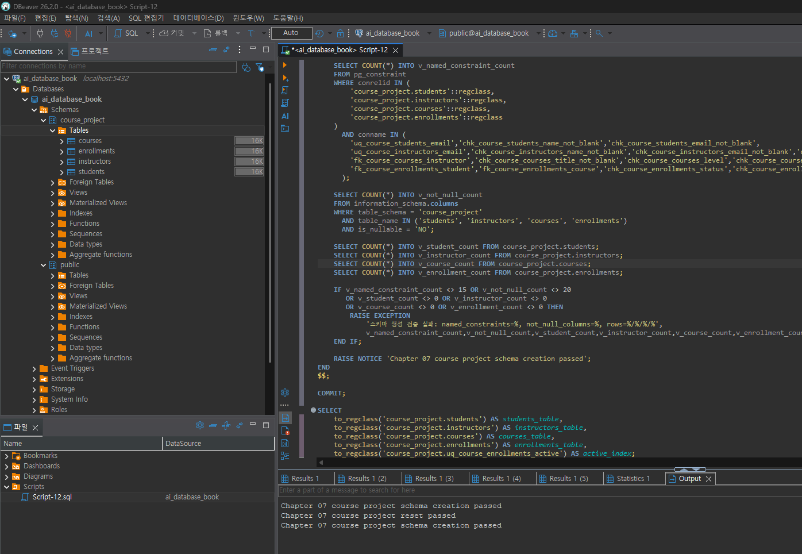
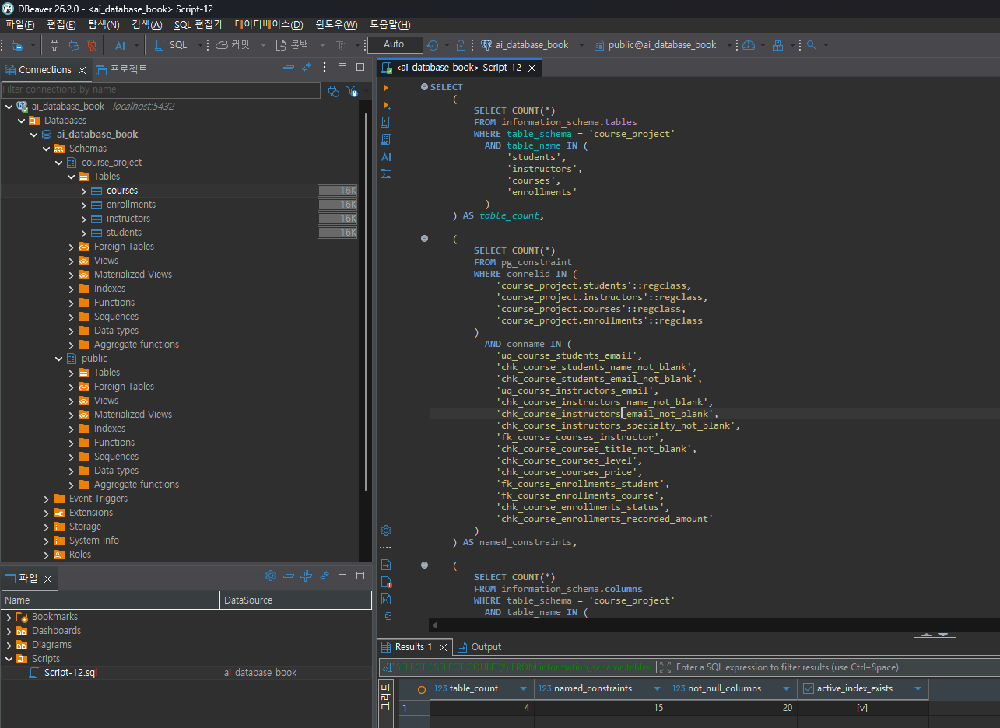
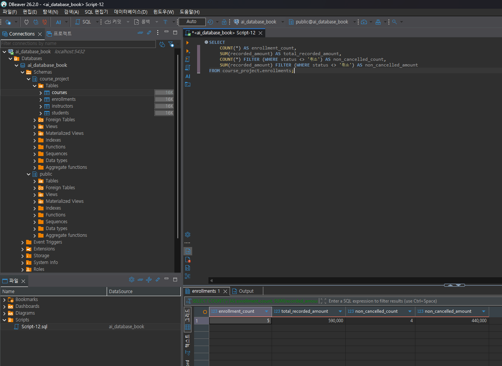
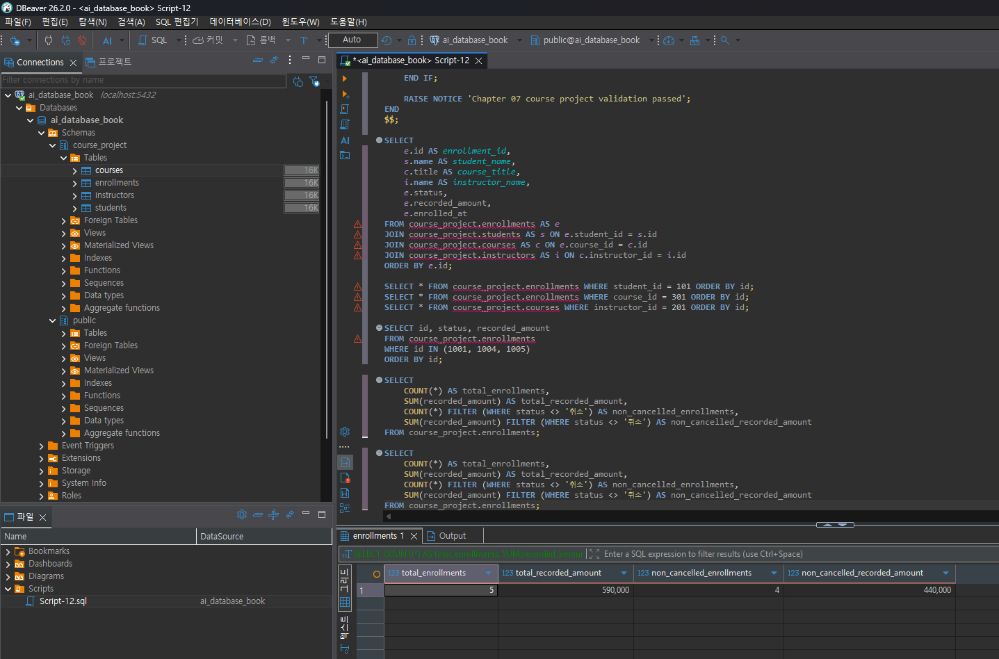
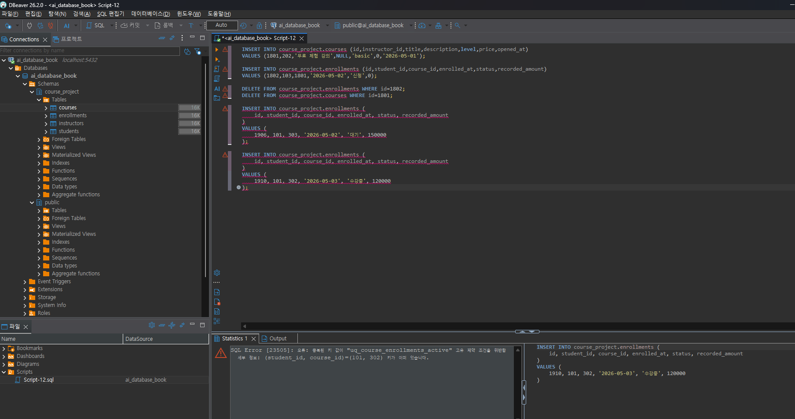
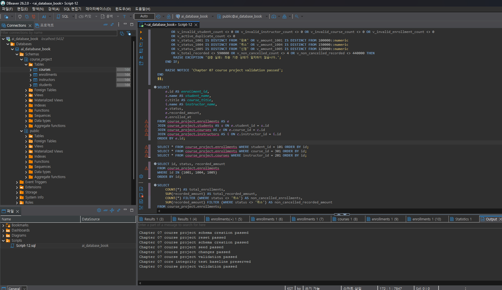
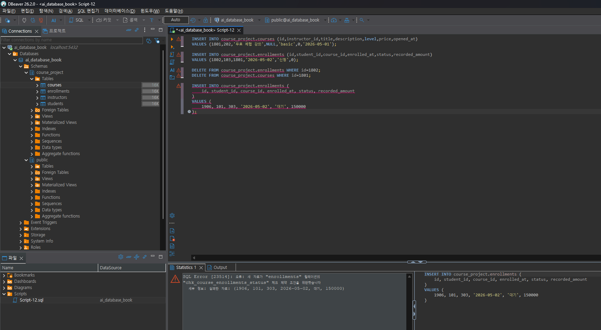

# Chapter 07 확장 실습 답안

> **과제:** 실전 프로젝트 1 — 온라인 강의 수강신청 DB 완성하기  
> **제출 방법:** LMS에는 본인 GitHub 저장소의 `chapter07_answer.md` 파일 URL을 제출한다.

---

## 제출 전 주의

이 파일과 캡처 화면에는 실제 비밀번호, 전체 DB 접속 URL, API Key, 개인정보를 기록하지 않는다.

```text
GitHub 계정 또는 별칭: cyw0927
과제 작성일: 2026-09-16
사용한 AI 도구: ChatGPT
```

---

# 1. 시작 환경 확인

```sql
SELECT current_database();
SELECT current_user;
SELECT current_schema();
SHOW search_path;
SHOW transaction_read_only;
```

| 확인 항목 | 실제 결과 | 의미 |
| --- | --- | --- |
| `current_database()` | `ai_database_book` | 현재 접속한 DB 이름 |
| `current_user` | 실행 결과 확인 필요 | 현재 접속 사용자 |
| `current_schema()` | `public` | 현재 기본 스키마 |
| `search_path` | 실행 결과 확인 필요 | 객체 이름 탐색 순서 |
| `transaction_read_only` | 실행 결과 확인 필요 | 쓰기 가능한 연결인지 확인 |

- [x] 현재 DB가 `ai_database_book`이다.
- [x] 실행할 SQL 범위를 확인했다.
- [x] `course_project` 스키마 생성 및 데이터 변경이 실제로 수행되는 것을 확인했다.
- [ ] `current_user`, `search_path`, `transaction_read_only` 값을 답안에 최종 기록했다.

### 프로젝트 SQL을 실행하기 전에 시작 상태를 확인해야 하는 이유

```text
처음에는 접속한 곳이 어디인지 잘 안 보고 바로 실행할 뻔했다. 다른 데이터베이스에서 실행하면
원하지 않는 곳에 테이블이나 데이터가 생길 수 있다. 이번에는 실제로 데이터를 만들고 바꾸므로
시작 전에 데이터베이스와 실행할 범위를 확인해야겠다고 생각했다.
```

---

# 2. 프로젝트 범위와 요구사항 읽기

## 2-1. 포함 범위

```text
1. 학생 정보를 저장하고 관리한다.
2. 강사와 강의 정보를 저장하고 강의가 어떤 강사를 참조하는지 관리한다.
3. 학생의 수강신청을 별도 사건으로 저장하고 신청 상태를 관리한다.
4. 강의의 현재 기준 가격과 신청 당시 기록 금액을 구분해서 저장한다.
```

## 2-2. 제외 범위

```text
1. 실제 결제 승인·실패·환불 이력은 다루지 않는다.
2. 강의 정원과 대기열은 다루지 않는다.
3. 신청 상태 변경 전체 이력은 별도 테이블로 저장하지 않는다.
4. 강의 콘텐츠·진도·수료, 수강평·쿠폰·할인 이력은 현재 범위에서 제외한다.
```

### 범위를 명확하게 정해야 하는 이유

```text
처음부터 기능을 많이 넣기보다 이번에 만들 범위를 먼저 정하는 게 낫다고 생각했다.
결제나 환불 같은 기능까지 넣으면 지금 배우는 내용보다 일이 훨씬 커질 수 있다.
그래서 현재 요구사항에 있는 것만 먼저 만들고 나머지는 제외했다.
```

## 2-3. 요구사항 / 프로젝트 결정 / 미확정 질문 구분

| ID | 종류 | 내용 요약 | DB 구조/규칙에 미치는 영향 |
| --- | --- | --- | --- |
| P07-R01 | 요구사항 | 학생은 이름·이메일·가입일을 가진다 | `students` 테이블 필요 |
| P07-R05 | 요구사항 | 신청은 학생·강의·신청일·상태·신청 시 기록 금액을 가진다 | `enrollments` 사건 테이블 필요 |
| P07-R07 | 요구사항 | 학생·강사 이메일은 각 테이블에서 공백과 동일 문자열 중복이 불가하다 | CHECK와 UNIQUE 필요 |
| P07-D02 | 프로젝트 결정 | 할인 기능이 없는 현재 범위에서는 신청 생성 시 `courses.price`를 `recorded_amount`에 복사한다 | 현재 가격과 신청 당시 기록 금액을 분리 보존 |
| P07-D03 | 프로젝트 결정 | 같은 학생·강의의 진행 중 신청은 최대 한 건만 허용한다 | 부분 고유 인덱스 필요 |
| P07-Q01 | 미확정 질문 | 학생과 강사 사이에서도 이메일을 전역 고유하게 제한할지 미정 | 현재는 각 테이블별 UNIQUE만 적용 |

### 미확정 질문을 바로 제약조건으로 만들면 안 되는 이유

```text
아직 정하지 않은 규칙을 제가 마음대로 데이터베이스에 넣으면 안 된다고 생각했다.
예를 들어 이메일을 전체 서비스에서 꼭 다르게 해야 하는지 아직 모른다.
일단 질문으로 남겨 두고 실제 규칙이 정해지면 테이블에 반영하는 게 좋겠다.
```

---

# 3. 네 테이블의 한 행 의미와 관계

## 3-1. 한 행 의미

```text
course_project.students 한 행 = 학생 한 명
course_project.instructors 한 행 = 강사 한 명
course_project.courses 한 행 = 개설된 강의 한 개
course_project.enrollments 한 행 = 특정 학생이 특정 강의에 신청한 사건 한 건
```

## 3-2. 키와 중요 규칙

| 테이블 | PK | FK | 중요 규칙 |
| --- | --- | --- | --- |
| students | `id` | 없음 | 이름·이메일·가입일 필수, 이메일 중복/공백 불가 |
| instructors | `id` | 없음 | 이름·이메일·전문분야 필수, 이메일 중복/공백 불가 |
| courses | `id` | `instructor_id` | 강사는 반드시 존재, 난이도 제한, 가격 0 이상 |
| enrollments | `id` | `student_id`, `course_id` | 상태 제한, 기록 금액 0 이상, 진행 중 중복 신청 금지 |

## 3-3. 관계를 양방향 문장으로 작성

```text
instructors ↔ courses:
한 강사는 0개 이상의 강의를 담당할 수 있다.
한 강의는 정확히 한 강사를 참조한다.

students ↔ enrollments:
한 학생은 0개 이상의 수강신청을 가질 수 있다.
한 수강신청은 정확히 한 학생을 참조한다.

courses ↔ enrollments:
한 강의는 0개 이상의 수강신청을 가질 수 있다.
한 수강신청은 정확히 한 강의를 참조한다.
```

### 학생과 강의의 N:M 관계가 `enrollments`를 통해 어떻게 바뀌는지 설명

```text
학생 한 명이 여러 강의를 들을 수 있고, 강의 하나에도 여러 학생이 올 수 있다.
그래서 students와 courses를 바로 연결하지 않고 enrollments에 신청 기록을 한 건씩 넣는다.
이렇게 보니 어느 학생이 어떤 강의를 신청했는지 확인하기 쉬웠다.
```

### `enrollments`가 단순 연결 테이블이 아니라 사건 테이블이라고 볼 수 있는 이유

```text
enrollments에는 학생 번호와 강의 번호뿐 아니라 신청 날짜, 상태, 신청 당시 금액도 들어 있다.
그래서 두 테이블을 이어 주기만 하는 표가 아니라 신청이 실제로 일어난 일을 기록하는 표라고 이해했다.
```

---

# 4. `recorded_amount`의 의미 이해

```text
courses.price = 현재 강의 기준 가격

enrollments.recorded_amount = 신청이 만들어진 시점에 해당 신청 행에 기록한 금액
```

### 두 값이 처음에는 같아도 같은 의미가 아닌 이유

```text
새 신청을 만들 때는 현재 강의 가격을 신청 기록에도 적는다. 나중에 강의 가격이 바뀌어도
예전 신청 금액까지 바뀌면 안 된다. 그래서 courses.price는 지금 가격이고 recorded_amount는
신청할 때 기록한 가격이라고 구분했다.
```

### `recorded_amount`를 실제 결제 성공액이나 회계 매출로 해석하면 안 되는 이유

```text
이 프로젝트에는 결제 성공이나 환불 기록이 없다. recorded_amount는 신청할 때 적어 둔 금액이다.
실제로 돈을 받았는지까지 확인할 수는 없으므로 매출이라고 부르면 안 된다고 알게 됐다.
```

---

# 5. STEP 01 — 스키마와 테이블 생성

실행 파일:

```text
code/chapter07/01_course_project_schema.sql
```

## 5-1. 실행 전 예상

```text
course_project 스키마 존재 여부: 새로 생성되어야 함
예상 테이블 수: 4개
예상 데이터 행 수: students 0 / instructors 0 / courses 0 / enrollments 0
예상되는 명명 제약조건 수: 15개
예상되는 NOT NULL 열 수: 20개
부분 고유 인덱스 존재 여부: uq_course_enrollments_active 존재
```

## 5-2. 실행 결과

```text
실제 테이블 수: 4개
실제 명명 제약조건 수: 15개
실제 NOT NULL 열 수: 20개
부분 고유 인덱스: uq_course_enrollments_active 존재
네 테이블의 실제 행 수: students 0 / instructors 0 / courses 0 / enrollments 0
통과 메시지: Chapter 07 course project schema creation passed
```

### 예상과 실제 비교

```text
실행 전 예상한 구조와 실제 생성 결과가 일치했다.
course_project 스키마 아래에 students, instructors, courses, enrollments 4개 테이블이 생성되었고,
명명 제약조건 15개, NOT NULL 열 20개, 활성 신청 중복 방지용 부분 고유 인덱스가 확인되었다.
초기 상태이므로 네 테이블의 데이터 행 수는 모두 0이었다.
```

### 증거 화면

```text
assignments/chapter07/images/step05_schema.png
```




---

# 6. STEP 02 — Seed 데이터 입력

실행 파일:

```text
code/chapter07/02_course_project_seed.sql
```

## 6-1. 실행 전 예상

```text
students: 3
instructors: 2
courses: 3
enrollments: 4
recorded_amount 합계: 470000
학생 101 신청 건수: 2
강의 301 신청 건수: 2
강사 201 담당 강의 수: 2
활성 중복 신청: 0
1001 상태: 수강중
1004 상태: 신청
1005 존재 여부: 없음
```

## 6-2. 실제 결과

```text
students: 3
instructors: 2
courses: 3
enrollments: 4
recorded_amount 합계: 470000
학생 101 신청 건수: 2
강의 301 신청 건수: 2
강사 201 담당 강의 수: 2
활성 중복 신청: 0
1001 상태: 수강중
1004 상태: 신청
1005 존재 여부: 없음
통과 메시지: Chapter 07 course project seed passed
```

### Seed 데이터를 단순 예제가 아니라 검증 데이터라고 볼 수 있는 이유

```text
Seed 데이터는 화면을 보기 좋게 채우는 용도만은 아니었다. 같은 학생이 여러 번 신청하거나
한 강의에 여러 신청이 있는 경우를 만들어 두어 관계를 확인할 수 있었다. 뒤에서 데이터를 바꾼 뒤
행 수와 금액이 예상대로인지 비교하는 기준으로도 썼다.
```

---

# 7. STEP 03 — 변경 시나리오 실행

실행 파일:

```text
code/chapter07/03_course_project_changes.sql
```

## 7-1. 실행 전에 상태 변화를 예상

| 신청 ID | 변경 전 예상 상태 | 변경 후 예상 상태 | 예상 recorded_amount |
| ---: | --- | --- | ---: |
| 1001 | 수강중 | 완료 | 100000 |
| 1004 | 신청 | 취소 | 150000 |
| 1005 | 없음 | 신청 | 120000 |

```text
변경 후 예상 enrollments 행 수: 5
변경 후 예상 전체 recorded_amount 합계: 590000
변경 후 예상 취소 제외 건수: 4
변경 후 예상 취소 제외 recorded_amount 합계: 440000
활성 중복 신청: 0
```

## 7-2. 실제 결과

```text
1001 상태 / recorded_amount: 완료 / 100000
1004 상태 / recorded_amount: 취소 / 150000
1005 상태 / recorded_amount: 신청 / 120000
최종 enrollments 행 수: 5
전체 recorded_amount 합계: 590000
취소 제외 건수: 4
취소 제외 recorded_amount 합계: 440000
활성 중복 신청: 0
통과 메시지: Chapter 07 course project changes passed
```

### 조건부 UPDATE에서 예상 이전 상태를 확인해야 하는 이유

```text
UPDATE를 할 때 ID만 확인하면 이미 바뀐 데이터를 또 덮어쓸 수도 있다.
그래서 1001이 아직 수강중일 때만 완료로 바꾸고, 1004가 신청 상태일 때만 취소하도록 조건을 넣었다.
바꾸기 전 상태도 확인하는 방법이 더 안전하다고 느꼈다.
```

### 증거 화면

```text
assignments/chapter07/images/step07_changes.png
```



---

# 8. STEP 04 — 최종 완료 게이트 실행

실행 파일:

```text
code/chapter07/04_course_project_validation.sql
```

## 8-1. 최종 검증 결과

```text
최종 행 수 students/instructors/courses/enrollments: 3 / 2 / 3 / 5
서비스 JOIN 결과 행 수: 5
학생 101 신청 수: 2
강의 301 신청 수: 2
강사 201 강의 수: 2
고아 관계 수: 0
활성 중복 신청 수: 0
1001: 완료 / 100000
1004: 취소 / 150000
1005: 신청 / 120000
전체 recorded_amount: 590000
취소 제외 recorded_amount: 440000
통과 메시지: Chapter 07 course project validation passed
```

### SQL 파일 4개가 모두 실행되었다는 사실과 프로젝트 검증 PASS가 다른 이유

```text
SQL 파일이 오류 없이 끝났어도 데이터가 제대로 들어갔는지는 별도로 봐야 했다.
마지막 검증 파일은 행 수와 금액, 연결이 끊긴 신청이 있는지, 중복 신청이 있는지까지 확인했다.
그래서 실행 성공 메시지와 최종 검증 통과는 다른 의미라고 이해했다.
```

### 증거 화면

```text
assignments/chapter07/images/step08_validation.png
```



---

# 9. 무결성 테스트

실행 파일:

```text
code/chapter07/05_course_project_integrity_tests.sql
```

## 9-1. 허용되어야 하는 경계값 1개

```text
테스트 내용: 무료 강의 price=0, description=NULL, 무료 신청 recorded_amount=0
기대 결과: 정상 입력되고 테스트 후 임시 데이터를 삭제할 수 있어야 함
실제 결과: 오류 없이 실행됨
왜 허용되어야 하는가: 0원 강의는 정상적인 확정 가격일 수 있고 description은 선택값이기 때문이다.
```

## 9-2. 실패해야 하는 테스트 1 — 허용되지 않은 상태값

```text
테스트 내용: status='대기'인 수강신청 입력
기대 결과: INSERT 실패
실제 오류 핵심: chk_course_enrollments_status CHECK 제약조건 위반
동작한 제약조건/규칙: chk_course_enrollments_status
왜 실패해야 하는가: 현재 허용 상태는 신청, 수강중, 완료, 취소 네 가지뿐이기 때문이다.
```

실행한 테스트:

```sql
INSERT INTO course_project.enrollments (
    id, student_id, course_id, enrolled_at, status, recorded_amount
)
VALUES (
    1906, 101, 303, '2026-05-02', '대기', 150000
);
```

## 9-3. 실패해야 하는 테스트 2 — 활성 중복 신청

```text
테스트 내용: 학생 101이 강의 302에 두 번째 활성 신청을 추가
기대 결과: INSERT 실패
실제 오류 핵심: uq_course_enrollments_active 중복 키 위반
동작한 인덱스/규칙: uq_course_enrollments_active
왜 실패해야 하는가: 같은 학생과 강의에 신청 또는 수강중 상태가 동시에 두 건 존재하면 안 되기 때문이다.
```

실행한 테스트:

```sql
INSERT INTO course_project.enrollments (
    id, student_id, course_id, enrolled_at, status, recorded_amount
)
VALUES (
    1910, 101, 302, '2026-05-03', '수강중', 120000
);
```

## 9-4. 실패 후 기준 상태 재검증

```text
04 validation 재실행 결과: Chapter 07 course project validation passed
기준 데이터가 유지되었는가: 예
```

### 실패 테스트가 프로젝트 품질 검증에 필요한 이유

```text
정상 데이터가 들어가는 것만 보면 규칙이 잘 작동하는지 알기 어렵다.
일부러 잘못된 값을 넣어 보고 거부되는지 확인해야 데이터베이스가 규칙을 지키는지 알 수 있었다.
```

### 증거 화면

```text
assignments/chapter07/images/step09_integrity.png
```





---

# 10. 재현성 실험

실행 순서:

```text
reset_course_project.sql
→ 01_course_project_schema.sql
→ 02_course_project_seed.sql
→ 03_course_project_changes.sql
→ 04_course_project_validation.sql
```

```text
처음 실행의 최종 결과:
students 3 / instructors 2 / courses 3 / enrollments 5
전체 recorded_amount 590000
취소 제외 recorded_amount 440000
Chapter 07 course project validation passed

재실행의 최종 결과:
students 3 / instructors 2 / courses 3 / enrollments 5
전체 recorded_amount 590000
취소 제외 recorded_amount 440000
Chapter 07 course project validation passed

두 결과가 일치했는가: 예
중간에 수동 데이터 수정이 필요했는가: 아니오
```

### 다른 사람이 같은 순서로 실행해 같은 결과를 얻는 것이 중요한 이유

```text
처음 실행한 결과와 초기화 후 다시 실행한 결과가 같았다. 한 번 우연히 된 게 아니라
같은 순서로 다시 해도 같은 상태가 만들어진다는 뜻이라고 이해했다. 그래야 다른 사람도 따라 해 보고
결과를 비교할 수 있을 것 같다.
```

---

# 11. Chapter 01~06 개인 프로젝트를 중간 프로젝트 초안으로 확장

> 현재 저장소의 기존 개인 프로젝트 주제가 답안에 확정되어 있지 않아 임의로 만들지 않았다.  
> Chapter 05~06에서 사용한 개인 프로젝트 주제를 확인한 뒤 아래 항목을 채운다.

## 11-1. 프로젝트 기본 정보

```text
프로젝트 이름: 기존 개인 프로젝트 확인 후 입력
해결하려는 문제: 기존 개인 프로젝트 확인 후 입력
주요 사용자: 기존 개인 프로젝트 확인 후 입력
```

## 11-2. 포함 범위 / 제외 범위

```text
[포함]
1. 기존 개인 프로젝트 확인 후 입력
2.
3.
4.

[제외]
1. 기존 개인 프로젝트 확인 후 입력
2.
3.
```

## 11-3. 요구사항

| ID | 요구사항 | 관련 테이블/관계 | 검증 방법 후보 |
| --- | --- | --- | --- |
| P07-MR01 | 개인 프로젝트 확정 후 입력 |  |  |
| P07-MR02 |  |  |  |
| P07-MR03 |  |  |  |
| P07-MR04 |  |  |  |
| P07-MR05 |  |  |  |
| P07-MR06 |  |  |  |
| P07-MR07 |  |  |  |
| P07-MR08 |  |  |  |

## 11-4. 프로젝트 결정

| ID | 이번 프로젝트에서 내린 결정 | 이유 | 구현 후보 |
| --- | --- | --- | --- |
| P07-MD01 | 개인 프로젝트 확정 후 입력 |  |  |
| P07-MD02 |  |  |  |
| P07-MD03 |  |  |  |

## 11-5. 미확정 질문

```text
P07-MQ01. 개인 프로젝트 확정 후 입력
P07-MQ02.
P07-MQ03.
```

---

# 12. 개인 프로젝트 ERD와 한 행 의미

## 12-1. 테이블 후보

| 테이블 | 한 행의 의미 | PK 후보 | FK 후보 | 주요 규칙 |
| --- | --- | --- | --- | --- |
| 개인 프로젝트 확정 후 입력 |  |  |  |  |
|  |  |  |  |  |
|  |  |  |  |  |
|  |  |  |  |  |

## 12-2. 관계 문장

```text
1. 개인 프로젝트 확정 후 입력
2.
3.
```

## 12-3. ERD

권장 이미지 경로:

```text
assignments/chapter07/images/personal_project_erd.png
```

### Chapter 05~06 ERD에서 이번에 바꾼 점

```text
기존 개인 프로젝트 ERD 확인 후 작성한다.
```

---

# 13. 개인 프로젝트 완료 기준 만들기

| 번호 | 완료 기준 | 자동 SQL 검증 가능? | 검증 방법 |
| ---: | --- | --- | --- |
| 1 | 개인 프로젝트 확정 후 입력 |  |  |
| 2 |  |  |  |
| 3 |  |  |  |
| 4 |  |  |  |
| 5 |  |  |  |
| 6 |  |  |  |

---

# 14. AI를 프로젝트 리뷰어로 사용

## 14-1. AI에게 전달할 핵심 자료

```text
요구사항: 개인 프로젝트 확정 후 입력
테이블/ERD 설명: 개인 프로젝트 확정 후 입력
프로젝트 결정: 개인 프로젝트 확정 후 입력
미확정 질문: 개인 프로젝트 확정 후 입력
완료 기준: 개인 프로젝트 확정 후 입력
```

## 14-2. 사용한 프롬프트

```text
나는 데이터베이스 입문 수업의 중간 프로젝트 초안을 작성하고 있습니다.
아래 프로젝트를 대신 완성하지 말고 리뷰어로 검토해 주세요.

특히 다음을 찾아 주세요.
1. 요구사항과 ERD가 연결되지 않는 부분
2. 한 행의 의미가 섞인 테이블
3. 빠진 PK/FK 관계 후보
4. 근거 없이 추가한 UNIQUE / NOT NULL / CHECK / CASCADE
5. 미확정 정책을 내가 임의로 확정한 부분
6. Seed 데이터로 검증하기 어려운 요구사항
7. 모호해서 자동 검증할 수 없는 완료 기준
8. 아직 배우지 않은 기능을 꼭 넣지 않아도 되는 부분

정답 ERD나 전체 SQL을 먼저 작성하지 말고 문제점과 확인 질문을 우선순위 순으로 알려 주세요.
```

## 14-3. AI 제안 검토

| AI 제안 | 수용 / 수정 / 보류 / 거절 | 실제 근거 | 반영 내용 |
| --- | --- | --- | --- |
| 개인 프로젝트 확정 후 입력 |  |  |  |
|  |  |  |  |
|  |  |  |  |
|  |  |  |  |

### AI가 미확정 정책을 임의로 확정하려 한 부분이 있었나요?

```text
개인 프로젝트 리뷰 후 작성한다.
```

### AI가 제안한 규칙 중 아직 배우지 않은 기능이라 보류한 것이 있나요?

```text
개인 프로젝트 리뷰 후 작성한다.
```

### AI 활용 후 실제로 좋아진 부분

```text
개인 프로젝트 리뷰 후 작성한다.
```

---

# 15. 최종 성찰

```text
1. 데이터베이스 프로젝트가 끝났다고 말하려면
   SQL 파일만 있는 게 아니라 필요한 테이블과 데이터가 만들어졌는지 확인해야 한다.

2. Seed 데이터를 넣는 이유는
   나중에 관계나 숫자가 맞는지 다시 확인할 기준을 만들기 위해서다.

3. 일부러 실패하는 테스트도 해 보는 이유는
   잘못된 데이터가 실제로 막히는지 확인하기 위해서다.

4. 요구사항과 내가 정한 방법을 구분하는 이유는
   꼭 지켜야 하는 조건과 내가 선택한 방법을 헷갈리지 않기 위해서다.

5. 내가 만든 개인 프로젝트에서 가장 먼저 추가 확인해야 할 정책은
   개인 프로젝트 주제를 확정한 뒤 작성한다.
```

---

# 16. 제출 체크리스트

- [x] `chapter07_answer.md`를 본인 저장소에 만들었다.
- [x] 현재 DB가 `ai_database_book`임을 확인했다.
- [x] 프로젝트 포함/제외 범위를 설명했다.
- [x] 요구사항/결정/미확정 질문을 구분했다.
- [x] 네 테이블의 한 행 의미와 관계를 설명했다.
- [x] `01_course_project_schema.sql`을 실행하고 결과를 확인했다.
- [x] `02_course_project_seed.sql`의 기준 상태를 확인했다.
- [x] `03_course_project_changes.sql` 전후 상태를 비교했다.
- [x] `04_course_project_validation.sql` PASS를 확인했다.
- [x] 허용 경계값 1개를 확인했다.
- [x] 실패 테스트 2개를 한 구간씩 실행했다.
- [x] 실패 후 validation을 다시 실행했다.
- [x] reset → 01 → 02 → 03 → 04 재실행으로 재현성을 확인했다.
- [ ] 개인 프로젝트 요구사항 8개 이상을 작성했다.
- [ ] 프로젝트 결정 3개 이상과 미확정 질문 3개 이상을 작성했다.
- [ ] 개인 프로젝트 ERD를 작성했다.
- [ ] 검증 가능한 완료 기준 6개 이상을 작성했다.
- [ ] AI 제안을 수용/수정/보류/거절로 구분했다.
- [ ] 핵심 캡처를 `assignments/chapter07/images/`에 정리했다.
- [ ] 캡처에 비밀번호나 개인정보가 없는지 최종 확인했다.
- [ ] GitHub 웹에서 Markdown과 이미지가 정상적으로 보이는지 확인했다.

---

# 17. LMS 제출 URL

```text
https://github.com/cyw0927/ai-database-study/blob/main/assignments/chapter07/chapter07_answer.md
```

> 저장소 메인 URL이나 교수자 템플릿 URL이 아니라 위 최종 답안 파일 URL을 제출한다.
