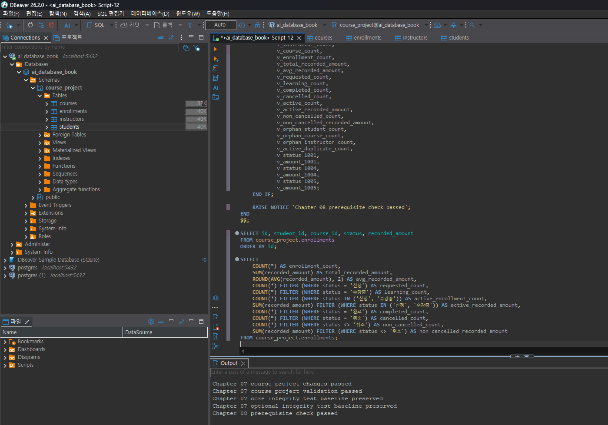
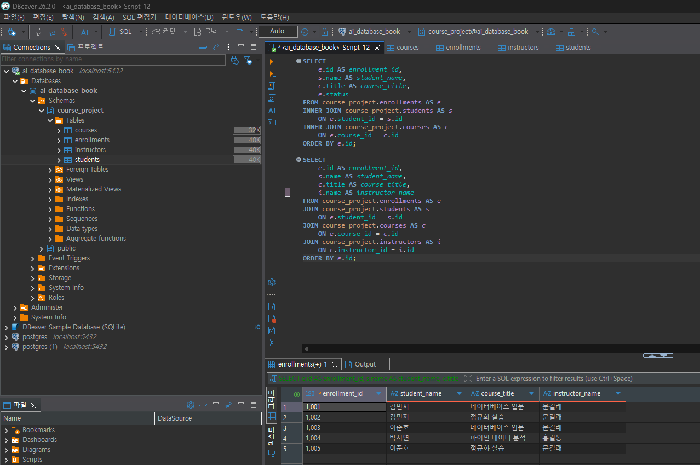
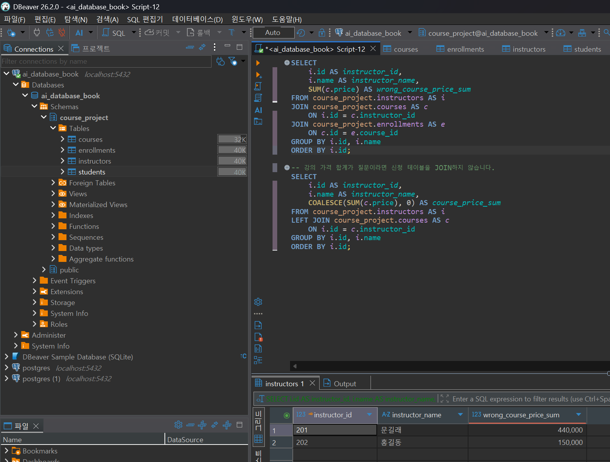
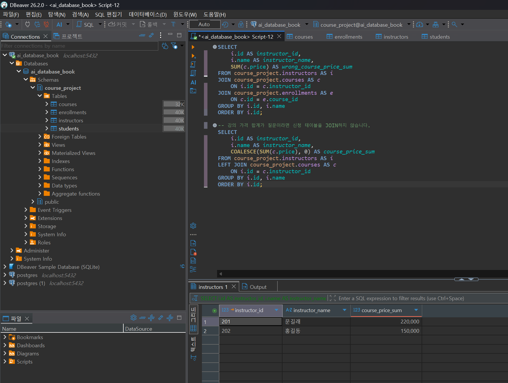
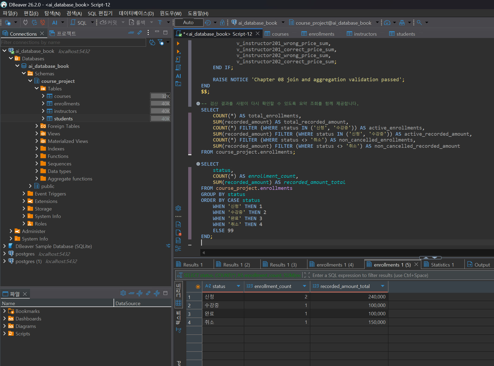

# Chapter 08 확장 실습 답안

> **과제:** JOIN과 집계로 서비스 질문에 답하기  
> **제출 방법:** LMS에는 본인 GitHub 저장소의 `chapter08_answer.md` 파일 URL을 제출한다.

---

## 제출 전 주의

이 파일과 캡처 화면에는 실제 비밀번호, 전체 DB 접속 URL, API Key, 개인정보를 기록하지 않는다.

```text
GitHub 계정 또는 별칭: cyw0927
과제 작성일: 2026-09-17
사용한 AI 도구: ChatGPT, Claude
```

> 이 답안은 저장소의 Chapter 07 최종 데이터와 Chapter 08 검증 SQL을 기준으로 작성했다.  
> 모든 SQL은 로컬 PostgreSQL(`ai_database_book`)에 `psql`로 직접 접속하여 실행했고, 결과값이 예상과 모두 일치함을 확인했다(`00_check_course_project.sql`, `01_join_queries.sql`, `02_aggregation_queries.sql`, `03_join_aggregation_validation.sql` 전부 실행·검증 완료).  
> 다만 `step09_over_aggregation.png`, `step11_validation.png` 두 캡처는 DBeaver 화면으로 직접 남겨야 하는 증거이므로 로컬 DBeaver에서 실행 후 캡처하여 채워 넣는다.

---

# 1. Chapter 07 기준 상태 확인

다음을 실행한다.

```text
code/chapter08/00_check_course_project.sql
```

## 1-1. 사전 검사 결과

```text
검증 메시지: Chapter 08 prerequisite check passed (psql로 직접 실행하여 확인 완료)

students 행 수: 3
instructors 행 수: 2
courses 행 수: 3
enrollments 행 수: 5

전체 신청 건수: 5
전체 recorded_amount: 590000
활성 신청 건수: 3
활성 recorded_amount: 340000
취소 제외 신청 건수: 4
취소 제외 recorded_amount: 440000
```

기준값:

```text
students = 3
instructors = 2
courses = 3
enrollments = 5

전체 = 5 / 590000
활성 = 3 / 340000
취소 제외 = 4 / 440000
```

### 기준값이 다르면 그대로 진행하면 안 되는 이유

```text
Chapter 08의 JOIN과 집계 결과는 Chapter 07 최종 데이터 상태를 기준으로 검증한다
기준 행 수나 상태가 달라지면 같은 SQL을 실행해도 결과가 달라져서
SQL이 잘못된 것인지 데이터 상태가 달라진 것인지 구분하기 어렵다
따라서 먼저 Chapter 07 기준 상태를 복원하고 사전 검사를 통과한 뒤 진행해야 한다
```

### 증거 화면

권장 경로:

```text
assignments/chapter08/images/step01_prerequisite.png
```

---


# 2. 업무 질문을 SQL보다 먼저 정의하기

## 질문 A

```text
업무 질문: 수강신청 한 건마다 학생 이름과 강의 제목을 보여 주세요.
결과 한 행의 의미: 수강신청 한 건
포함 상태: 신청, 수강중, 완료, 취소 전체
제외 상태: 없음
JOIN할 테이블: enrollments, students, courses
JOIN 경로: enrollments.student_id = students.id, enrollments.course_id = courses.id
INNER JOIN / LEFT JOIN 선택: INNER JOIN
그 이유: 각 신청은 유효한 학생과 강의를 반드시 참조하는 구조이고, 신청 한 건을 기준으로 연결된 정보만 조회하면 되기 때문이다.
예상 행 수: 5행
```

## 질문 B

```text
업무 질문: 강의별 취소 제외 신청 수, 고유 학생 수, recorded_amount 합계를 보여 주세요.
결과 한 행의 의미: 강의 한 개
포함 상태: 신청, 수강중, 완료
제외 상태: 취소
JOIN할 테이블: courses, enrollments
JOIN 경로: courses.id = enrollments.course_id
집계 대상: COUNT(e.id), COUNT(DISTINCT e.student_id), SUM(e.recorded_amount)
예상 결과: 301 = 2건 / 2명 / 200000, 302 = 2건 / 2명 / 240000, 303 = 0건 / 0명 / 0
```

## 질문 C

```text
업무 질문: 학생별 취소 제외 신청 수를 보여 주되 신청이 0건인 학생도 표시해 주세요.
결과 한 행의 의미: 학생 한 명
포함 상태: 신청, 수강중, 완료
제외 상태: 취소
0건인 부모도 보여야 하는가: 예. 모든 학생이 결과에 남아야 한다.
NULL을 어떻게 해석할 것인가: 오른쪽 enrollments가 NULL이면 해당 학생에게 취소 제외 신청이 없다는 뜻이다.
예상 결과: 김민지 2건, 이준호 2건, 박서연 0건
```

---

# 3. INNER JOIN과 다중 JOIN

## 3-1. 신청 한 건마다 학생 이름과 강의 제목 조회

실행 전 예상:

```text
결과 한 행 = 수강신청 한 건
예상 행 수 = 5행
JOIN 경로 = enrollments.student_id → students.id, enrollments.course_id → courses.id
```

내가 실행할 SQL:

```sql
SELECT
    e.id AS enrollment_id,
    s.name AS student_name,
    c.title AS course_title,
    e.status
FROM course_project.enrollments AS e
INNER JOIN course_project.students AS s
    ON e.student_id = s.id
INNER JOIN course_project.courses AS c
    ON e.course_id = c.id
ORDER BY e.id;
```

실제 결과:

```text
실제 행 수: 5행 (psql로 직접 실행하여 확인 완료)
예상과 일치 여부: 일치함
```

### 학생 이름이 여러 번 보이는 것이 중복 오류가 아닐 수 있는 이유

```text
결과 한 행의 기준이 학생 한 명이 아니라 수강신청 한 건이기 때문이다.
한 학생은 여러 강의를 신청할 수 있으므로 같은 학생 이름이 여러 신청 행에 반복되는 것은 정상적인 1:N 관계 결과이다.
따라서 이름이 반복된다는 이유만으로 DISTINCT를 사용하면 안 된다.
```

## 3-2. 학생·강의·강사까지 연결

```text
결과 한 행 = 수강신청 한 건
강사까지 가는 JOIN 경로 = enrollments.course_id → courses.id → courses.instructor_id → instructors.id
```

```sql
SELECT
    e.id AS enrollment_id,
    s.name AS student_name,
    c.title AS course_title,
    i.name AS instructor_name
FROM course_project.enrollments AS e
JOIN course_project.students AS s
    ON e.student_id = s.id
JOIN course_project.courses AS c
    ON e.course_id = c.id
JOIN course_project.instructors AS i
    ON c.instructor_id = i.id
ORDER BY e.id;
```

실제 행 수:

```text
5행 (psql로 직접 실행하여 확인 완료: 문길래가 301·302, 홍길동이 303 담당)
```

### 왜 PK/FK 경로를 따라 JOIN해야 하는가?

```text
학생명이나 강사명처럼 중복될 수 있는 일반 열을 임의로 연결하면 잘못된 행이 붙을 수 있다.
반면 PK/FK는 테이블 사이의 실제 관계를 표현하므로 enrollments → courses → instructors처럼
정의된 키 경로를 따라 JOIN해야 데이터의 의미를 유지할 수 있다.
```

### 증거 화면

권장 경로:

```text
assignments/chapter08/images/step03_inner_join.png
```



---

# 4. LEFT JOIN과 0건 표현

## 4-1. 강의별 취소 제외 신청 수

신청이 없는 강의도 결과에 남도록 작성한다.

실행 전:

```text
결과 한 행 = 강의 한 개
강의 303의 예상 실제 신청 수 = 0
강의 303의 예상 고유 학생 수 = 0
강의 303의 예상 recorded_amount = 0
```

내 SQL:

```sql
SELECT
    c.id AS course_id,
    c.title AS course_title,
    COUNT(e.id) AS non_cancelled_count,
    COUNT(DISTINCT e.student_id) AS student_count,
    COALESCE(SUM(e.recorded_amount), 0) AS non_cancelled_recorded_amount
FROM course_project.courses AS c
LEFT JOIN course_project.enrollments AS e
    ON c.id = e.course_id
   AND e.status <> '취소'
GROUP BY c.id, c.title
ORDER BY c.id;
```

실제 결과:

```text
강의 301: 2건 / 2명 / 200000 (psql로 직접 실행하여 확인 완료)
강의 302: 2건 / 2명 / 240000 (psql로 직접 실행하여 확인 완료)
강의 303: 0건 / 0명 / 0 (psql로 직접 실행하여 확인 완료)
```

## 4-2. `COUNT(*)`와 `COUNT(e.id)` 비교

강의 303을 기준으로 작성한다.

```text
COUNT(*) 결과: 1
COUNT(e.id) 결과: 0
COUNT(DISTINCT e.student_id) 결과: 0
```

### 왜 `COUNT(*) = 1`인데 실제 신청 수는 0일 수 있나요?

```text
LEFT JOIN은 오른쪽에 조건을 만족하는 신청이 없어도 왼쪽의 강의 303 행을 남긴다.
따라서 JOIN 결과 자체는 NULL이 채워진 한 행이 존재하므로 COUNT(*)는 1이 된다.
하지만 실제 신청 id는 NULL이므로 실제 연결된 신청 수는 0건이다.
```

### 자식 사건 수를 셀 때 `COUNT(child.id)`가 더 적절한 이유

```text
COUNT(e.id)는 NULL을 세지 않기 때문에 실제로 연결된 enrollments 사건만 계산한다.
부모를 유지하기 위한 NULL 확장 행을 신청 한 건으로 잘못 세지 않으므로 자식 사건 수를 셀 때 더 적절하다.
```

---

# 5. `LEFT JOIN`에서 `ON`과 `WHERE` 조건 비교

취소 제외 신청만 연결한다고 가정한다.

## 5-1. 조건을 `ON`에 둔 경우

```sql
SELECT
    s.id,
    s.name,
    COUNT(e.id) AS non_cancelled_count
FROM course_project.students AS s
LEFT JOIN course_project.enrollments AS e
    ON s.id = e.student_id
   AND e.status <> '취소'
GROUP BY s.id, s.name
ORDER BY s.id;
```

```text
결과 학생 수: 3명
박서연 포함 여부: 포함됨. 취소 제외 신청 수 0건으로 남음.
```

## 5-2. 조건을 `WHERE`에 둔 경우

```sql
SELECT
    s.id,
    s.name,
    COUNT(e.id) AS non_cancelled_count
FROM course_project.students AS s
LEFT JOIN course_project.enrollments AS e
    ON s.id = e.student_id
WHERE e.status <> '취소'
GROUP BY s.id, s.name
ORDER BY s.id;
```

```text
결과 학생 수: 2명
박서연 포함 여부: 제외됨.
```

## 5-3. 차이 설명

```text
ON 조건이 LEFT JOIN의 오른쪽 연결 대상을 제한하는 방식:
취소 상태의 신청을 연결 대상에서 제외하지만 왼쪽 students 행 자체는 유지한다.
그래서 취소 제외 신청이 없는 박서연도 NULL 확장 행으로 결과에 남는다.

WHERE 조건이 JOIN 이후 결과 행을 제거하는 방식:
LEFT JOIN이 끝난 뒤 e.status <> '취소' 조건을 적용한다.
박서연의 오른쪽 값은 NULL인데 NULL <> '취소'는 TRUE가 아니므로 해당 행이 제거된다.

이번 사례에서 ON = 3명, WHERE = 2명이 되는 이유:
ON에 조건을 두면 모든 학생을 보존하지만 WHERE에 조건을 두면 취소 제외 신청이 없는 학생이 최종 결과에서 빠지기 때문이다.
```

---

# 6. 신청이 없는 학생 찾기 — 두 방법 비교

## 방법 1. `LEFT JOIN ... IS NULL`

```sql
SELECT
    s.id,
    s.name,
    s.email
FROM course_project.students AS s
LEFT JOIN course_project.enrollments AS e
    ON s.id = e.student_id
   AND e.status <> '취소'
WHERE e.id IS NULL;
```

## 방법 2. `NOT EXISTS`

```sql
SELECT
    s.id,
    s.name,
    s.email
FROM course_project.students AS s
WHERE NOT EXISTS (
    SELECT 1
    FROM course_project.enrollments AS e
    WHERE e.student_id = s.id
      AND e.status <> '취소'
);
```

```text
방법 1 결과: 박서연 1명 (psql로 직접 실행하여 확인 완료)
방법 2 결과: 박서연 1명 (psql로 직접 실행하여 확인 완료)
두 결과가 같은가: 같음. 직접 실행하여 최종 확인함.
찾아진 학생: 박서연
```

### 두 방식의 공통 의미를 자신의 말로 설명

```text
두 SQL 모두 부모인 학생을 기준으로 취소 제외 신청이 하나도 존재하지 않는 학생을 찾는다.
표현 방식은 다르지만 업무적으로는 '조건을 만족하는 자식 행이 존재하지 않는 부모 찾기'라는 같은 질문이다.
```

---

# 7. 기본 집계 검산

저장소의 `00_check_course_project.sql`과 `03_join_aggregation_validation.sql`이 아래 값을 검증하도록 작성되어 있다. 로컬 실행 후 실제 결과가 같은지 최종 확인한다.

| 분석 범위 | 예상 건수 | 실제 건수 | 예상 금액 | 실제 금액 | 일치? |
| --- | ---: | ---: | ---: | ---: | --- |
| 전체 신청 | 5 | 5 | 590000 | 590000 | 일치 |
| 활성 신청 | 3 | 3 | 340000 | 340000 | 일치 |
| 취소 제외 | 4 | 4 | 440000 | 440000 | 일치 |
| 취소 | 1 | 1 | 150000 | 150000 | 일치 |

> 위 값은 `psql`로 `00_check_course_project.sql`, `02_aggregation_queries.sql`을 직접 실행하여 확인했다.

## 7-1. 전체 평균 `recorded_amount`

```text
예상 평균: 118000.00
실제 평균: 118000.00 (psql로 직접 실행하여 확인 완료)
```

## 7-2. 취소 제외 평균

```text
예상 평균: 110000.00
실제 평균: 110000.00 (psql로 직접 실행하여 확인 완료)
```

### `recorded_amount`를 실제 회계 매출이라고 부르면 안 되는 이유

```text
recorded_amount는 수강신청이 생성된 시점에 신청 행에 기록한 금액이다.
현재 데이터 모델에는 실제 결제 승인, 결제 실패, 환불 같은 회계 사건이 저장되어 있지 않다.
따라서 recorded_amount 합계를 실제 결제 성공액이나 회계 매출이라고 해석하면 안 된다.
```

---

# 8. `GROUP BY`, `HAVING`, `FILTER`

## 8-1. 상태별 신청 건수

```sql
SELECT
    status,
    COUNT(*) AS enrollment_count,
    SUM(recorded_amount) AS total_recorded_amount
FROM course_project.enrollments
GROUP BY status
ORDER BY CASE status
    WHEN '신청' THEN 1
    WHEN '수강중' THEN 2
    WHEN '완료' THEN 3
    WHEN '취소' THEN 4
    ELSE 99
END;
```

결과:

```text
신청: 2건
수강중: 1건
완료: 1건
취소: 1건
상태별 합계: 5건
```

### 상태별 건수 합이 전체 신청 5건과 맞는지 검산

```text
2 + 1 + 1 + 1 = 5이므로 전체 enrollments 5건과 일치한다.
psql로 직접 실행한 결과 화면에서도 신청 2 / 수강중 1 / 완료 1 / 취소 1로 동일하게 확인했다.
```

## 8-2. 강의별 취소 제외 신청 수와 금액

```sql
SELECT
    c.id AS course_id,
    c.title AS course_title,
    COUNT(e.id) AS non_cancelled_count,
    COUNT(DISTINCT e.student_id) AS student_count,
    COALESCE(SUM(e.recorded_amount), 0) AS non_cancelled_recorded_amount
FROM course_project.courses AS c
LEFT JOIN course_project.enrollments AS e
    ON c.id = e.course_id
   AND e.status <> '취소'
GROUP BY c.id, c.title
ORDER BY c.id;
```

```text
강의 301: 2건 / 2명 / 200000
강의 302: 2건 / 2명 / 240000
강의 303: 0건 / 0명 / 0
강의별 합계를 다시 더한 값: 440000
전체 취소 제외 기준 440000과 일치 여부: 일치
```

## 8-3. `HAVING` 사용

취소 제외 신청이 2건 이상인 강의를 조회한다.

```sql
SELECT
    c.id,
    c.title,
    COUNT(e.id) AS enrollment_count
FROM course_project.courses AS c
JOIN course_project.enrollments AS e
    ON c.id = e.course_id
WHERE e.status <> '취소'
GROUP BY c.id, c.title
HAVING COUNT(e.id) >= 2
ORDER BY c.id;
```

```text
예상 강의 수: 2개
실제 강의 수: 2개 (psql로 직접 실행하여 확인 완료: 강의 301, 302)
```

### `WHERE`와 `HAVING`의 차이

```text
WHERE는 GROUP BY 전에 개별 신청 행을 필터링한다.
HAVING은 GROUP BY가 끝난 뒤 만들어진 그룹의 집계 결과를 조건으로 필터링한다.
이번 SQL에서는 먼저 취소 신청을 WHERE로 제외하고, 이후 강의별 COUNT가 2 이상인 그룹만 HAVING으로 남긴다.
```

---

# 9. 과대 집계 오류 직접 관찰

강사 201의 강의 가격 합계를 구한다고 가정한다.

## 9-1. 신청까지 JOIN해서 잘못 집계한 결과

```sql
SELECT
    i.id AS instructor_id,
    i.name AS instructor_name,
    SUM(c.price) AS wrong_course_price_sum
FROM course_project.instructors AS i
JOIN course_project.courses AS c
    ON i.id = c.instructor_id
JOIN course_project.enrollments AS e
    ON c.id = e.course_id
WHERE i.id = 201
GROUP BY i.id, i.name;
```

```text
강사 201 잘못된 가격 합계: 440000
```

## 9-2. 강의 수준에서 올바르게 집계

```sql
SELECT
    i.id AS instructor_id,
    i.name AS instructor_name,
    COALESCE(SUM(c.price), 0) AS course_price_sum
FROM course_project.instructors AS i
LEFT JOIN course_project.courses AS c
    ON i.id = c.instructor_id
WHERE i.id = 201
GROUP BY i.id, i.name;
```

```text
강사 201 올바른 가격 합계: 220000
```

## 9-3. 왜 두 결과가 달라졌나요?

```text
JOIN 전 강의 행 수: 강사 201의 강의는 301, 302 두 개이므로 2행
JOIN 후 강의가 반복된 이유: 강의 301에 신청 2건, 강의 302에 신청 2건이 연결되어 각 강의 행이 신청 수만큼 반복됨
SUM이 무엇을 반복해서 더했는가: 301의 가격 100000을 2번, 302의 가격 120000을 2번 더해서 440000이 됨
```

### `SUM(DISTINCT c.price)`를 일반적인 해결책으로 사용하면 안 되는 이유

```text
DISTINCT는 강의 id가 아니라 가격 값 자체의 중복을 제거한다.
서로 다른 두 강의가 우연히 같은 가격을 가지고 있으면 정상적으로 더해야 할 가격 하나까지 제거될 수 있다.
따라서 DISTINCT로 증상을 숨기기보다 질문의 집계 단위가 강의라면 신청 테이블을 불필요하게 JOIN하지 않는 것이 우선이다.
```

### 증거 화면

강사 201 기준으로 잘못된 합계(440,000)와 올바른 합계(220,000)를 각각 캡처했다.

```text
assignments/chapter08/images/step09a_wrong_aggregation.png
assignments/chapter08/images/step09b_correct_aggregation.png
```




---

# 10. 상세 결과 ↔ 집계 결과 교차 검산

강의 301을 선택한다.

```text
선택한 course_id: 301
강의 제목: 데이터베이스 입문
```

## 10-1. 상세 신청 행 조회

```sql
SELECT
    id,
    student_id,
    status,
    recorded_amount
FROM course_project.enrollments
WHERE course_id = 301
ORDER BY id;
```

```text
상세 행 수: 2행
상세 recorded_amount를 직접 더한 값: 100000 + 100000 = 200000
```

## 10-2. 집계 SQL

```sql
SELECT
    COUNT(*) AS enrollment_count,
    SUM(recorded_amount) AS total_recorded_amount
FROM course_project.enrollments
WHERE course_id = 301;
```

```text
집계 건수: 2
집계 금액: 200000
```

## 10-3. 비교

```text
상세 행 수와 COUNT 결과 일치 여부: 일치함. 2 = 2
상세 금액 합과 SUM 결과 일치 여부: 일치함. 200000 = 200000
다르다면 원인: JOIN 경로, 상태 조건, COUNT 대상, 중복 행, GROUP BY 수준을 다시 확인한다.
```

> 위 값은 psql로 직접 실행하여 최종 확인했다.

---

# 11. 자동 완료 게이트

다음을 실행한다.

```text
code/chapter08/03_join_aggregation_validation.sql
```

```text
최종 검증 메시지: Chapter 08 join and aggregation validation passed (psql로 직접 실행하여 확인 완료)
```

기대 메시지:

```text
Chapter 08 join and aggregation validation passed
```

### 자동 검증이 통과했어도 사람이 SQL 의미를 설명해야 하는 이유

```text
자동 검증은 현재 준비된 샘플 데이터에서 정해 둔 값과 결과가 같은지를 확인한다.
하지만 업무 질문의 범위를 잘못 정의했거나 recorded_amount의 의미를 잘못 해석한 경우까지 자동으로 판단할 수는 없다.
또 현재 데이터에서는 우연히 맞는 SQL이 미래의 다른 데이터에서는 틀릴 수도 있다.
따라서 PASS 여부와 별개로 결과 한 행의 의미, 상태 범위, JOIN 경로와 집계 단위를 사람이 설명하고 검산해야 한다.
```

### 증거 화면

권장 경로:

```text
assignments/chapter08/images/step11_validation.png
```



---

# 12. 개인 프로젝트 업무 질문 3개 만들기

Chapter 01~04에서 정한 개인 프로젝트 **개인 예산관리 시스템**을 사용한다.

```text
지금까지 실제 PostgreSQL에 만든 테이블: expenses (지출 한 건 = 한 행, user_id/category/amount/spent_at)
아직 실제로 만들지 않은 테이블: users, budgets
```

이번 확장에서는 `users`(사용자)와 `budgets`(카테고리별 월 예산 한도)를 개념적으로 추가했다고 가정하고 업무 질문을 만든다. 두 테이블을 실제 PostgreSQL에 아직 구현하지 않았으므로 **SQL 초안 + 예상 결과 + 검산 방법 + 미실행 표시**까지만 작성한다.

```text
users(id, name) — 사용자 한 명
budgets(category, monthly_limit) — 카테고리 한 개의 월 한도
expenses(expense_id, user_id, category, amount, spent_at) — 지출 한 건
```

| 질문 ID | 업무 질문 | 결과 한 행 | 포함/제외 범위 | JOIN 경로 | 집계 대상 | 검산 방법 |
| --- | --- | --- | --- | --- | --- | --- |
| P08-Q01 | 사용자별 이번 달 총 지출액은 얼마인가? | 사용자 한 명 | 2026-04-01~2026-04-30 지출 전체, 지출 0건 사용자도 표시 | users LEFT JOIN expenses (ON user_id, 기간 조건 포함) | COUNT(expense_id), SUM(amount) | 사용자별 상세 지출 행을 직접 조회해 건수·합계 재계산 후 비교 |
| P08-Q02 | 카테고리별 이번 달 지출 건수와 합계는 얼마인가? (예산은 있지만 지출이 없는 카테고리도 표시) | 카테고리 한 개 | 예산이 설정된 카테고리 전체, 2026-04 지출만 포함 | budgets LEFT JOIN expenses (ON category, 기간 조건 포함) | COUNT(expense_id), SUM(amount) | 카테고리별 상세 지출 행 합계와 GROUP BY 집계값 비교 |
| P08-Q03 | 이번 달 예산 한도를 초과한 카테고리는 어디인가? | 카테고리 한 개 | 예산이 설정된 카테고리만 (한도 비교가 필요하므로 예산 없는 지출은 제외) | budgets INNER JOIN expenses ON category (기간 조건 포함) | SUM(amount), monthly_limit과 비교 (HAVING) | 초과로 표시된 카테고리의 상세 지출 행을 직접 합산해 한도 초과 여부 재확인 |

## 12-1. 질문 1 SQL — 사용자별 이번 달 총 지출액

```text
미실행 (users 테이블 미구현) — 아래는 SQL 초안이다.
```

```sql
SELECT
    u.id AS user_id,
    u.name AS user_name,
    COUNT(e.expense_id) AS expense_count,
    COALESCE(SUM(e.amount), 0) AS total_amount
FROM users AS u
LEFT JOIN expenses AS e
    ON u.id = e.user_id
   AND e.spent_at >= '2026-04-01'
   AND e.spent_at <  '2026-05-01'
GROUP BY u.id, u.name
ORDER BY u.id;
```

```text
예상 결과: 지출이 없는 사용자도 0건 / 0원으로 남아야 한다 (LEFT JOIN이므로).
실제 결과: 미실행
검산 방법: WHERE u.id = <특정 사용자> AND spent_at 조건으로 상세 지출 행을 조회한 뒤
           행 수와 SUM(amount)을 위 GROUP BY 결과와 비교한다.
```

## 12-2. 질문 2 SQL — 카테고리별 이번 달 지출 건수·합계

```text
미실행 (budgets 테이블 미구현) — 아래는 SQL 초안이다.
```

```sql
SELECT
    b.category,
    b.monthly_limit,
    COUNT(e.expense_id) AS expense_count,
    COALESCE(SUM(e.amount), 0) AS total_amount
FROM budgets AS b
LEFT JOIN expenses AS e
    ON b.category = e.category
   AND e.spent_at >= '2026-04-01'
   AND e.spent_at <  '2026-05-01'
GROUP BY b.category, b.monthly_limit
ORDER BY b.category;
```

```text
예상 결과: 예산은 있지만 이번 달 지출이 없는 카테고리도 0건 / 0원으로 표시되어야 한다.
실제 결과: 미실행
검산 방법: 카테고리 하나를 골라 expenses를 category와 기간으로 직접 필터링한 뒤
           행 수·합계를 COUNT/SUM 결과와 비교한다.
```

## 12-3. 질문 3 SQL — 이번 달 예산 초과 카테고리

```text
미실행 (budgets 테이블 미구현) — 아래는 SQL 초안이다.
```

```sql
SELECT
    b.category,
    b.monthly_limit,
    SUM(e.amount) AS total_amount
FROM budgets AS b
JOIN expenses AS e
    ON b.category = e.category
   AND e.spent_at >= '2026-04-01'
   AND e.spent_at <  '2026-05-01'
GROUP BY b.category, b.monthly_limit
HAVING SUM(e.amount) > b.monthly_limit
ORDER BY b.category;
```

```text
예상 결과: 카테고리별 합계가 monthly_limit을 넘는 행만 남는다.
실제 결과: 미실행
검산 방법: HAVING으로 걸러진 카테고리마다 상세 지출 행을 직접 합산해
           monthly_limit 대비 실제로 초과했는지 재확인한다.
과대 집계 주의: 여기서는 카테고리 단위 집계이므로 budgets·expenses 외에 users처럼
           또 다른 1:N 관계까지 JOIN하면 지출 행이 중복 반복되어 SUM이 부풀 수 있다.
```

---

# 13. AI를 JOIN·집계 리뷰어로 활용

## 13-1. 내가 AI에게 전달한 질문

```text
강의별 취소 제외 신청 수와 recorded_amount 합계를 구하는 SQL을 검토해 주세요.
SQL이 실행된다는 이유만으로 정답이라고 판단하지 말고,
결과 한 행의 의미, 상태 범위, PK/FK JOIN 경로, LEFT JOIN 선택 이유,
COUNT 대상, NULL과 0건 해석, 과대 집계 위험, 상세 결과 검산 방법을 확인해 주세요.
특히 신청이 0건인 강의도 결과에 남아야 합니다.
```

## 13-2. 내 SQL과 AI SQL 비교

| 검토 항목 | 내 판단/SQL | AI 제안 | 최종 선택 | 이유 |
| --- | --- | --- | --- | --- |
| 결과 한 행 | 강의 한 개 | 강의 한 개로 유지 | 수용 | 질문이 강의별 집계이므로 GROUP BY 수준이 강의여야 함 |
| 상태 범위 | 취소 제외 | `e.status <> '취소'` | 수용 | 신청·수강중·완료만 집계하기 위함 |
| JOIN 경로 | `c.id = e.course_id` | PK/FK 경로 유지 | 수용 | 실제 관계를 따라야 잘못된 연결을 막을 수 있음 |
| INNER/LEFT 선택 | LEFT JOIN | LEFT JOIN 유지 | 수용 | 신청 0건인 강의 303도 결과에 남겨야 함 |
| COUNT 대상 | `COUNT(e.id)` | `COUNT(e.id)` 유지 | 수용 | `COUNT(*)`는 NULL 확장 행까지 1로 셀 수 있음 |
| 과대 집계 위험 | 신청 행의 `recorded_amount`만 합계 | 강의 가격과 신청 금액의 집계 단위를 구분 | 수용 | 서로 다른 수준의 값을 1:N JOIN 뒤 바로 SUM하면 중복될 수 있음 |
| 상세 검산 방법 | 강의별 상세 신청 행 조회 후 COUNT/SUM 비교 | 301·302·303을 각각 상세 행과 비교 | 수용 | 집계 결과를 원본 사건 행으로 역검산할 수 있음 |

### AI가 만든 SQL에서 발견한 위험 또는 확인한 점

```text
LEFT JOIN에서 취소 제외 조건을 WHERE에 두면 강의 303처럼 조건을 만족하는 신청이 없는 강의가 사라질 수 있다.
또 COUNT(*)를 사용하면 강의 303의 NULL 확장 행을 1건으로 잘못 셀 수 있다.
따라서 상태 조건은 ON에 두고 실제 신청 사건 수는 COUNT(e.id)로 세는 것이 질문의 의미와 맞다.
COALESCE(SUM(...), 0)는 0건 강의의 표시를 0으로 바꾸는 용도이며 JOIN 중복 문제를 해결하는 기능은 아니다.
```

### AI SQL이 실행 성공했다고 바로 정답이라고 할 수 없는 이유

```text
SQL은 문법적으로 정상 실행되어도 질문과 다른 행 단위로 집계하거나 불필요한 1:N JOIN 때문에 값을 중복 합산할 수 있다.
실행 성공은 문법 오류가 없다는 뜻일 뿐 업무 의미와 집계 정확성까지 보장하지 않는다.
따라서 예상값, 상세 행, 다른 집계 방식과 교차 검산해야 한다.
```

---

# 14. 최종 성찰

```text
1. JOIN SQL을 작성하기 전에 가장 먼저 정해야 하는 것은
   업무 질문에서 결과 한 행이 무엇을 의미하는지와 어떤 상태를 포함·제외할지 정하는 것이다.

2. LEFT JOIN에서 COUNT(*) 대신 COUNT(child.id)를 검토해야 하는 이유는
   자식이 없어도 부모를 보존하기 위한 NULL 확장 행이 생겨 COUNT(*)가 1이 될 수 있기 때문이다.

3. ON과 WHERE 조건 위치가 중요한 이유는
   ON은 오른쪽 테이블의 연결 대상을 제한하면서 왼쪽 행을 유지할 수 있지만 WHERE는 JOIN 후 결과 행 자체를 제거하기 때문이다.

4. 여러 1:N 관계를 JOIN한 뒤 바로 SUM하면 위험한 이유는
   한 행이 자식 수만큼 반복되어 같은 값을 여러 번 더하는 과대 집계가 발생할 수 있기 때문이다.

5. 집계 결과를 신뢰하기 전에 가장 좋은 검산 방법 중 하나는
   같은 조건의 상세 행을 직접 조회한 뒤 행 수와 금액을 COUNT·SUM 결과와 비교하는 것이다.
```

---

# 15. 제출 체크리스트

- [x] `chapter08_answer.md`를 본인 저장소에 만들었다.
- [x] `00_check_course_project.sql`이 통과했다. — psql로 직접 실행하여 확인 완료
- [x] 업무 질문마다 결과 한 행을 먼저 정의했다.
- [x] INNER JOIN과 다중 JOIN을 실행했다. — psql로 직접 실행하여 확인 완료
- [x] LEFT JOIN에서 0건 부모를 확인했다. — psql로 직접 실행하여 확인 완료
- [x] `COUNT(*)`와 `COUNT(child.id)` 차이를 설명했다.
- [x] ON과 WHERE 조건 위치 차이를 직접 실행해 비교했다.
- [x] `LEFT JOIN ... IS NULL`과 `NOT EXISTS`를 직접 실행해 비교했다.
- [x] 전체/활성/취소 제외 기준값을 직접 실행해 검산했다.
- [x] `GROUP BY`, `HAVING` SQL을 작성했다.
- [x] 과대 집계 오류와 수정 결과를 직접 실행해 비교했다.
- [x] 상세 결과와 집계 결과를 직접 실행해 교차 검산했다.
- [x] `03_join_aggregation_validation.sql`이 통과했다.
- [x] 개인 프로젝트 업무 질문 3개를 작성했다. (users/budgets 미구현으로 초안 SQL)
- [x] AI SQL을 실행 성공 여부가 아니라 의미와 검산 관점에서 평가했다.
- [ ] 핵심 캡처는 3~4장 정도만 사용했다. — step09/step11 캡처 추가 필요
- [x] 비밀번호·개인정보·비밀정보가 없다.
- [ ] GitHub 웹에서 Markdown과 이미지가 정상적으로 보이는지 최종 확인했다.
- [ ] 최종 답안을 commit/push했다.

---

# 16. LMS 제출 URL

```text
https://github.com/cyw0927/ai-database-study/blob/main/assignments/chapter08/chapter08_answer.md
```

내 제출 URL:

```text
https://github.com/cyw0927/ai-database-study/blob/main/assignments/chapter08/chapter08_answer.md
```
