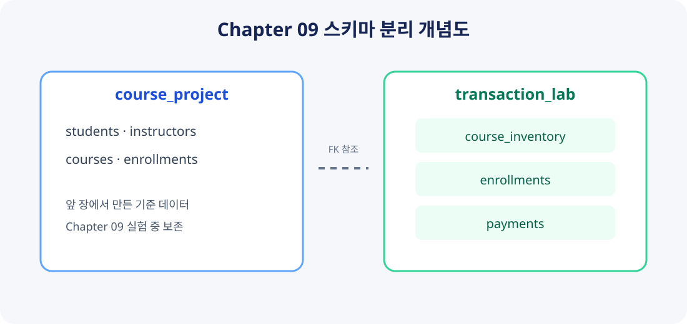
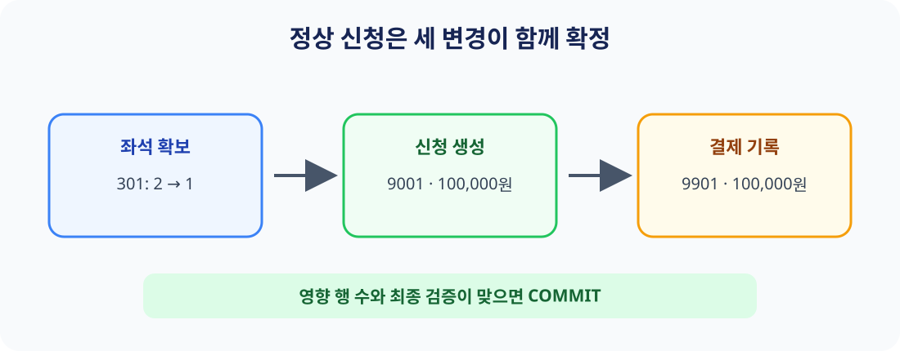
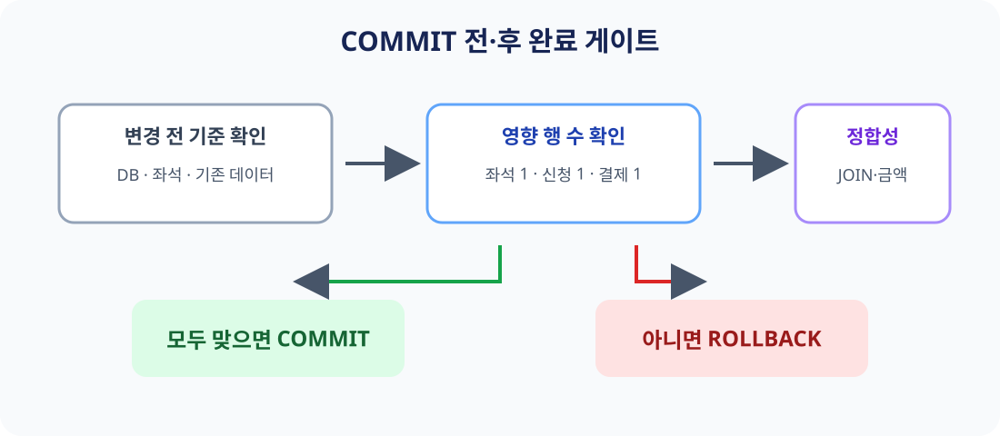

# Chapter 09 확장 실습 답안 — 트랜잭션으로 데이터 정합성 지키기

> **과제:** COMMIT, ROLLBACK, 영향 행 수, 정합성 검증, 동시성 실습  
> **작성 방식:** 기존 Chapter 09 템플릿과 `code/chapter09/` 제공 SQL을 기준으로 정리했다.  
> **실행 증거 안내:** 이 답안 작성 시점에는 로컬 PostgreSQL/DBeaver 연결 결과를 확인하지 못했다. 따라서 `예상`은 저장소의 SQL과 README에 적힌 검증 조건이며, `실측`은 직접 실행하고 나서 채워야 한다. 그림은 개념 설명용 도식이고 실행 화면 캡처가 아니다.

```text
GitHub 계정 또는 별칭: cyw0927 (저장소의 기존 Chapter 07 답안 기준)
과제 작성일: 2026-09-30 (초안 정리일)
사용한 AI 도구: ChatGPT (SQL 흐름을 읽고 개념을 질문하는 리뷰어로 사용)
실행 상태: SQL 파일 정적 확인 / PostgreSQL 실습 실행은 미확인
```

## 먼저 적어 두는 실습 순서

```text
Chapter 07·08 기준 데이터 확인
→ 01 스키마 생성
→ 02 좌석 초기화
→ 03 정상 COMMIT
→ 04 임시 작업 ROLLBACK
→ 05 두 번째 COMMIT과 매진 처리
→ 06 최종 검증
→ 선택 실습 07~09
→ 개인 프로젝트 설계와 AI 리뷰
```

처음 파일 목록을 봤을 때는 SQL 파일이 9개나 있어서 전부 한 번에 실행해야 하는 줄 알았다. README를 읽어 보니 01~06이 주 실습이고 07~09는 선택 실습이었다. 이런 건 파일 이름만 보고 돌리면 안 되겠다. 특히 reset 파일이 따로 있어서 이름을 보고 막 실행하기보다 README에서 용도를 확인하는 습관이 필요하다고 느꼈다.

---

# 1. 시작 환경과 Chapter 07·08 기준 상태

템플릿에서 안내한 환경 확인 SQL은 다음과 같다.

```sql
SELECT current_database();
SELECT current_user;
SELECT current_schema();
SHOW search_path;
SHOW transaction_read_only;
```

| 확인 항목 | 기대 또는 기존 기록 | 실측 결과 |
| --- | --- | --- |
| `current_database()` | `ai_database_book`이어야 함 | 이 대화에서는 미실행 |
| `current_user` | 접속 계정에 따라 다름 | 미실행 |
| `current_schema()` | 보통 `public`일 수 있으나 연결 설정에 따라 다름 | 미실행 |
| `search_path` | 현재 세션 설정을 그대로 확인 | 미실행 |
| `transaction_read_only` | `off`여야 변경 실습 가능 | 미실행 |

Chapter 07 답안에는 `ai_database_book` 데이터베이스를 사용했다고 기록되어 있었다. Chapter 09의 사전 검사도 데이터베이스 이름과 Chapter 07·08 데이터 상태를 검사한다. 그래도 예전 답안에 적힌 값만 보고 현재 연결도 같다고 단정하면 안 된다. 접속 대상을 바꿨을 수도 있으니까 실행 직전에 다시 봐야 한다.

### Chapter 07·08 기준값

저장소의 `code/chapter09/README.md`와 최종 검증 SQL에서 읽은 기준은 아래와 같다. 아래 숫자는 이 파일에 포함된 자동 검증 조건이고, 이번 실행에서 새로 측정한 값은 아니다.

| 항목 | 기대값 |
| --- | ---: |
| `students / instructors / courses / enrollments` | `3 / 2 / 3 / 5` |
| 신청 상태별 건수 | 신청 2 / 수강중 1 / 완료 1 / 취소 1 |
| 전체 `recorded_amount` | 590,000 |
| 활성(신청+수강중) 건수 / 금액 | 3 / 340,000 |
| 취소 제외 건수 / 금액 | 4 / 440,000 |
| 신청 1001 | 완료 / 100,000 |
| 신청 1004 | 취소 / 150,000 |
| 신청 1005 | 신청 / 120,000 |

### 기준 상태가 다르면 바로 넘어가면 안 되는 이유

이 실습은 앞 장에서 만든 학생과 강의 데이터를 사용한다. 시작 데이터가 다르면 스크립트가
실패할 수 있고, 이유가 이번 실습 때문인지 앞 장 데이터 때문인지 헷갈릴 수 있다.
검증 숫자가 다르다고 숫자부터 바꾸지 말고, 어디가 달라졌는지 먼저 확인해야겠다고 생각했다.

---

# 2. `transaction_lab` 스키마 만들기

실행 파일: `code/chapter09/01_transaction_lab_schema.sql`

## 2-1. 테이블의 한 행 의미

| 테이블 | 한 행의 의미 |
| --- | --- |
| `transaction_lab.course_inventory` | 특정 강의의 실습용 정원과 남은 좌석 상태 한 건 |
| `transaction_lab.enrollments` | 이 실습 스키마에서 만든 수강신청 사건 한 건 |
| `transaction_lab.payments` | 실습 신청 한 건에 연결된 결제 기록 한 건 |

## 2-2. 생성 전후 기록

| 항목 | 예상 | 실제 |
| --- | --- | --- |
| 새 스키마 | `transaction_lab` | 실행 미확인 |
| 새 테이블 | 위 세 테이블 | 실행 미확인 |
| 성공 메시지 | `Chapter 09 transaction lab schema validation passed` | 실행 미확인 |



*그림 1. 개념 설명용 도식. PostgreSQL 화면 캡처가 아니며, 실제 생성 여부를 증명하지 않는다.*

### 기존 `course_project`와 분리하는 이유

앞 장 데이터는 그대로 두고 좌석과 결제 실험은 새 `transaction_lab`에서 하기로 했다.
실습 데이터를 따로 두면 초기화할 때 앞 장 데이터를 실수로 지울 가능성이 줄어든다.
데이터를 따로 둔다고 모든 문제가 없어지는 건 아니지만, 실습 범위를 나누는 데 도움이 됐다.

실행 예상 메시지는 위와 같고 실제로 봤는지 여부는 아직 확인하지 못했다. 나중에 실행할 때는 DBeaver의 메시지만 보는 것으로 끝내지 않고 왼쪽 스키마 트리에도 세 테이블이 생겼는지 같이 확인해야겠다.

---

# 3. 좌석 초기 데이터

실행 파일: `code/chapter09/02_transaction_lab_seed.sql`

| 데이터 | 실행 전 예상 | 이번 실측 |
| --- | ---: | --- |
| 강의 301 남은 좌석 | 2 | 미실행 |
| 강의 302 남은 좌석 | 1 | 미실행 |
| 강의 303 남은 좌석 | 1 | 미실행 |
| 실습 신청 수 | 0 | 미실행 |
| 결제 수 | 0 | 미실행 |
| 기대 메시지 | `Chapter 09 transaction lab seed validation passed` | 미실행 |

과제 안내에는 좌석 수가 `3/0/0`이라고 되어 있었는데 저장소의 SQL 파일과 README에는 `2/1/1`로
적혀 있었습니다. 저는 파일을 실행하지 않았기 때문에 어느 쪽이 맞는지 실습 결과로 확인하지는
못했습니다. 답안에는 저장소 SQL에 적힌 값을 예상값으로 적었습니다. 실행하기 전에 안내와 코드가
다른 이 부분은 한 번 더 확인해야겠습니다.

시작할 때 좌석 수를 적어 두지 않으면 뒤에서 좌석이 바뀐 게 맞는지 비교할 수 없습니다.
시작 상태를 기록하는 게 COMMIT이나 ROLLBACK 후에 확인할 기준이 된다고 이해했습니다.

---

# 4. 첫 번째 정상 COMMIT 추적

실행 파일: `code/chapter09/03_commit_transaction.sql`

학생 101이 강의 301을 신청한다. 저장소 SQL을 읽어 보면 강의 301 좌석을 하나 차감하고, 그 결과가 만들어졌을 때에만 신청과 결제 행을 이어 만든다.

## 4-1. 하나의 업무 단위

```text
1) 강의 301 잔여 좌석을 1 감소한다.
2) 학생 101의 실습 신청 9001을 생성한다.
3) 신청 금액과 같은 결제 9901을 생성한다.
```

좌석만 줄고 신청이 없거나 신청은 있는데 결제가 없다면 이상한 상태가 됩니다.
그래서 좌석 변경, 신청, 결제를 한 트랜잭션으로 묶었습니다. 모두 잘 됐는지 확인한 다음에만
COMMIT해서 저장해야 한다고 이해했습니다.

## 4-2. 상태 변화표

아래 값은 제공된 SQL의 사전 조건과 검증 조건을 기준으로 한 **예상값**이다. 실제로 실행하지 않았으므로 실측으로 표시하지 않는다.

| 시점 | 강의 301 남은 좌석 | 신청 9001 | 결제 9901 | 상태 |
| --- | ---: | --- | --- | --- |
| BEGIN 전 | 2 | 없음 | 없음 | seed 기준 예상 |
| 트랜잭션 내부 | 1 | student 101 / course 301 / 100,000 | 9001에 연결 / 100,000 | 아직 COMMIT 전 |
| COMMIT 후 | 1 | 존재 | 존재 | 검증 성공 시 확정 |



*그림 2. 세 변경의 관계를 설명하는 도식이며 실행 결과 캡처가 아니다.*

## 4-3. 영향 행 수와 COMMIT 판단

좌석이 0개보다 클 때만 좌석을 하나 줄입니다. 좌석이 실제로 줄어든 경우에만 그 결과를
신청과 결제 추가 작업에 넘깁니다. 좌석을 못 잡았다면 신청과 결제도 만들지 않게 한 구조입니다.
예상한 변경 행은 좌석, 신청, 결제가 각각 1행입니다.

| 확인 내용 | 기대 | 실측 |
| --- | ---: | --- |
| 좌석 UPDATE | 1행 | 미실행 |
| 신청 INSERT | 1행 | 미실행 |
| 결제 INSERT | 1행 | 미실행 |
| 신청 금액과 결제 금액 | 100,000으로 일치 | 미실행 |
| 통과 메시지 | `Chapter 09 first commit validation passed` | 미실행 |

SQL이 오류 없이 실행돼도 원하는 업무가 제대로 됐다는 뜻은 아닙니다. 엉뚱한 행을 바꿔도
문법상 문제는 없을 수 있습니다. 그래서 바뀐 행 수와 마지막 데이터가 맞는지 확인해야겠습니다.
`RETURNING`은 바뀐 행을 보여 주고, 그 결과를 다음 작업에 넘기는 데도 쓸 수 있다는 점을 알게 됐습니다.

---

# 5. ROLLBACK으로 임시 변경 취소

실행 파일: `code/chapter09/04_rollback_transaction.sql`

이 파일은 강의 302의 임시 신청을 트랜잭션 안에서 만든 뒤 ROLLBACK한다. 이후 확인할 기대 상태는 좌석 302가 다시 1이고 신청 9002와 결제 9902가 없는 것이다. 앞 단계에서 이미 COMMIT한 9001/9901과 강의 301의 좌석 1은 그대로여야 한다.

| ROLLBACK 후 확인 | 기대값 | 실측 |
| --- | --- | --- |
| 강의 302 남은 좌석 | 1 | 미실행 |
| 신청 9002 | 없음 | 미실행 |
| 결제 9902 | 없음 | 미실행 |
| 이전 COMMIT 9001/9901 | 유지 | 미실행 |
| 기대 메시지 | `Chapter 09 rollback validation passed` | 미실행 |

처음에는 ROLLBACK을 하면 앞에서 한 작업도 전부 되돌아가는 줄 알았습니다. 실제로는 지금 열려
있는 트랜잭션에서 바꾼 내용이 취소됩니다. 이미 COMMIT한 9001은 앞에서 확정했기 때문에 그대로 남습니다.

## IDENTITY 값은 왜 되돌아오지 않을 수 있나

자동으로 번호를 만들 때는 트랜잭션을 취소해도 이미 받은 번호가 다시 돌아오지 않을 수 있다고
배웠습니다. 그래서 중간 번호가 비어도 이상한 오류는 아닙니다. 번호는 행을 구분하는 데 쓰는 것이고,
영수증 번호처럼 하나도 빠지면 안 되는 번호가 필요하다면 별도 규칙을 만들어야 합니다.

---

# 6. 두 번째 COMMIT과 좌석 부족

실행 파일: `code/chapter09/05_commit_and_sold_out.sql`

첫 부분은 학생 103이 강의 302를 신청한다. 저장소의 seed 기준에서 강의 302는 좌석 1개이므로 정상 신청 후 0이 되는 것이 기대된다.

```text
예상 신청: 9002 / student 103 / course 302 / recorded_amount 120000
예상 결제: 9902 / enrollment 9002 / amount 120000
예상 강의 302 잔여 좌석: 0
```

두 번째 시도에는 남은 좌석이 0개라 좌석을 줄이지 못합니다. 이건 문법 오류는 아니지만,
신청을 받지 못했으므로 업무 결과로는 실패입니다. 좌석을 줄이지 못하면 신청과 결제도 만들지
않도록 되어 있고, 이 시도에서 한 변경은 마지막에 ROLLBACK하도록 되어 있습니다.

| 확인 내용 | 기대값 | 실측 |
| --- | ---: | --- |
| 매진 상태 좌석 UPDATE | 0행 | 미실행 |
| 신청 9003 | 생성 안 됨 | 미실행 |
| 결제 9903 | 생성 안 됨 | 미실행 |
| 최종 메시지 | `Chapter 09 sold-out validation passed` | 미실행 |

좌석을 잡지 못했는데 신청과 결제만 생기면 안 됩니다. 이 SQL은 좌석 변경 결과가 없으면
뒤의 신청·결제 작업도 진행하지 않습니다. 처음에는 실패를 만들려면 꼭 오류가 나야 하는 줄
알았는데, 변경된 행이 0개인지 확인하고 다음 작업을 멈추는 방법도 있다는 걸 알았습니다.

---

# 7. 최종 정합성 검증

실행 파일: `code/chapter09/06_transaction_validation.sql`

| 항목 | 저장소 기준 기대값 | 실측 |
| --- | ---: | --- |
| `course_inventory` | 3행 | 미실행 |
| lab `enrollments` | 2행 | 미실행 |
| lab `payments` | 2행 | 미실행 |
| 강의 301 잔여 좌석 | 1 | 미실행 |
| 강의 302 잔여 좌석 | 0 | 미실행 |
| 강의 303 잔여 좌석 | 1 | 미실행 |
| 9001 / 9901 | 101 / 301 / 100,000 / 결제 100,000 | 미실행 |
| 9002 / 9902 | 103 / 302 / 120,000 / 결제 120,000 | 미실행 |
| 9003 / 9903 | 존재하지 않음 | 미실행 |
| Chapter 07 신청 행 수 / 합계 | 5 / 590,000 | 미실행 |
| 기대 메시지 | `Chapter 09 main transaction validation passed` | 미실행 |

마지막 검사는 새로 만든 lab 데이터뿐 아니라 앞에서 쓰던 `course_project`도 확인합니다.
새 실습이 잘 됐더라도 앞 장 데이터가 바뀌면 안 되기 때문입니다.



*그림 3. 검증 흐름을 설명하는 개념 그림이며 SQL 실행 캡처가 아니다.*

아직 실제로 실행하지는 않았습니다. 실행하게 되면 통과 메시지만 보지 않고 SQL이 끝까지 실행됐는지,
좌석과 신청·결제 내용도 맞는지 확인해야겠습니다.

---

# 8. 이번 실습으로 이해한 ACID

| 속성 | 이번 예시로 설명 |
| --- | --- |
| Atomicity | 좌석, 신청, 결제가 전부 저장되거나 전부 취소된다. |
| Consistency | 작업 전후에도 좌석 수나 금액 같은 규칙이 맞아야 한다. |
| Isolation | 두 사람이 마지막 좌석을 동시에 신청할 때 서로 꼬이지 않게 처리한다. |
| Durability | COMMIT이 끝난 데이터는 확정되어 남는다. |

처음에는 둘 다 “데이터가 안전하다”는 뜻처럼 느껴졌습니다. Atomicity는 여러 변경을 전부
저장하거나 전부 취소하는 것이고, Consistency는 저장한 뒤에도 정해 둔 규칙이 맞는 상태라고
이해했습니다. 변경을 한꺼번에 저장하더라도 규칙 자체를 잘못 만들면 잘못된 데이터가 저장될 수
있어서 마지막 확인도 필요합니다.

---

# 9. 선택 실습 — 두 세션 Lock 관찰

실행 파일: `code/chapter09/07_concurrency_two_sessions.sql`

**수행 방식: 절차 분석만 기록.** 이 환경에서 서로 다른 PostgreSQL 세션 두 개를 열어 대기/timeout을 직접 확인하지 못했다. 따라서 아래는 스크립트의 의도에 대한 분석이며 관찰 결과로 주장하지 않는다.

| 순서 | Session A | Session B | 예상 관찰 |
| ---: | --- | --- | --- |
| 1 | BEGIN 후 강의 303 행을 `FOR UPDATE`로 잠금 | 아직 실행 전 | A가 해당 행 잠금을 보유 |
| 2 | 트랜잭션을 열린 채 유지 | 같은 행 잠금 요청 | A가 끝나지 않았다면 B가 대기할 수 있음 |
| 3 | COMMIT 또는 ROLLBACK | 대기 중 | A의 잠금 해제 |
| 4 | 종료 | 잠금 요청 계속/timeout 처리 | B가 진행하거나 `lock_timeout`이면 오류 |

Lock 대기는 다른 작업이 잠금을 풀 때까지 기다리는 상태입니다. Deadlock은 서로가 가진 잠금이
풀리기를 서로 기다려서 아무도 진행하지 못하는 경우라고 배웠습니다. 한쪽이 기다렸다고 해서
그게 바로 Deadlock은 아닙니다.

`SELECT ... FOR UPDATE`를 쓰면 다른 작업이 같은 행을 동시에 바꾸지 못하게 잠시 막을 수 있습니다.
하지만 조건을 넣은 UPDATE만으로 안전하게 처리되는 경우도 있어서 매번 잠금을 추가해야 하는 건
아니라고 합니다. 어떤 상황인지 먼저 보고 필요한 방법을 골라야겠습니다.

---

# 10. 선택 실습 — 취소와 좌석 복구

실행 파일: `code/chapter09/08_cancel_and_restore.sql`

이 스크립트는 신청 9001을 취소하고, 취소가 실제로 된 경우에만 강의 좌석을 하나 돌려놓습니다.
같은 취소를 또 요청하면 이미 취소된 상태라 다시 바뀌지 않고 좌석도 더 늘어나면 안 됩니다.
마지막에는 ROLLBACK해서 원래 실습 데이터를 유지하게 되어 있습니다.

| 항목 | 기대 | 실제 |
| --- | --- | --- |
| 첫 취소 UPDATE | 1행 | 미실행 |
| 강의 301 좌석 변화 | 1 → 2 | 미실행 |
| 같은 취소 재시도 | 0행 | 미실행 |
| 두 번째 좌석 복구 | 0행 | 미실행 |
| 전체 ROLLBACK 후 | 신청 9001 수강중, 좌석 1 | 미실행 |
| 통과 메시지 | `Chapter 09 cancel rollback validation passed` | 미실행 |

취소 요청을 두 번 처리해 좌석을 두 번 돌려주면 실제 좌석보다 많아질 수 있습니다. 그래서
상태가 실제로 취소로 바뀐 경우에만 좌석을 돌려줍니다. 이 실습에서는 환불은 만들지 않았습니다.
수강 취소와 돈을 돌려주는 일은 별도로 다뤄야 한다는 점을 알게 됐습니다.

---

# 11. 선택 실습 — 오류 상태와 SAVEPOINT

실행 파일: `code/chapter09/09_error_and_savepoint.sql`

오류를 만드는 SQL은 주석으로 막혀 있어서 파일을 그냥 실행하면 오류가 나지 않습니다.
안내대로 주석을 풀면 이미 진행 중인 신청을 한 번 더 넣으려 해서 오류가 날 수 있습니다.
트랜잭션 안에서 오류가 나면 그 트랜잭션을 계속 쓸 수 없는 상태가 될 수 있다고 합니다.
미리 SAVEPOINT를 만들어 두면 그 지점 이후만 취소하고 계속할 수 있습니다.

```text
예상: SAVEPOINT 이전 좌석 차감은 복구 대상이 됨
예상: 중복 신청 9003은 생성되지 않음
예상: 전체 실습 마지막 ROLLBACK으로 기준 상태 보존
실행 및 실제 오류 문구: 미확인
```

SAVEPOINT를 쓴다고 오류가 없던 일이 되는 건 아닙니다. 어디까지 되돌려도 괜찮은지 먼저
생각해야 합니다. 오류가 났는데 무조건 계속하면 잘못된 데이터가 남을 수도 있습니다.

---

# 12. 개인 프로젝트 트랜잭션 시나리오 설계

> 개인 프로젝트는 아직 진행하지 않아 이 항목은 비워 둡니다.

---
# 13. AI를 트랜잭션 리뷰어로 활용

> 개인 프로젝트를 작성하지 않아 개인 프로젝트 기반 AI 리뷰도 아직 진행하지 않았습니다.

---
# 14. 최종 성찰

```text
1. 트랜잭션은 무엇을 하는 방법인가?
   좌석, 신청, 결제처럼 한 업무에 필요한 변경을 같이 저장하거나 같이 취소하는 방법이다.

2. ROLLBACK은 언제 필요한가?
   좌석이 없거나 중간 확인에서 문제가 생겨 변경 내용을 저장하면 안 될 때 사용한다.

3. UPDATE가 몇 행을 바꿨는지 확인해야 하는 이유는?
   SQL은 오류 없이 실행돼도 바꾸려던 행이 하나도 없을 수 있기 때문이다.

4. 제약조건이 있어도 트랜잭션을 쓰는 이유는?
   여러 테이블을 바꿀 때 일부 내용만 저장되는 일을 막기 위해서다.

5. Lock은 왜 필요한가?
   여러 사람이 마지막 좌석을 동시에 바꾸다가 잘못 처리되는 일을 막기 위해서다.

6. AI가 만든 트랜잭션 SQL에서 먼저 볼 것은?
   실제 테이블을 바꾸는지, 몇 행이 바뀌는지, 마지막 결과가 맞는지 확인한다.
```

## 한 문장 요약

> 트랜잭션은 한 업무에 필요한 변경을 같이 저장하거나 취소하는 방법이다. 저장하기 전에는 바뀐 행 수와 결과를 확인해야 한다.

---

# 15. 제출 전 체크리스트

- [x] Chapter 09 템플릿과 저장소의 실제 SQL 흐름을 확인했다.
- [x] 기대값과 직접 실측하지 않은 값을 구분했다.
- [ ] 개인 프로젝트 트랜잭션 시나리오를 작성했다. — 아직 미작성
- [x] 그림에 설명용 도식이며 실행 캡처가 아님을 표시했다.
- [ ] PostgreSQL에서 환경 확인 쿼리를 실행하고 실제 결과를 기록한다.
- [ ] Chapter 07·08 사전 기준 검사를 통과한 뒤 01~06을 순서대로 실행한다.
- [ ] 실제 성공 메시지와 SELECT 결과를 표의 `미실행`에 기록한다.
- [ ] 선택 실습 07~09는 수행 여부를 솔직하게 표시하고 캡처가 있다면 실제 화면만 추가한다.
- [ ] 개인 프로젝트 기반 AI 리뷰를 작성한다. — 개인 프로젝트 미작성으로 보류
- [ ] GitHub 웹에서 Markdown과 그림이 정상 표시되는지 확인한다.
- [ ] 최종 파일 commit/push 후 LMS에는 본인 파일 URL을 제출한다.

## LMS URL

```text
https://github.com/cyw0927/ai-database-study/blob/main/assignments/chapter09/chapter09_answer.md
```

> 이 URL은 사용자가 알려 준 저장소명과 기존 Chapter 07 답안의 계정명을 사용해 작성한 예상 링크다. GitHub에서 실제 공개 접근이 되는지 확인하지 않았다.
