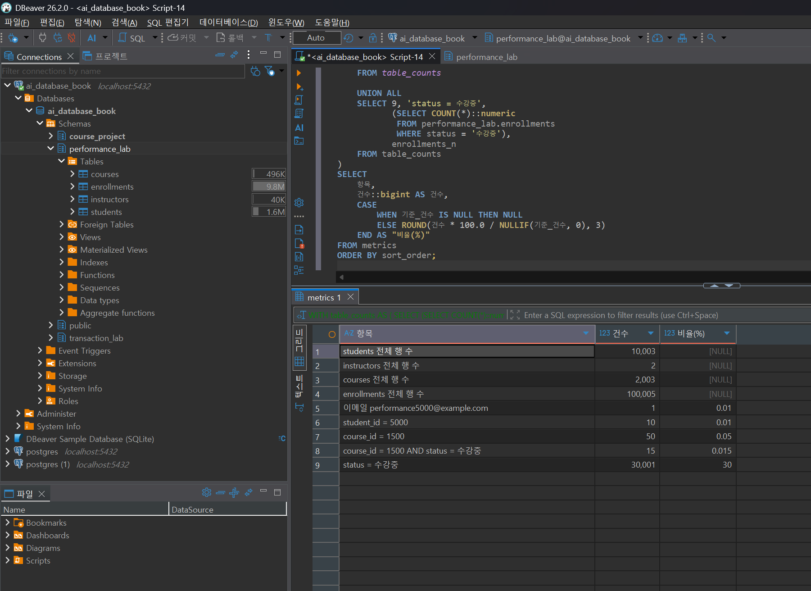
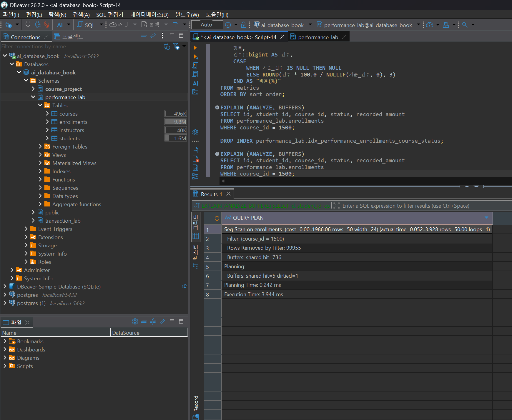
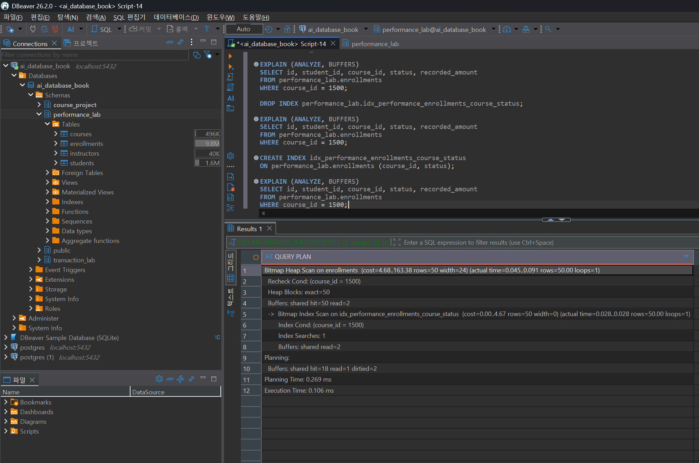

# Chapter 10 확장 실습 답안

> **과제:** 실행 계획으로 인덱스 효과 검증하기
> **사용 방법:** 이 파일을 내려받아 본인의 GitHub 저장소에 `chapter10_answer.md`라는 이름으로 저장한 뒤 실습하면서 바로 작성합니다.
> **제출 방법:** LMS에는 파일을 직접 업로드하지 않고, **본인 GitHub 저장소의 `chapter10_answer.md` 파일 URL**을 제출합니다.

---

## 제출 전 주의

이 파일과 캡처 화면에는 실제 비밀번호, 전체 DB 접속 URL, API Key, 개인정보를 기록하지 않습니다.

```text
GitHub 계정 또는 별칭: cyw0927
과제 작성일: 2026-09-30
사용한 AI 도구: Claude (Claude Code), Codex
```

---

# 1. PostgreSQL 버전과 시작 환경 확인

다음을 실행합니다.

```sql
SELECT version();
SELECT current_database();
SELECT current_user;
SELECT current_schema();
SHOW search_path;
```

| 확인 항목 | 실제 결과 | 의미 |
| --- | --- | --- |
| PostgreSQL 버전 | PostgreSQL 18.4 on x86_64-windows, compiled by msvc-19.44.35227, 64-bit | 현재 연결된 서버의 실제 버전 |
| `current_database()` | ai_database_book | 현재 접속한 데이터베이스 |
| `current_user` | postgres | 현재 접속 계정 |
| `current_schema()` | public | 스키마를 생략했을 때 기본으로 잡히는 스키마 |
| `search_path` | "$user", public | 테이블 이름만 썼을 때 찾아보는 스키마 순서 |

### PostgreSQL 버전을 기록해야 하는 이유

```text
제 컴퓨터에는 PostgreSQL 18.4가 설치되어 있고, 과제의 기준 버전은 16이라고 합니다. 버전이 다르면
실행 계획도 달라질 수 있다고 해서 조금 걱정했습니다. 특히 복합 인덱스의 뒷부분 컬럼만 조건으로
쓰면 어떤 일이 생기는지 궁금했습니다. 실제로 해보니 status만 조회할 때 제 컴퓨터에서도 Seq Scan이
나왔습니다. 전체 데이터 중 약 30%나 찾는 조건이라 인덱스보다 테이블을 읽는 쪽이 나았던 것 같습니다.
교재 화면과 달라도 바로 제가 틀렸다고 생각하지 말고, 버전과 데이터도 살펴봐야 한다는 걸 알게 됐습니다.
```

> 이 장의 자동 검증 기준은 PostgreSQL 16입니다. PostgreSQL 18 이상에서는 B-tree Skip Scan 등으로 동일 SQL의 실행 계획이 달라질 수 있습니다.

---

# 2. Chapter 07·08 기준 상태 확인

Chapter 10은 기존 `course_project`를 변경하지 않습니다.

확인 기준:

```text
students = 3
instructors = 2
courses = 3
enrollments = 5

전체 recorded_amount = 590000
활성 = 3건 / 340000
취소 제외 = 4건 / 440000
```

```text
1001 = 완료 / 100000
1004 = 취소 / 150000
1005 = 신청 / 120000
```

### 실제 확인 결과

```text
students: 3
instructors: 2
courses: 3
enrollments: 5
전체 recorded_amount: 590000
활성 신청 건수/금액: 3건 / 340000
취소 제외 건수/금액: 4건 / 440000
(1001=완료/100000, 1004=취소/150000, 1005=신청/120000 모두 일치)
```

### 성능 실험을 기존 `course_project`에 대량 데이터를 넣지 않고 별도 스키마에서 하는 이유

```text
처음에는 왜 새 스키마를 만드는지 몰랐습니다. course_project은 행이 몇 개 안 돼서 인덱스 효과를
보기 어렵고, 데이터를 많이 넣으면 앞 장에서 확인한 숫자도 바뀔 수 있었습니다. 그래서 performance_lab을
따로 만들어 실험했습니다. 원래 데이터를 건드리지 않고 다시 실험할 수 있어서 이 방법이 편했습니다.
```

---

# 3. `performance_lab` 생성과 대량 데이터 확인

다음 파일을 순서대로 실행했습니다.

```text
code/chapter10/01_performance_lab_schema.sql
code/chapter10/02_performance_lab_seed.sql
```

## 3-1. 생성 후 행 수

| 테이블 | 기대 행 수 | 실제 행 수 | 일치? |
| --- | ---: | ---: | --- |
| `performance_lab.students` | 10003 | 10003 | O |
| `performance_lab.instructors` | 2 | 2 | O |
| `performance_lab.courses` | 2003 | 2003 | O |
| `performance_lab.enrollments` | 100005 | 100005 | O |

## 3-2. 데이터 분포 확인

| 조건 | 기대 행 수 | 실제 행 수 | 대략적 비율 |
| --- | ---: | ---: | ---: |
| `performance5000@example.com` | 1 | 1 | 약 0.001% |
| `student_id = 5000` | 10 | 10 | 약 0.010% |
| `course_id = 1500` | 50 | 50 | 약 0.050% |
| `course_id = 1500 AND status='수강중'` | 15 | 15 | 약 0.015% |
| 전체 `status='수강중'` | 30001 | 30001 | 약 30.00% |

### 선택도가 낮은 조건과 많은 행을 반환하는 조건은 인덱스 판단에서 어떻게 다르게 볼 수 있나요?

```text
처음에는 인덱스가 있으면 항상 빨라지는 줄 알았습니다. student_id=5000은 10건, course_id=1500은
50건만 나왔습니다. 전체 10만 건에 비하면 적어서 인덱스를 쓴 계획이 나왔습니다. 반대로
status='수강중'은 3만 건 정도라 전체 중 꽤 많은 데이터를 찾습니다. 이때는 인덱스가 있어도 Seq Scan이
나왔습니다. 왜 결과가 다르지? 하고 봤더니 찾는 행 수가 달랐습니다. 인덱스가 있으면 무조건
Index Scan이 되는 건 아니라는 걸 확인했습니다.
```

### 증거 화면



---

# 4. 인덱스 생성 전 기준 계획 기록

다음 파일을 실행했습니다.

```text
code/chapter10/03_baseline_explain.sql
```

> **중요:** `04_create_candidate_indexes.sql`을 먼저 실행하지 않았습니다. 기준 계획을 잃으면 같은 조건의 전후 비교가 어려워지기 때문입니다.

아래는 실제로 기록한 8개 쿼리 중 대표 3개입니다(전체 8개 결과는 `code/chapter10/03_baseline_explain.sql`을 그대로 실행하면 재현됩니다).

## Query A — course title 정확 일치

```text
업무 질문: 강의 상세 페이지에서 제목으로 강의를 찾는다
WHERE / JOIN / ORDER BY / LIMIT: WHERE title = '성능 테스트 강의 00500'
예상 반환 행 수: 1
실제 반환 행 수: 1
```

```sql
EXPLAIN (ANALYZE, BUFFERS)
SELECT id, title, level, price
FROM performance_lab.courses
WHERE title = '성능 테스트 강의 00500';
```

| 관찰 항목 | 기록 |
| --- | --- |
| 주요 Scan/계획 노드 | Seq Scan on courses |
| estimated rows | 1 |
| actual rows | 1 |
| Filter | (title)::text = '성능 테스트 강의 00500'::text (Rows Removed by Filter: 2002) |
| Index Cond | 없음 (인덱스 미사용) |
| Buffers hit/read | shared hit=34 |
| Planning Time | 0.063 ms |
| Execution Time | 0.158 ms |

## Query B — 학생별 신청 JOIN (student_id=5000, 10행)

```text
업무 질문: 특정 학생의 전체 수강 내역을 강의명과 함께 보여준다
WHERE / JOIN / ORDER BY / LIMIT: enrollments-students-courses 3-way JOIN, WHERE e.student_id = 5000
예상 반환 행 수: 10
실제 반환 행 수: 10
```

| 관찰 항목 | 기록 |
| --- | --- |
| 주요 Scan/계획 노드 | Nested Loop > (Index Scan on students_pkey) + Seq Scan on enrollments |
| estimated rows | 10 |
| actual rows | 10 |
| Filter | Seq Scan 내부 Filter: student_id = 5000 (Rows Removed by Filter: 99995) |
| Index Cond | students_pkey: id = 5000 (student 조회에만 인덱스 사용) |
| Buffers hit/read | shared hit=769 |
| Execution Time | 3.840 ms |

## Query C — status 단독 조건 (수강중, 30001행)

```text
업무 질문: 전체 수강중 신청 목록을 뽑는다(관리자 통계용)
WHERE / JOIN / ORDER BY / LIMIT: WHERE status = '수강중'
예상 반환 행 수: 30001
실제 반환 행 수: 30001
```

| 관찰 항목 | 기록 |
| --- | --- |
| 주요 Scan/계획 노드 | Seq Scan on enrollments |
| estimated rows | 30138 |
| actual rows | 30001 |
| Filter | (status)::text = '수강중'::text (Rows Removed by Filter: 70004) |
| Index Cond | 없음 |
| Buffers hit/read | shared hit=736 |
| Execution Time | 9.000 ms |

### `cost`와 실제 실행 시간이 같은 개념이 아닌 이유

```text
처음에는 cost 숫자가 실행 시간인 줄 알았는데 아니었습니다. PostgreSQL이 계획끼리 비교할 때 쓰는
예상 점수 같은 값이라고 이해했습니다. 실제 시간은 Execution Time에 ms로 따로 표시됩니다. 그래서
cost가 1986이라고 해서 1986ms가 걸린다는 뜻은 아니었습니다. 이 부분을 헷갈리지 않게 기억하려고
적어 둡니다.
```

### `EXPLAIN ANALYZE`는 실제 SQL을 실행한다는 점을 왜 기억해야 하나요?

```text
EXPLAIN만 실행하면 예상 계획을 보여주지만, ANALYZE를 붙이면 쿼리도 실제로 실행한다고 배웠습니다.
이번에는 SELECT만 실행해서 데이터를 바꾸지는 않았습니다. 그런데 UPDATE나 DELETE에 붙이면 변경이
실제로 일어날 수 있다고 해서 놀랐습니다. 나중에 변경 쿼리를 확인할 때는 조심해야겠습니다.
```

### 증거 화면



---

# 5. 후보 인덱스를 만들기 전에 이유 작성

본문 실험 후보는 다음 세 개입니다.

```text
idx_performance_courses_title
idx_performance_enrollments_student_id
idx_performance_enrollments_course_status
```

각 인덱스의 이유를 먼저 작성합니다.

| 후보 인덱스 | 대응 조회 패턴 | 예상 이점 | 컬럼 순서 이유 | 예상 비용/단점 |
| --- | --- | --- | --- | --- |
| `idx_performance_courses_title` | 강의 제목 정확 일치 검색(Query A), `ORDER BY title` 정렬 | Seq Scan(2003행 스캔) 대신 바로 위치를 찾고, 정렬도 인덱스 순서로 대체 가능 | 컬럼이 title 하나뿐이라 순서 이슈 없음 | courses에 INSERT/UPDATE(title 변경) 시 인덱스도 같이 갱신, 약 120KB 저장 공간 |
| `idx_performance_enrollments_student_id` | 학생별 신청 목록 JOIN(Query B) | student_id=5000처럼 선택도가 매우 낮은(10/100005) 조건에서 Seq Scan(99995행 제거)을 Index Scan으로 대체 | 컬럼 1개라 순서 이슈 없음, FK 자식 컬럼인데도 자동 인덱스가 없었던 컬럼 | enrollments는 쓰기가 잦은 테이블(신청/취소)이라 INSERT마다 이 인덱스도 갱신, 약 936KB |
| `idx_performance_enrollments_course_status` | course_id 단독 조건 + course_id AND status 복합 조건(Query D) | 두 조건 모두 선두 컬럼(course_id)이 있어 인덱스 탐색 범위를 좁힐 수 있음 | course_id를 앞에 둔 이유: course_id 단독 조회도 있고 course_id+status 복합 조회도 있어서, 선두 컬럼을 course_id로 하면 두 패턴을 하나의 인덱스로 커버 가능. status를 앞에 두면 status 단독 조회는 도움받지만 course_id 단독 조회는 인덱스를 못 씀 | 신청 상태가 자주 바뀌는(신청→수강중→완료/취소) 컬럼이 포함돼 있어 UPDATE 시 인덱스 갱신 비용, 약 960KB |

### "중요한 컬럼이므로 인덱스를 만든다"는 설명이 부족한 이유

```text
처음엔 중요한 컬럼에 인덱스를 만들면 되는 줄 알았습니다. 그런데 status는 중요한 값이어도 한 번에
찾는 데이터가 많아서 Seq Scan이 나왔습니다. student_id는 평범해 보였지만 찾는 행이 적어서 도움이
됐습니다. 인덱스를 만들기 전에 어떤 쿼리에서 쓰는지와 결과가 몇 건인지 먼저 확인해야겠습니다.
```

### `(course_id, status)`와 `(status, course_id)`가 항상 같은 효과가 아닌 이유

```text
복합 인덱스는 컬럼 순서가 중요하다고 배웠습니다. (course_id, status)로 만들면 course_id만
조회하거나 두 값을 같이 조회할 때 쓸 수 있었습니다. status만 조회할 때는 잘 쓰이지 않았습니다.
앞뒤 순서를 바꿔도 똑같을 거라고 생각했는데, 어떤 쿼리를 자주 쓰는지에 따라 순서를 정해야 한다고
합니다. 아직 조금 헷갈리지만 실행 계획에서 차이를 확인할 수 있었습니다.
```

---

# 6. 후보 인덱스 생성

다음을 실행했습니다.

```text
code/chapter10/04_create_candidate_indexes.sql
```

생성 후 확인:

```text
후보 인덱스 수: 3
전체 인덱스 수: 9
```

본문 기준:

```text
자동 인덱스 = 6
후보 인덱스 = 3
전체 인덱스 = 9
```

### PRIMARY KEY나 UNIQUE가 이미 인덱스를 만들 수 있는데 같은 목적의 인덱스를 또 만들면 어떤 문제가 생기나요?

```text
같은 곳에 인덱스를 두 개 만들면 조회가 더 빨라질 것 같았는데 꼭 그런 건 아니었습니다. 같은 역할을
하는 인덱스가 있으면 데이터가 바뀔 때 둘 다 관리해야 하고 저장 공간도 더 필요합니다. 그래서 이미
기본키나 UNIQUE로 인덱스가 생긴 컬럼은 다시 만들지 않고, 실습에서 필요하다고 본 컬럼만 추가했습니다.
```

---

# 7. 같은 SQL로 인덱스 후 재측정

다음 파일을 실행했습니다.

```text
code/chapter10/05_after_index_explain.sql
```

Chapter 4에서 기록한 **동일 SQL**을 비교합니다.

## Query A 전후 비교 (course title 정확 일치)

| 항목 | Before | After | 해석 |
| --- | --- | --- | --- |
| 주요 계획 노드 | Seq Scan on courses | Index Scan using idx_performance_courses_title | Seq Scan에서 Index Scan으로 전환됨 |
| actual rows | 1 | 1 | 결과 행 수 동일 (누수 없음) |
| Buffers hit/read | shared hit=34 | shared hit=3 | 읽은 버퍼가 34→3으로 대폭 감소 |
| Execution Time | 0.158 ms | 0.020 ms | 약 8배 빨라짐 |
| Index Cond | 없음 | (title)::text = '성능 테스트 강의 00500'::text | 인덱스 조건으로 탐색 |

```text
결과 행이 동일했는가: 예, 1행으로 동일
읽은 버퍼가 줄었는가: 예, 34 -> 3
계획이 바뀌었는가: 예, Seq Scan -> Index Scan
시간을 한 번만 재서 결론을 내릴 수 있나요: 아니요. 같은 수의 행이 나왔는지, PostgreSQL이 어떤
방법으로 찾았는지, 읽은 데이터 양도 줄었는지 함께 확인했습니다.
```

## Query B 전후 비교 (학생별 신청 JOIN, student_id=5000)

| 항목 | Before | After | 해석 |
| --- | --- | --- | --- |
| 주요 계획 노드 | Nested Loop > Seq Scan on enrollments | Nested Loop > Index Scan using idx_performance_enrollments_student_id | enrollments 접근이 Seq Scan에서 Index Scan으로 전환 |
| actual rows | 10 | 10 | 결과 행 수 동일 |
| Buffers hit/read | shared hit=769 | shared hit=36 | 769→36으로 약 21배 감소 |
| Execution Time | 3.840 ms | 0.087 ms | 약 44배 빨라짐 |
| Index Cond | 없음(student_id는 students_pkey 조회에만 사용) | student_id = 5000 (enrollments에도 Index Cond 적용) | enrollments 자체에 인덱스 조건이 생김 |

## Query C 전후 비교 (course_id 단독, 50행)

| 항목 | Before | After | 해석 |
| --- | --- | --- | --- |
| 주요 계획 노드 | Seq Scan on enrollments | Bitmap Heap Scan + Bitmap Index Scan on idx_performance_enrollments_course_status | course_id 단독 조건도 복합 인덱스의 선두 컬럼이라 활용됨 |
| actual rows | 50 | 50 | 결과 행 수 동일 |
| Buffers hit/read | shared hit=736 | shared hit=50, read=2 (총 52) | 실행 Buffers 총량 736→52로 감소 |
| Execution Time | 3.944 ms | 0.106 ms | 이번 단일 측정에서 약 37배 빨랐음 (시간은 캐시·부하에 따라 변동) |
| Index Cond | 없음 | course_id = 1500 | 인덱스 조건으로 후보 행을 먼저 좁힘 |

> 용어 메모: Index Scan은 인덱스에서 조건에 맞는 위치를 찾는 방법입니다. Bitmap Scan은 인덱스로
> 찾을 행의 위치를 먼저 모은 다음 테이블에서 가져오는 방법입니다. Buffers는 쿼리가 읽거나 이용한
> 데이터 블록 수입니다. 숫자가 작으면 이번 쿼리에서 읽은 양이 적었다는 뜻으로 볼 수 있습니다.

### `Index Scan`으로 바뀌었다는 사실만으로 성공이라고 할 수 없는 이유

```text
계획이 인덱스를 쓰는 방식으로 바뀌어도 결과가 틀리면 소용없습니다. 그래서 먼저 인덱스 전후에
나온 행 수가 같은지 봤습니다. 제목 검색은 1개, 학생 검색은 10개, 강의 검색은 50개로 같았습니다.
그 다음 읽은 양과 시간을 비교했습니다. status 검색은 인덱스가 있어도 그대로였지만, 찾는 데이터가
많을 때는 그럴 수 있다고 이해했습니다.
```

### 증거 화면



---

# 8. `status` 단독 조회와 Seq Scan 해석

전체 `status = '수강중'`은 약 30%의 행을 반환합니다.

```text
예상 행 수 = 30001
실제 행 수 = 30001 (Before), 30001 (After)
주요 계획 노드 = Seq Scan on enrollments (Before/After 동일, 변화 없음)
```

Before: `Execution Time: 9.000 ms`, `Buffers: shared hit=736`
After(인덱스 생성 후에도 동일): `Execution Time: 9.191 ms`, `Buffers: shared hit=736`

### 인덱스가 존재해도 PostgreSQL이 Seq Scan을 선택할 수 있는 이유

```text
(course_id, status) 인덱스를 만들었지만 이 쿼리에는 course_id 조건이 없고 status만 있습니다.
그리고 100,005행 중 30,001행이나 나왔습니다. 3만 건을 찾으려고 인덱스를 이용하는 것보다 테이블을
한 번 읽는 쪽이 낫다고 판단한 것 같습니다. 실제로 인덱스를 만들기 전과 후 모두 Seq Scan이었고
Buffers도 736으로 같았습니다.
```

### "Seq Scan = 나쁜 계획"이라고 단정하면 안 되는 이유

```text
예전에는 Seq Scan이 나오면 인덱스를 잘못 만든 줄 알았습니다. 이번에는 많은 행을 가져와야 해서
테이블을 읽는 게 더 나은 경우도 있다는 걸 봤습니다. 그래서 Seq Scan만 보고 실패라고 하면 안 되고,
조회 결과가 몇 건인지도 같이 봐야겠습니다.
```

### PostgreSQL 16과 18 이상에서 복합 B-tree 후행 컬럼 조건의 계획이 다를 수 있는 이유

```text
PostgreSQL 버전이 달라지면 인덱스를 쓰는 방법도 조금 달라질 수 있다고 합니다. 그런데 제 컴퓨터는
18.4인데도 status만 찾는 쿼리는 Seq Scan으로 나왔습니다. 수강중 데이터가 전체의 약 30%라서
인덱스를 쓰는 것보다 테이블을 읽는 쪽이 낫다고 판단한 것 같습니다. 새 기능이 있다고 항상 그 기능을
쓰는 건 아니라는 점을 알게 됐습니다.
```

---

# 9. `ORDER BY`와 `LIMIT`에서 인덱스 관찰

`ORDER BY title`과 `ORDER BY title LIMIT 20` 계획을 비교합니다.

```text
ORDER BY title 계획:
  Before: Sort(quicksort, Memory 179kB) -> Seq Scan on courses. Buffers hit=37. Execution Time 6.154ms
  After : Index Scan using idx_performance_courses_title (Sort 노드 없음). Buffers hit=37 read=12. Execution Time 0.564ms

ORDER BY title LIMIT 20 계획:
  Before: Limit -> Sort(top-N heapsort, Memory 26kB) -> Seq Scan on courses. Buffers hit=34. Execution Time 1.045ms
  After : Limit -> Index Scan using idx_performance_courses_title (Sort 노드 없음). Buffers hit=3. Execution Time 0.026ms
```

### LIMIT이 있을 때 PostgreSQL이 전체 정렬보다 인덱스 순서를 활용하는 것이 유리할 수 있는 이유

```text
제목 인덱스는 제목 순서로 되어 있으니 LIMIT 20이면 앞에서 20개를 가져오고 끝낼 수 있다고 합니다.
전에는 전체를 읽고 정렬하는 계획이었는데, 인덱스를 만든 뒤에는 Sort가 없어졌습니다. 결과 화면에서
Buffers가 3으로 줄어든 것도 확인했습니다. LIMIT을 쓰면 이런 차이가 날 수 있다는 걸 알았습니다.
```

### 실제 계획에서 Sort 노드 또는 Index Scan을 어떻게 확인했나요?

```text
실행 계획 화면에서 인덱스 만들기 전에는 Sort가 보였고 그 아래에 Seq Scan이 있었습니다.
인덱스를 만든 뒤에는 Sort가 사라지고 제목 인덱스를 사용한다고 표시됐습니다. 화면에서 이 차이를
직접 확인했습니다.
```

---

# 10. 인덱스 검토

다음을 실행했습니다.

```text
code/chapter10/06_index_review.sql
```

## 10-1. 인덱스별 판단

| 인덱스 | 크기/사용 관찰 | 유지 / 보류 / 제거 | 판단 근거 |
| --- | --- | --- | --- |
| `idx_performance_courses_title` | 120KB, idx_scan=4 | 유지 | 제목 정확 일치 + ORDER BY title(LIMIT 포함) 두 패턴 모두에서 Seq Scan/Sort를 없애고 Buffers를 크게 줄였다 |
| `idx_performance_enrollments_student_id` | 936KB, idx_scan=2 | 유지 | 학생별 신청 조회(선택도 0.01%)에서 Buffers 769→36으로 감소, 실제 조회 빈도가 높을 업무(학생 상세 페이지)에 해당 |
| `idx_performance_enrollments_course_status` | 960KB, idx_scan=7(idx_tup_read=30133, idx_tup_fetch=0) | 유지(단, status 단독 조회에는 도움 안 됨을 인지) | course_id 단독/복합 조회에는 Bitmap Scan으로 전환되어 효과가 컸지만, status 단독 조회에는 여전히 Seq Scan이 선택된다는 한계를 같이 기록해둔다 |

> 참고: 통계 표의 `idx_tup_fetch`가 0이어도 이 인덱스가 사용되지 않았다는 뜻은 아닙니다.
> 실행 계획 화면에는 Bitmap Index Scan이 표시됐고, 통계의 `idx_scan`도 7이었습니다.

### `idx_scan = 0`이라는 이유 하나만으로 인덱스를 삭제하면 안 되는 이유

```text
이번 결과에 `idx_scan`이 0인 인덱스가 있었습니다. 이 숫자는 이번에 실행한 쿼리에서 그 인덱스를
사용하지 않았다는 뜻이라고 이해했습니다. 그렇다고 바로 지워도 되는 건 아니었습니다. 기본키나
중복 방지 규칙을 위해 필요한 인덱스일 수도 있어서, 숫자만 보고 지우면 안 되겠다고 적었습니다.
```

### 외래키 자식 컬럼 인덱스가 무결성 자체의 필수 조건은 아니지만 성능상 필요할 수 있는 이유

```text
외래키를 만들었다고 해서 그 번호를 찾는 인덱스까지 자동으로 생기는 것은 아니라고 배웠습니다.
그래서 student_id로 신청을 찾을 때는 별도 인덱스가 없으면 테이블을 많이 읽을 수 있습니다.
이번에는 student_id 인덱스를 만든 뒤 Buffers가 769에서 36으로 줄었습니다. 외래키 컬럼도 실제로
자주 찾는다면 인덱스가 필요한지 확인해야겠습니다.
```

### 인덱스를 많이 만들었을 때 생기는 쓰기·저장 비용

```text
인덱스는 조회를 도와주지만 공짜는 아닙니다. 데이터를 추가하거나 인덱스에 들어 있는 값을 바꾸면
인덱스도 같이 고쳐야 하고, 저장 공간도 더 씁니다. 이번 데이터에서는 신청 테이블이 약 5.8MB였고
인덱스가 약 4.1MB였습니다. 그래서 자주 쓰지 않는 인덱스를 많이 만들면 공간과 데이터 변경 시간이
늘어날 수 있다고 이해했습니다.
```

---

# 11. 자동 완료 게이트

다음을 실행했습니다.

```text
code/chapter10/07_result_validation.sql
```

```text
최종 검증 결과: "Chapter 10 performance result validation passed" (RAISE NOTICE로 확인)
- email_result_count = 1
- title_result_count = 1
- student_5000_enrollment_count = 10
- course_1500_enrollment_count = 50
- course_1500_learning_count = 15
- all_learning_count = 30001
- 활성 신청 중복(student_id, course_id) = 0행
- course_project 기준 상태(3/2/3/5, 590000/340000/440000, 1001/1004/1005) 그대로 유지 확인
- performance_lab 인덱스: 전체 9개, 후보 3개 모두 valid/ready
```

### 실행 계획 비교와 별도로 결과 행 동일성을 검증해야 하는 이유

```text
인덱스를 만든 뒤 빨라졌더라도 결과가 그대로인지 따로 확인해야 합니다. 빠르게 잘못된 결과를
내놓으면 의미가 없기 때문입니다. 마지막 검증 파일을 실행해 행 수와 데이터가 예상과 같은지
확인했습니다.
```

---

# 12. 인덱스가 항상 좋은 건 아닌 이유

이 부분은 “인덱스를 만들면 무조건 좋아질까?”를 직접 확인해 보는 문제라고 이해했습니다.
실습 결과를 보니, 인덱스를 만들었는데도 그대로인 쿼리도 있었고 빨라진 쿼리도 있었습니다.

## 주장 1: “인덱스를 만들었는데 Seq Scan이면 실패다.”

**Seq Scan**은 테이블을 처음부터 읽어 조건에 맞는 행을 찾는 방법입니다. 이 말은 인덱스를 만들었는데
Seq Scan이 나왔으니 인덱스가 잘못됐다는 주장입니다.

```text
제가 확인한 쿼리: status가 '수강중'인 신청 찾기
찾은 행: 30,001개 / 전체 100,005개
인덱스 만들기 전: Seq Scan, Buffers 736
인덱스 만든 뒤:   Seq Scan, Buffers 736
```

이 결과만 보면 인덱스가 아무 효과도 없는 것처럼 보였습니다. 그런데 10만 건 중 3만 건을 찾아야
해서 결과가 많이 나옵니다. 이런 경우에는 테이블을 쭉 읽는 방법이 더 나을 수도 있다고 배웠습니다.
그래서 저는 이 쿼리만 보고 “인덱스 만들기에 실패했다”고 하기는 어렵다고 생각했습니다.

## 주장 2: “한 번이라도 실행 시간이 빨라지면 효과가 증명된 것이다.”

쿼리 실행 시간은 실행할 때마다 조금 달라질 수 있다고 합니다. 한 번 잰 시간만으로 결론을 내리면
운 좋게 빨리 끝난 것을 인덱스 효과라고 착각할 수도 있습니다.

```text
제가 비교한 쿼리: course_id = 1500인 신청 찾기
찾은 행: 만들기 전과 후 모두 50개
만들기 전: Seq Scan, Buffers 736, 실행 시간 3.944ms
만든 뒤: Bitmap Scan, Buffers 52, 실행 시간 0.106ms
```

시간만 달라진 게 아니라, 같은 50개 행이 나왔고 데이터를 읽는 방법도 바뀌었으며 Buffers도 줄었습니다.
이런 점을 함께 확인하고 나서 인덱스가 도움이 된 것 같다고 판단했습니다. 실행 시간 한 번만 보는
것보다 결과 행 수와 실행 계획도 같이 봐야겠다고 정리했습니다.

---

# 13. 개인 프로젝트 조회 패턴과 인덱스 후보

> 아직 개인 프로젝트를 진행하지 않아 이 항목은 비워 둡니다.

---
# 14. AI를 실행 계획 리뷰어로 활용

AI에게 인덱스 추천만 부탁하지 않고, 어떤 데이터를 찾는지와 실행 결과도 함께 알려 줬습니다.

## 14-1. AI에게 전달한 정보

```text
업무 질문: course_id만 검색할 때와 course_id와 status를 같이 검색할 때 쓸 인덱스를 하나로 만들 수 있을까요?
두 검색에 모두 쓸 수 있는지, 컬럼 순서는 어떻게 하는 게 나을지 봐 주세요.
PostgreSQL 버전: 18.4 (자동 검증 기준은 16)
테이블 행 수: performance_lab.enrollments 100,005행
데이터 분포: course_id=1500 -> 50행(0.05%), course_id=1500 AND status='수강중' -> 15행(0.015%),
status='수강중' 단독 -> 30,001행(약 30%)
기존 인덱스: PK(id), 그 외에는 course_id/status 관련 인덱스 없음(생성 전 기준)
SQL: STEP3 Query 4/5/6 (course_id 단독, course_id+status, status 단독)
EXPLAIN (ANALYZE, BUFFERS) 핵심 결과: 03_baseline_explain.sql 결과 그대로(Seq Scan, Buffers 736,
각각 3.944ms/4.536ms/9.000ms)
```

## 14-2. AI 제안 검토

| AI 제안 | 수용 / 수정 / 보류 / 거절 | 실제 계획/데이터 근거 | 최종 판단 |
| --- | --- | --- | --- |
| `(course_id, status)` 인덱스 하나로 course_id 검색 두 종류를 처리 | 수용 | 두 쿼리에서 인덱스를 이용했고 Buffers가 줄었음 | 이 인덱스를 사용 |
| 이 인덱스를 만들면 status만 검색해도 빨라짐 | 거절 | status만 검색했을 때는 Seq Scan이었고 Buffers도 736으로 같았음 | 직접 확인한 결과와 달라서 받아들이지 않음 |
| status만 검색하는 인덱스를 추가 | 보류 | status에 맞는 행이 전체의 약 30%였음. 별도 인덱스가 도움이 될지는 확인하지 않음 | 지금은 만들지 않고, 실제로 느린 문제가 있는지 먼저 보기로 함 |

### AI가 제안한 인덱스 중 만들지 않기로 한 것이 있다면 이유

```text
status만 찾는 인덱스는 이번에는 만들지 않았습니다. 수강중 신청이 전체의 약 30%라 꽤 많이
찾아야 했고, 기존 인덱스를 만들고 나서도 Seq Scan이 그대로였습니다. 새 인덱스를 더 만들어도
도움이 될지 확인하지 못했기 때문에, 우선 만들지 않고 남겨 두기로 했습니다.
```

### AI가 PostgreSQL 버전이나 데이터 분포를 무시하고 단정한 내용이 있었나요?

```text
처음에는 인덱스가 있으면 status 검색도 빨라질 거라고 생각했습니다. 그런데 데이터의 약 30%가
조건에 맞아서 인덱스가 선택되지 않았습니다. 실행 결과를 보면서 데이터가 얼마나 많이 검색되는지도
중요하다는 것을 알게 됐습니다.
```

### AI가 만든 인덱스 제안을 실제 계획 없이 채택하면 위험한 이유

```text
AI 설명만 읽으면 인덱스가 무조건 도움될 것처럼 느낄 수 있습니다. 하지만 실제 데이터가 얼마나
많이 조건에 맞는지와 내 PostgreSQL이 어떤 계획을 골랐는지는 직접 확인해야 했습니다. 이번에는
실행 결과를 보여 주고 다시 검토해서 status 인덱스를 바로 추가하지 않았습니다. 결과를 보지 않고
만들었다면 공간만 차지하고 별 도움 없는 인덱스를 만들 뻔했습니다.
```

---

# 15. 최종 성찰

```text
1. 인덱스가 필요한지 생각할 때 먼저 볼 것은
   어떤 쿼리를 자주 쓰는지와 그 쿼리에서 몇 건이 나오는지이다.

2. 인덱스 만들기 전후를 비교할 때 맞춰야 할 것은
   같은 데이터와 같은 쿼리로 실행하는 것이다. 그래야 달라진 부분을 비교하기 쉽다.

3. Seq Scan이 꼭 나쁜 것은 아닌 이유는
   이번처럼 찾는 행이 많으면 테이블을 쭉 읽는 편이 나을 수도 있기 때문이다.

4. 시간만 보지 않고 계획과 Buffers도 보는 이유는
   시간이 조금 달라져도 데이터를 읽는 방법이 바뀌었는지 같이 확인할 수 있기 때문이다.

5. 내 개인 프로젝트에서 아직 인덱스를 보류한 후보가 있다면 그 이유는
   ____________________________________________________________.
```

---

# 16. 제출 체크리스트

- [x] `chapter10_answer.md`를 본인 저장소에 만들었다.
- [x] PostgreSQL 버전을 기록했다.
- [x] Chapter 07·08 기준 상태를 확인했다.
- [x] `performance_lab`의 10003 / 2 / 2003 / 100005 기준을 확인했다.
- [x] `03_baseline_explain.sql`을 후보 인덱스 생성 전에 실행했다.
- [x] 기준 실행 계획을 최소 3개 기록했다.
- [x] 후보 인덱스 3개의 근거를 먼저 작성했다.
- [x] 동일 SQL의 인덱스 전후 계획을 비교했다.
- [x] 실행 시간뿐 아니라 Scan, actual rows, Buffers, Index Cond를 확인했다.
- [x] `status` 단독 조건의 계획을 해석했다.
- [x] `ORDER BY`와 `LIMIT` 계획을 확인했다.
- [x] 인덱스 만능론 주장 2개를 반박했다.
- [x] `07_result_validation.sql`로 최종 상태를 확인했다.
- [ ] 개인 프로젝트의 반복 조회 2개와 인덱스 후보를 작성했다.
- [x] AI 제안을 실제 실행 계획과 비교했다.
- [x] 핵심 캡처 3장만 넣었다.
- [x] 캡처에 비밀번호·개인정보가 없다.
- [ ] GitHub 웹에서 Markdown과 이미지가 정상적으로 보인다. (push 후 확인)
- [ ] 최종 답안을 commit/push했다. (제출 직전 진행)

---

# 17. LMS 제출 URL

아래 형식의 **본인 GitHub 파일 URL**을 LMS에 제출합니다.

```text
https://github.com/<본인-GitHub-ID>/<본인-저장소>/blob/main/assignments/chapter10/chapter10_answer.md
```

내 제출 URL:

```text
https://github.com/cyw0927/ai-database-study/blob/main/assignments/chapter10/chapter10_answer.md
```

> 저장소 메인 URL, 교수자 템플릿 URL, Raw URL이 아니라 **작성 완료된 본인 `chapter10_answer.md` 파일 화면 URL**을 제출합니다.
