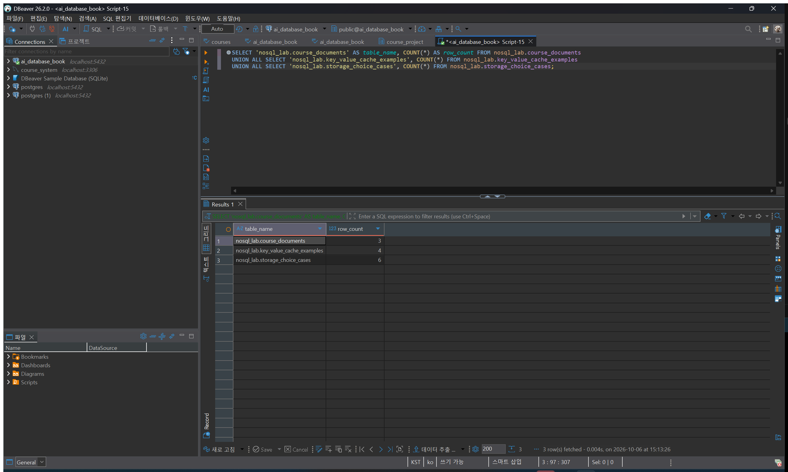
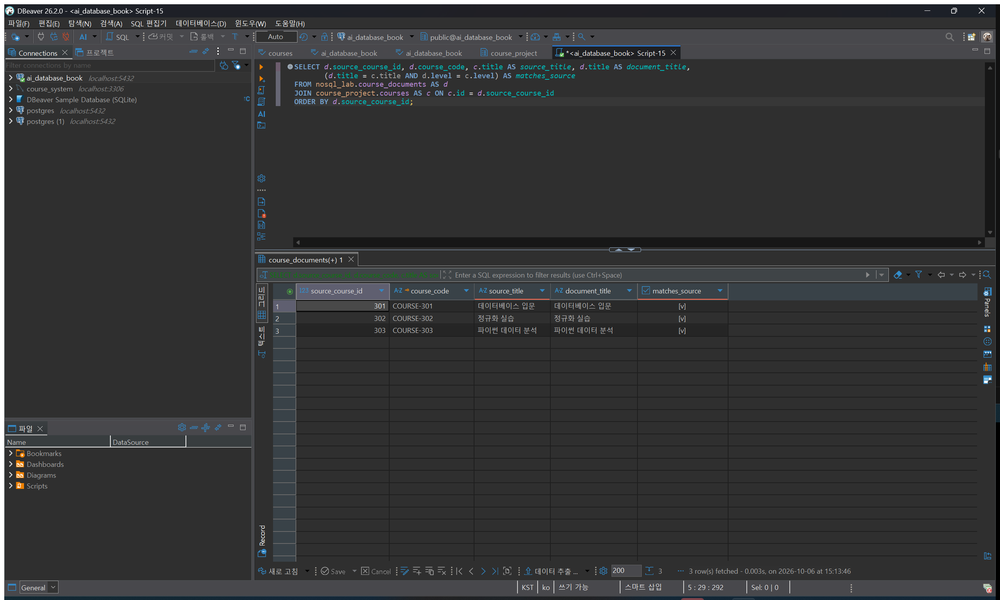
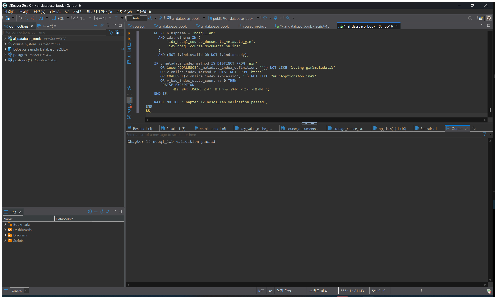

# Chapter 12 확장 실습 답안

> **과제:** 조회 패턴으로 RDBMS와 NoSQL 선택하기  
> **제출 방법:** LMS에는 본인 GitHub 저장소의 `chapter12_answer.md` 파일 URL을 제출한다.

---

## 제출 전 주의

이 파일과 캡처 화면에는 실제 비밀번호, 전체 DB 접속 URL, API Key, 개인정보를 기록하지 않습니다.

```text
GitHub 계정 또는 별칭: cyw0927
과제 작성일: 2026-10-06
PostgreSQL 버전: PostgreSQL 18.4 (x86_64-windows)
사용한 AI 도구: Claude (Claude Code) - SQL을 psql로 실행해 결과를 확인하고 답안 초안을 작성하는 데 사용
```

> 이번 장에서는 MongoDB, Redis, Cassandra, Graph DB 같은 별도 서버를 설치하지 않았습니다.  
> 제공된 PostgreSQL `nosql_lab`으로 **원본·파생·캐시·문서·저장소 선택 기준**을 실습했습니다.

> **작성 상태 안내**
> - 01~07번 SQL 실행 결과는 로컬 PostgreSQL(`ai_database_book`)에서 `psql`로 직접 실행해 확인한 값입니다.
> - 증거 이미지(`step04`, `step04b`, `step11`)는 DBeaver에서 SQL을 실제로 실행한 화면입니다. DBeaver에서의 실행과 화면 캡처는 Claude Code가 PC 자동화로 진행했습니다.
> - 개인 프로젝트 부분(12~14장, 15장의 개인 프로젝트 리뷰, 16장 4번)은 아직 진행하지 않아 비워 두었습니다.

---

# 1. 시작 환경과 Chapter 07 기준 상태 확인

다음을 실행했습니다.

```sql
SELECT current_database();
SELECT current_user;
SELECT current_schema();
SHOW search_path;
```

| 확인 항목 | 실제 결과 | 의미 |
| --- | --- | --- |
| `current_database()` | `ai_database_book` | 이 책 실습용 DB가 맞다. 다른 DB에 잘못 접속하지 않았다. |
| `current_user` | `postgres` | 로컬 실습용 관리자 계정으로 접속했다. 스키마와 테이블을 만들 권한이 있다. |
| `current_schema()` | `public` | 이름 앞에 스키마를 안 쓰면 `public`을 쓴다. 그래서 이번 장 SQL은 항상 `nosql_lab.` 처럼 스키마를 직접 적는다. |
| `search_path` | `"$user", public` | 스키마를 생략했을 때 찾는 순서다. `course_project`와 `nosql_lab`은 여기에 없다. |

Chapter 07·08 기준 상태도 확인했습니다. (`07_nosql_lab_validation.sql` 출력과 직접 조회 결과)

```text
students = 3
instructors = 2
courses = 3
enrollments = 5

전체 recorded_amount = 590000
활성 = 3건 / 340000
취소 제외 = 4건 / 440000
```

실제 결과도 위와 같았습니다. (3 / 2 / 3 / 5, 590000, 3건 340000, 4건 440000)  
`01_nosql_lab_schema.sql`은 시작할 때 Chapter 07의 이름 있는 제약조건 15개와 NOT NULL 열 20개도 검사하며, 이 검사를 통과했습니다.

### 기준 상태를 유지한 채 별도 `nosql_lab`에서 실습하는 이유

```text
course_project는 Chapter 07·08에서 값까지 검증해 둔 원본(Source of Truth)이다.
이번 장 실습에는 문서를 UPDATE해 보고 인덱스를 만드는 실험이 있어서,
원본 테이블에서 하면 기준값(5건 / 590000 등)이 틀어질 수 있다.
그래서 별도 스키마 nosql_lab에서 실험하고, 원본은 그대로 두었다.
마지막 검증 SQL이 원본이 그대로인지도 같이 확인해 준다.
```

---

# 2. 온라인 강의 데이터의 시스템 역할 분류

| 데이터 | 시스템 역할 | Source of Truth 여부 | 잃어버리면 재구축 가능? | 이유 |
| --- | --- | --- | --- | --- |
| 수강신청 | Source of Truth | 예 | 불가능 | 학생이 신청했다는 사실 자체라 다른 데이터에서 계산해 낼 수 없다. |
| 신청 당시 금액 | Source of Truth | 예 (`enrollments.recorded_amount`) | 불가능 | 신청한 시점에 기록한 값이라 나중에 강의 가격이 바뀌어도 달라지면 안 된다. 결제 승인액은 아니다. |
| 로그인 세션 | Ephemeral State | 아니오 (원본은 인증 시스템의 사용자·로그인 정보) | 세션은 다시 발급하면 됨 | 짧게 쓰고 만료되면 사라져도 되는 임시 상태다. 잃으면 다시 로그인하면 된다. |
| 인기 강의 TOP 3 | Derived Cache | 아니오 | 가능 | 신청 데이터를 집계하면 다시 계산할 수 있는 파생 값이다. |
| 강의 태그/옵션 | Flexible Metadata | 일부만 (제목·난이도·강사는 `courses` 원본) | 일부 가능 | 제목·난이도·강사는 원본에서 다시 만들 수 있다. 하지만 태그·옵션 값은 지금 구조에서는 문서 안에만 있어서 따로 보관해야 한다. |
| 학습 행동 이벤트 | Event Log | 예 (수집된 이벤트 로그가 원본) | 불가능 | 이미 일어난 행동 기록이라 다시 만들 수 없다. 이벤트로 만든 통계·파티션은 파생이라 다시 만들 수 있다. |
| 추천 관계 | Relationship Index | 아니오 | 가능 | 수강·학습 데이터에서 계산한 관계 인덱스라 원본에서 다시 생성할 수 있다. |

### Source of Truth와 파생 저장소를 구분해야 하는 이유

```text
장애가 나서 두 저장소의 값이 서로 다를 때 어느 쪽이 맞는지 정해야 하기 때문이다.
원본이 정해져 있으면 파생 저장소(캐시, 인덱스, 문서 복사본)는 지우고 원본에서 다시 만들면 된다.
구분이 없으면 어느 쪽을 믿어야 할지 몰라서 복구할 수 없다.
또 원본은 백업과 무결성을 강하게 관리해야 하고, 파생 데이터는 재생성 방법만 있으면 되므로 관리 방법도 다르다.
```

---

# 3. 저장소보다 먼저 조회·쓰기 패턴 정의

저장소 이름을 정하기 전에 조회·쓰기 문장을 먼저 6개 작성했습니다.  
예상 빈도는 실제 트래픽 데이터가 없어서 서비스 화면을 상상해서 적은 **가정**입니다.

| ID | 읽기/쓰기 문장 | 키/조건 | 정렬/범위 | 예상 빈도 (가정) | 일관성 요구 | 함께 원자적으로 맞아야 하는 데이터 |
| --- | --- | --- | --- | --- | --- | --- |
| Q01 | 학생 101의 최근 30일 학습 이벤트를 시간순으로 읽는다. | 학생 번호 = 101, 날짜 범위 | 시간 오름차순, 최근 30일 | 높음 (학습 화면을 열 때마다) | 조금 늦게 보여도 됨 | 없음 (이벤트 한 건씩 독립) |
| Q02 | `course:popular:v1:top3` 키로 인기 강의 3개를 읽는다. | 정확한 키 하나 | 정렬 없음 (이미 순위 목록) | 매우 높음 (메인 화면) | 몇 분~1시간 오래된 값 허용 | 없음 |
| Q03 | 강의 301의 태그와 온라인 제공 옵션을 읽는다. | `source_course_id = 301` | 한 건 | 높음 (강의 상세 화면) | 제목·난이도는 원본과 일치, 태그·옵션은 조금 늦어도 됨 | 문서 한 건 안에서만 맞으면 됨 |
| Q04 | 학생과 강의의 수강신청을 하나의 트랜잭션으로 확정한다. | 학생 번호 + 강의 번호 + 상태 | 한 건 쓰기 | 중간 (신청할 때마다) | 강함 (항상 정확해야 함) | 신청 행 + 신청 금액 + (Chapter 9의 좌석·결제 기록) |
| Q05 | 학생 A와 관심 주제가 가까운 강의를 2~3단계 관계로 탐색한다. | 학생 → 주제 → 강의 관계 | 2~3단계 | 중간 (추천 화면) | 조금 오래된 추천 허용 | 없음 |
| Q06 | `student:101:session` 키로 로그인 세션을 읽고 만료되면 무효로 본다. | 정확한 키 하나 | 한 건 | 매우 높음 (요청마다) | 만료·로그아웃은 바로 반영되어야 함 | 없음 |

### 기술 이름보다 조회 패턴을 먼저 작성해야 하는 이유

```text
"Redis가 빠르다", "NoSQL이 확장성이 좋다" 같은 말은 어떤 조회에 쓰는지 모르면 판단할 수 없다.
같은 데이터라도 키로 한 건만 읽는지, 범위로 읽는지, 여러 테이블을 묶어 쓰는지, 여러 변경이 함께 맞아야 하는지에 따라 맞는 저장 방식이 달라진다.
예를 들어 Q04는 여러 변경이 함께 맞아야 해서 RDBMS 트랜잭션이 필요하고, Q02는 키 하나로 읽고 오래된 값도 허용되어 캐시 후보가 된다.
조회 패턴을 먼저 적어야 이런 차이를 보고 고를 수 있다.
```

---

# 4. `nosql_lab` 생성과 기준 데이터 확인

다음 파일을 순서대로 실행했습니다.

```text
code/chapter12/01_nosql_lab_schema.sql
code/chapter12/02_nosql_lab_seed.sql
```

> **실행 중 있었던 일:** `01`을 처음 실행했을 때 `Chapter 12 구조 검증 실패: tables=3 constraints=51 not_null=26`으로 중단됐다.  
> 원인은 PostgreSQL 18부터 NOT NULL 제약조건도 `pg_constraint`에 행으로 저장되어, 파일이 기대한 제약조건 수 25에 NOT NULL 26개가 더해져 51로 세어진 것이었다.  
> 트랜잭션 안에서 실패해서 아무것도 만들어지지 않았다. `01`과 `07`의 제약조건 세는 쿼리에 `AND contype <> 'n'` 조건을 추가해서 해결했다. 다른 내용은 바꾸지 않았다.

실행 결과:

```text
01: Chapter 12 nosql lab schema validation passed
02: Chapter 12 nosql lab seed validation passed
```

## 4-1. 기준 행 수

| 테이블 | 기대 행 수 | 실제 행 수 | 일치? |
| --- | ---: | ---: | --- |
| `nosql_lab.course_documents` | 3 | 3 | 일치 |
| `nosql_lab.key_value_cache_examples` | 4 | 4 | 일치 |
| `nosql_lab.storage_choice_cases` | 6 | 6 | 일치 |

## 4-2. 원본 매핑 확인

```sql
SELECT d.source_course_id, d.course_code, c.title AS source_title, d.title AS document_title,
       (d.title = c.title AND d.level = c.level) AS matches_source
FROM nosql_lab.course_documents AS d
JOIN course_project.courses AS c ON c.id = d.source_course_id
ORDER BY d.source_course_id;
```

| source_course_id | 기대 course_code | 실제 title | 원본과 일치? |
| ---: | --- | --- | --- |
| 301 | `COURSE-301` | 데이터베이스 입문 | 일치 (`true`) |
| 302 | `COURSE-302` | 정규화 실습 | 일치 (`true`) |
| 303 | `COURSE-303` | 파이썬 데이터 분석 | 일치 (`true`) |

문서 테이블에는 `course_project`로 가는 FK를 만들지 않았기 때문에, 이렇게 JOIN으로 제목·난이도를 직접 대조해야 원본과 맞는지 알 수 있다.

### 증거 화면

권장 경로:

```text
assignments/chapter12/images/step04_nosql_lab.png
```



> 4-1 행 수를 확인하는 SELECT를 DBeaver에서 실행한 화면이다. `course_documents` 3, `key_value_cache_examples` 4, `storage_choice_cases` 6이 기준과 같다.



> 4-2 원본 매핑 SELECT를 DBeaver에서 실행한 화면이다. 301·302·303 문서의 제목과 난이도가 `course_project.courses` 원본과 같아서 `matches_source`가 모두 `[v]`(true)이다.

---

# 5. PostgreSQL JSONB 혼합 문서 실습

다음을 실행했습니다.

```text
code/chapter12/03_document_jsonb_queries.sql
```

## 5-1. 일반 컬럼과 JSONB 영역 구분

| 항목 | 일반 컬럼 / JSONB | 그렇게 둔 이유 |
| --- | --- | --- |
| `source_course_id` | 일반 컬럼 | 원본 `courses.id`와 연결하는 키라서 모든 문서에 있어야 하고 JOIN·대조에 쓴다. |
| `course_code` | 일반 컬럼 | 문서를 구분하는 코드이고 UPDATE·조회 조건에 쓴다. 공백 금지 CHECK도 걸 수 있다. |
| `title` | 일반 컬럼 | 모든 강의에 필수이고 원본과 대조해야 한다. |
| `level` | 일반 컬럼 | 모든 문서에 중요하고 자주 검색·검증하며 허용값 CHECK가 있다. |
| `document_version` | 일반 컬럼 | 낙관적 잠금 조건에 쓰는 값이라 안정적으로 있어야 한다. |
| `tags` | JSONB | 강의마다 개수와 내용이 다르다. |
| `options` | JSONB | 온라인 여부, 수료증 등 강의마다 달라질 수 있는 부가 속성이다. |
| `instructor_snapshot` | JSONB | 화면에 보여 주기 위한 강사 정보 복사본이다. |

### `level`을 JSONB 안에 넣지 않고 일반 컬럼으로 둔 이유

```text
level은 모든 문서에 반드시 있고, 허용값(basic 등)이 정해져 있고, 자주 검색하고 원본과도 대조하는 값이다.
이런 안정적인 핵심 값은 일반 컬럼에 두어야 CHECK 제약조건으로 DB가 직접 막아 줄 수 있고 인덱스도 쉽게 만들 수 있다.
JSONB 안에 넣으면 DB가 값의 종류를 강제하지 못해서 검증을 SQL이나 애플리케이션이 따로 해야 한다.
```

### `instructor_snapshot`이 Source of Truth가 아닌 이유

```text
문서 안의 강사 정보는 화면에 쓰려고 복사해 둔 값이고, 진짜 강사 정보는 course_project.instructors에 있다.
강사 정보가 바뀌면 원본은 바로 바뀌지만 복사본은 따로 갱신해야 해서 서로 달라질 수 있다.
달라졌을 때는 원본(instructors)이 맞고, 문서의 snapshot을 원본으로 다시 맞춰야 한다.
이번 실습에서는 snapshot 안의 source_instructor_id가 courses.instructor_id와 같은지 비교했고 301·302·303 모두 일치(true)였다.
```

## 5-2. JSONB 조회 결과

```text
사용한 JSONB 조건 1: metadata @> '{"tags": ["PostgreSQL"]}'::jsonb   (tags 배열에 PostgreSQL이 포함된 문서)
예상 결과: COURSE-301 한 행
실제 결과: COURSE-301 / 데이터베이스 입문 (1행) → 일치

사용한 JSONB 조건 2: metadata #>> '{options,online}' = 'true'   (온라인으로 제공되는 강의)
예상 결과: COURSE-301, COURSE-302
실제 결과: COURSE-301, COURSE-302 (2행) → 일치. COURSE-303은 online = false

사용한 JSONB 조건 3: metadata ? 'instructor_snapshot'   (최상위 키가 있는지)
실제 결과: 3행 (301, 302, 303 모두)
```

```sql
SELECT source_course_id, course_code, title
FROM nosql_lab.course_documents
WHERE metadata @> '{"tags": ["PostgreSQL"]}'::jsonb;

SELECT source_course_id, course_code, title
FROM nosql_lab.course_documents
WHERE metadata #>> '{options,online}' = 'true'
ORDER BY source_course_id;
```

구조 검사(`tags_is_array`, `options_is_object`, `online_is_boolean`, `instructor_snapshot_is_object`, `instructor_id_matches`, `version_is_valid`)도 301~303 모두 `t`였고, 원본과 제목·난이도가 다른 문서를 찾는 쿼리는 0행이었다.

## 5-3. 낙관적 잠금 관찰

```text
읽은 document_version: 1
UPDATE 조건에 사용한 version: 1
예상 영향 행 수: 1
실제 영향 행 수: 1  (03 파일이 영향 행 수를 확인해서 1이 아니면 예외를 내도록 되어 있다)
UPDATE 후 값: certificate=false, document_version=2
ROLLBACK 후 값: certificate=true, document_version=1 (기준 상태로 복구)
```

**추가로 직접 확인한 것 (영향 행 수가 0이 되는 경우):** 같은 트랜잭션 안에서 version 1로 한 번 UPDATE한 뒤, "예전에 읽은 version 1"로 한 번 더 UPDATE해 봤다.

```sql
BEGIN;
UPDATE nosql_lab.course_documents SET document_version = document_version + 1, updated_at = CURRENT_TIMESTAMP
WHERE course_code = 'COURSE-301' AND document_version = 1;   -- 결과: UPDATE 1
UPDATE nosql_lab.course_documents SET document_version = document_version + 1, updated_at = CURRENT_TIMESTAMP
WHERE course_code = 'COURSE-301' AND document_version = 1;   -- 결과: UPDATE 0  (이미 version이 2가 됨)
ROLLBACK;
```

두 번째 UPDATE가 에러 없이 `UPDATE 0`으로 끝났다. SQL은 성공했지만 아무 행도 바뀌지 않은 것이다. ROLLBACK 후에는 `document_version = 1`, `certificate = true`로 돌아온 것도 확인했다.

### 영향 행 수가 0이면 무엇을 의심해야 하나요?

```text
1. 다른 작업이 먼저 문서를 수정해서 version이 이미 올라갔는지 (위 실험처럼)
2. 내가 읽은 version이 오래된 값이었는지
3. WHERE 조건(course_code, version 등)이 현재 문서와 맞는지
4. jsonb_set으로 바꾸려는 중간 경로(options)가 객체로 존재하는지
영향 행 수가 0인데도 에러가 나지 않을 수 있어서, 반드시 영향 행 수를 확인하고 0이면 다시 읽고 재시도하거나 충돌로 처리해야 한다.
```

### 실습에서 ROLLBACK 후 기준 상태를 유지하는 이유

```text
COURSE-301이 version 1, certificate=true인 상태가 마지막 자동 검증(07)의 기준이다.
수정한 채로 두면 07이 실패하고, 이후에 다시 실습할 때도 기준이 달라져서 결과를 비교할 수 없다.
그래서 변경이 되는지만 확인하고 ROLLBACK으로 되돌렸다.
```

---

# 6. Key-Value 캐시 개념 실습

다음을 실행했습니다.

```text
code/chapter12/04_key_value_cache_queries.sql
```

## 6-1. Seed 기준

```text
전체 캐시 = 4
Seed 시점 유효 = 3
Seed 시점 만료 = 1
```

| 항목 | 기대 | 실제 |
| --- | ---: | ---: |
| 전체 | 4 | 4 |
| Seed 시점 유효 | 3 | 3 |
| Seed 시점 만료 | 1 | 1 |

각 키의 Seed 기준 상태:

| cache_key | seed_status |
| --- | --- |
| `course:popular:v1:top3` | valid_at_seed (만료 시각 = 생성 + 1시간) |
| `feature:recommendation:v1` | no_expiry (만료 정책 없음) |
| `student:101:session` | valid_at_seed (만료 시각 = 생성 + 30분) |
| `student:103:session` | expired_at_seed (만료 시각이 생성 시각보다 이전) |

## 6-2. Seed 기준과 현재 시각 기준 차이

```text
현재 유효 캐시 수: 3  (실행 시각 2026-10-06 14:30경)
```

이 값은 실행한 시각 때문에 우연히 Seed 기준과 같았다. `expired_at` 값으로 계산해 보면(직접 관찰한 값은 아니고 계산한 예상):

```text
15:00:11 이후 → student:101:session 만료 → 현재 유효 2
15:30:11 이후 → course:popular:v1:top3 만료 → 현재 유효 1 (만료 정책 없는 키만 남음)
```

### 현재 유효 건수를 고정 정답으로 사용하면 안 되는 이유

```text
현재 유효 여부는 CURRENT_TIMESTAMP와 비교해서 정해지므로 SQL을 실행하는 시각에 따라 결과가 달라진다.
위처럼 지금은 3이지만 30분 뒤에는 2가 된다.
그래서 "정답은 3"처럼 고정해서 제출하면 시간이 지난 뒤에는 틀린 답이 된다.
그래서 자동 검증은 생성 시각을 기준으로 한 Seed 기준 4/3/1처럼 항상 같은 값을 쓴다.
```

## 6-3. 정확 키 조회

```text
조회한 키: student:101:session
결과: 1행 → {"status": "active", "student_id": 101, "login_device": "browser"}, 만료 15:00:11
캐시 미스 여부: 미스 아님 (hit)

조회한 키: course:popular:v2:top3
결과: 값 없음
캐시 미스 여부: cache_miss  (v1 키는 있지만 v2 키는 없어서 미스)
```

`student:103:session`은 Seed 시점에 이미 만료되어 있어서 Seed 기준으로 조회하면 0행이었다.

### Key-Value 제품의 TTL과 eviction을 같은 개념으로 보면 안 되는 이유

```text
TTL(만료)은 "정해 둔 시간이 지나면 사라진다"는 시간 기준의 규칙이다.
eviction은 메모리가 부족할 때 정책에 따라 키를 쫓아내는 것으로, 만료 시간이 남아 있어도 지워질 수 있다.
그래서 TTL이 1시간이라고 해서 1시간 동안 반드시 남아 있는 것은 아니다.
캐시에서 값이 없으면 항상 원본에서 다시 만들 수 있게 설계해야 하는 이유이기도 하다.
```

### 이 PostgreSQL 테이블이 실제 Redis 같은 Key-Value DB가 아닌 이유

```text
이 테이블은 키와 값을 저장하고 만료 시각을 비교하는 방법만 보여 주는 모형이다.
메모리 저장, 자동 TTL 삭제(expired_at이 지나도 행은 그대로 남아 있다), eviction, 복제, 샤딩,
네트워크 성능, 실제 장애 동작은 전혀 구현되어 있지 않다.
그래서 이 실습으로 Redis의 속도나 장애 동작을 판단하면 안 되고, 원본과 캐시의 책임을 이해하는 용도로만 써야 한다.
```

---

# 7. 캐시 장애 사고 실험

상황:

```text
PostgreSQL 원본에서는 인기 강의 순위가 변경되었다.
캐시에는 이전 TOP 3가 남아 있다.
```

다음에 답합니다.

```text
신뢰해야 할 원본:
PostgreSQL의 course_project(수강신청 데이터). 캐시 값이 달라도 원본 집계가 맞다.

사용자에게 오래된 값을 허용할 수 있는 시간:
인기 강의 순위는 결제나 신청처럼 틀리면 안 되는 값이 아니라서 몇 분~1시간 정도는 허용할 수 있다고 본다.
(Seed의 캐시 TTL이 1시간이다. 실제로는 서비스에서 얼마나 빨리 반영해야 하는지 정해야 한다.)

캐시 갱신 방식:
TTL이 지나면 자연스럽게 사라지고, 다음 조회에서 미스가 나면 원본에서 다시 만든다.
순위가 크게 바뀌는 이벤트가 있으면 해당 키를 삭제(무효화)해서 다음 조회 때 새로 만들게 한다.
키에 버전(v1 → v2)을 붙여 새 키를 만들고 오래된 키는 폐기하는 방법도 쓴다.

캐시 삭제 후 재생성 방법:
캐시 미스 → 원본에서 신청 데이터를 집계해 TOP 3 계산 → TTL과 버전을 붙여 캐시에 저장 → 사용자에게 반환.

캐시 서버 장애 시 fallback:
캐시가 안 되면 PostgreSQL에서 직접 집계해서 보여 준다. 느려질 수는 있지만 값은 정확하다.
핵심 기능(신청·결제 확인 등)이 캐시에 의존하지 않도록 한다.

동시 재생성 요청이 몰릴 때의 위험:
같은 키가 만료되는 순간 많은 요청이 동시에 미스가 나면 모두 원본 집계 쿼리를 실행해서 PostgreSQL에 부하가 몰린다.
(캐시 스탬피드) 한 요청만 재생성하게 잠금을 걸거나 같은 요청을 합치고, 만료 시각이 한꺼번에 몰리지 않게 분산하는 방법을 검토해야 한다.
```

### 캐시가 Source of Truth가 되어서는 안 되는 이유

```text
캐시는 메모리 부족이나 TTL 때문에 언제든 사라질 수 있고, 원본과 다른 오래된 값일 수도 있다.
캐시에만 있는 데이터가 있으면 캐시가 사라졌을 때 복구할 방법이 없다.
캐시는 잃어버려도 원본에서 다시 만들 수 있는 파생 데이터여야 한다.
```

---

# 8. 저장 방식 선택 사례 검토

다음을 실행했습니다.

```text
code/chapter12/05_storage_choice_review.sql
```

| 사례 | system_role | primary_query | 후보 저장소 | consistency | sync 전략 | recovery 전략 | decision_status |
| --- | --- | --- | --- | --- | --- | --- | --- |
| 1 수강신청과 신청 당시 금액 기록 | source_of_truth | 학생·강의·신청 당시 기록 금액을 제약조건·트랜잭션·JOIN으로 처리 | PostgreSQL RDBMS | 강한 무결성과 다중 변경 원자성 필요 | 원본 데이터베이스 내부 트랜잭션으로 처리 | Chapter 11에서 검증한 백업·복원 원칙으로 원본 복구 | adopted |
| 2 학생 로그인 세션 | ephemeral_state | 정확한 세션 키로 읽고 TTL 또는 명시적 폐기 후 무효화 | Key-Value DB 후보 | 세션 생성 직후 읽기와 만료·폐기 정책이 중요 | 세션 생성·폐기 이벤트와 TTL 정책 | 원본 인증 상태를 확인하고 세션을 다시 발급 | poc_planned |
| 3 인기 강의 캐시 | derived_cache | 고정 키로 상위 강의 ID 목록 읽기 | Key-Value DB 후보 | 일시적으로 오래된 값 허용 가능 | 배치·변경 이벤트 갱신과 캐시 미스 재생성 | 원본 집계로 키를 재생성하고 오래된 버전을 폐기 | poc_planned |
| 4 강의 유연 메타데이터 | flexible_metadata | 원본 강의 ID 또는 문서 필드로 상세 조회 | PostgreSQL JSONB 또는 Document DB 후보 | 핵심 제목·난이도는 원본과 일치, 부가 정보는 지연 가능 | 원본 변경 이벤트·문서 버전·주기적 대조 | source_course_id로 원본을 대조하고 문서를 재구축 | candidate |
| 5 학습 행동 이벤트 | event_log | 학생·날짜 파티션에서 이벤트를 시간순 범위 조회 | Column-Family DB 후보 | 중복·늦은 도착·재처리 허용 범위를 정의해야 함 | event_id 멱등성·실패 대기열·분석 파이프라인 | 원본 이벤트 보관본에서 파티션을 재생성 | hold |
| 6 학생-강의-주제 추천 관계 | relationship_index | 여러 단계 관계를 따라 추천 후보 탐색 | Graph DB 후보 | 원본보다 지연된 파생 관계를 허용할 수 있음 | 변경 이벤트·주기적 재구축·대조 작업 | 원본에서 전체 관계 인덱스를 다시 생성 | candidate |

결정 상태별 건수 (실제 결과): `adopted` 1 / `poc_planned` 2 / `candidate` 2 / `hold` 1, 합계 6건. 시스템 역할 6종이 사례마다 1건씩 있고, 근거 칸이 비어 있는 사례는 0건이었다.

```text
candidate
poc_planned
hold
adopted
rejected
```

### 후보 저장소와 실제 채택을 구분해야 하는 이유

```text
"후보"는 이런 저장소가 어울릴 수도 있겠다는 뜻이고, 도입하기로 결정한 것이 아니다.
후보를 바로 도입하면 아직 측정하지 않은 성능 기대나 운영 부담을 그대로 떠안게 된다.
후보 → PoC로 성공 기준을 확인 → 채택 순서로 나누어야 기록만 보고도 지금 실제로 쓰는 것이 무엇인지 알 수 있다.
PoC에는 성공 기준(예: 캐시 미스 시 원본에서 다시 만들어지는지, 장애 시 복구 시간)이 있어야 끝났는지 판단할 수 있다.
```

### 현재 데이터에서 `adopted`가 PostgreSQL 원본 1건뿐인 이유를 자신의 말로 설명

```text
수강신청과 신청 금액은 이미 PostgreSQL에서 제약조건과 트랜잭션으로 운영하고 검증까지 했고, 강한 무결성이 필요해서 지금도 PostgreSQL이 맞다.
나머지 다섯 가지는 아직 데이터가 몇 건 되지 않고 대표 조회량·규모·장애 요구가 정해지지 않아서, 별도 저장소를 넣어야 한다는 근거가 없다.
저장소가 하나 늘 때마다 동기화·백업·보안·장애 대응 책임도 늘기 때문에, 근거가 없는 후보는 PoC나 보류로 남겨 두는 것이 맞다.
```

---

# 9. 저장 모델 비교표

제품 이름보다 저장 모델을 비교했습니다. (이번 실습은 PostgreSQL 안의 `nosql_lab`만 직접 실행했고, 나머지 모델은 책 설명과 개념을 정리한 것이다. 제품별 실제 보장은 공식 문서와 PoC로 확인해야 한다.)

| 후보 | 잘 맞는 접근 패턴 | 트랜잭션/일관성 고려 | 재구축 가능성 | 운영·보안·백업 부담 | 현재 판단 |
| --- | --- | --- | --- | --- | --- |
| PostgreSQL RDBMS | 여러 테이블을 묶는 JOIN, 제약조건이 중요한 원본 데이터 | 여러 변경을 한 트랜잭션으로 묶을 수 있고 제약조건으로 무결성을 지킴 | 원본이라 재구축 대상이 아니라 백업·복구 대상 | 이미 운영 중이라 추가 부담 없음 | 채택 (원본 전부) |
| PostgreSQL JSONB | 항목이 강의마다 다른 부가 속성, 문서 한 건 조회 | 같은 DB라 트랜잭션 가능, 내부 구조 검증은 직접 해야 함 | 핵심 필드는 원본에서 재구축 가능 | 같은 PostgreSQL이라 추가 저장소 부담 없음 | 후보 (유연 메타데이터) |
| Key-Value | 정확한 키 하나로 읽는 세션·인기 목록 | 값 단위 조회에 적합, 여러 건 묶음 일관성은 제품마다 확인 필요 | 파생 캐시면 원본에서 재구축 가능 | 새 서버의 동기화·모니터링·백업·보안 필요 | PoC 계획 (세션·인기 캐시) |
| Document | 중첩된 문서를 한 번에 읽고 쓰는 패턴 | 제품마다 트랜잭션 범위가 다름 | 원본이 따로 있으면 가능 | 새 서버와 문서 구조 이전 부담 | 후보 (JSONB로 충분한지 먼저 확인) |
| Column-Family | 키(파티션)로 나눈 대량 이벤트를 시간순으로 쓰고 읽는 패턴 | 제품마다 다르고 조인·임의 조건 조회는 약함 | 원본 이벤트 보관본에서 재생성 | 분산 운영 난이도가 높음 | 보류 (규모가 아직 없음) |
| Graph | 여러 단계 관계를 따라가는 탐색 | 관계 탐색에 특화, 원본과 동기화가 필요 | 원본에서 관계 인덱스를 다시 생성 | 새 저장소와 동기화 책임 | 후보 (JOIN 대안과 비교 후) |

### "NoSQL은 항상 더 빠르다"가 잘못된 설명인 이유

```text
빠른지는 어떤 조회를 하느냐에 달려 있다. 키 하나로 읽는 조회는 Key-Value가 유리할 수 있지만,
여러 테이블을 묶는 JOIN이나 집계, 여러 변경을 함께 맞추는 트랜잭션은 RDBMS가 더 단순하고 안전하다.
또 데이터가 몇 건 안 되면 어떤 저장소든 차이가 거의 없다.
실제 nosql_lab도 3행뿐이라 인덱스를 만들어도 Seq Scan을 썼다.
빠르다는 말은 제품 이름이 아니라 내 조회 패턴과 데이터 규모로 측정해서 확인해야 한다.
```

### 저장소가 하나 추가될 때 새로 생기는 운영 책임 최소 5개

```text
1. 원본과 새 저장소의 동기화 (변경이 누락되거나 늦어지는 경우 처리)
2. 재시도와 멱등성 (같은 메시지가 두 번 와도 중복 데이터가 안 생기게)
3. 백업과 복원 (새 저장소를 어떻게 백업하고 복원 시험을 할지)
4. 접근 권한과 비밀 관리 (계정, 접속 정보, 네트워크 접근)
5. 모니터링과 장애 대응 (저장소가 죽었을 때 fallback과 알림)
6. 버전 업그레이드와 비용
```

---

# 10. JSONB 인덱스 후보 관찰

다음을 실행했습니다.

```text
code/chapter12/06_jsonb_index_candidates.sql
```

본문 후보:

```text
metadata @> ...
→ GIN 후보

metadata #>> '{options,online}' = 'true'
→ 표현식 B-tree 후보
```

## 10-1. 생성된 인덱스

| 인덱스 | 대상 표현식/컬럼 | 대응 조회 | 실제 정의 확인 |
| --- | --- | --- | --- |
| `idx_nosql_course_documents_metadata_gin` | `metadata` 컬럼 전체 (GIN) | `metadata @> '{"tags": ["PostgreSQL"]}'` 같은 포함 조건 | `USING gin (metadata)`, `indisvalid = t`, `indisready = t` |
| `idx_nosql_course_documents_online` | `(metadata #>> '{options,online}')` 표현식 (B-tree) | `metadata #>> '{options,online}' = 'true'` 조건 | `USING btree (((metadata #>> '{options,online}'::text[])))`, `indisvalid = t`, `indisready = t` |

두 인덱스를 만든 뒤 두 조회의 실행 계획(EXPLAIN)은 둘 다 다음처럼 **Seq Scan**이었다.

```text
Seq Scan on course_documents  (cost=0.00..1.04 rows=1 width=68)
  Filter: (metadata @> '{"tags": ["PostgreSQL"]}'::jsonb)

Seq Scan on course_documents  (cost=0.00..1.04 rows=1 width=68)
  Filter: ((metadata #>> '{options,online}'::text[]) = 'true'::text)
```

### 데이터가 3행뿐이라 인덱스가 있어도 Seq Scan이 합리적일 수 있는 이유

```text
테이블이 3행이라 한 번에 전부 읽어도 비용이 1.04 정도로 아주 작다.
이 경우 인덱스를 거쳐 가는 것보다 처음부터 끝까지 읽는 것이 오히려 더 싸서 PostgreSQL이 Seq Scan을 고른다.
인덱스가 있다고 반드시 Index Scan을 쓰는 것은 아니고, 데이터가 충분히 많을 때 효과가 있다.
이번 결과는 인덱스가 잘못 만들어졌다는 뜻이 아니라 정의가 정상(indisvalid = t)이고 3행이라 쓰이지 않았다는 뜻이다.
```

### `jsonb_ops`와 `jsonb_path_ops`를 무조건 같은 것으로 보면 안 되는 이유

```text
둘 다 JSONB GIN 인덱스의 연산자 클래스이지만 지원하는 연산이 다르다.
기본 jsonb_ops는 ?, ?|, ?&, @>, @?, @@ 등을 지원하고, jsonb_path_ops는 @>, @?, @@만 지원해서 ?, ?|, ?&에는 못 쓴다.
그래서 키 존재 여부(?)를 자주 검색하는데 jsonb_path_ops로 만들면 인덱스가 쓰이지 않을 수 있다.
실제로 쓰는 조회 연산에 맞게 골라야 한다.
```

---

# 11. 최종 자동 검증

다음을 실행했습니다.

```text
code/chapter12/07_nosql_lab_validation.sql
```

기대 메시지:

```text
Chapter 12 nosql_lab validation passed
```

```text
실제 검증 메시지: Chapter 12 nosql_lab validation passed
```

> 4장에 적은 것처럼 PostgreSQL 18에서 제약조건 수를 잘못 세는 부분만 `contype <> 'n'`으로 고친 뒤 실행했다.

검증되는 주요 내용:

```text
Chapter 07 기준 상태 유지
nosql_lab = 3 / 4 / 6
강의 301~303 원본 매핑
instructor_snapshot 원본 대조
JSONB 구조와 document_version 기준 유지
Seed 캐시 = 4 / 3 / 1
저장소 선택 근거 공백 0
adopted 사례 1
JSONB 인덱스 정의
```

출력에서 확인한 값: 원본 3/2/3/5, `nosql_lab` 3/4/6, 전체 590000, 활성 3건 340000, 취소 제외 4건 440000, 캐시 4/3/1, adopted 1건, 인덱스 2개(gin, btree) 모두 유효.

### 자동 검증이 통과해도 저장소 선택이 자동으로 정답이 되는 것은 아닌 이유

```text
검증 SQL은 준비된 샘플 데이터가 약속한 값과 구조에 맞는지만 확인한다.
어떤 저장소가 실제 서비스에 맞는지는 조회 패턴, 데이터 규모, 허용 가능한 지연, 운영 책임으로 따로 판단해야 한다.
통과했다는 사실만으로 Key-Value나 Document를 도입해도 된다는 근거는 되지 않는다.
이번 검증도 후보를 채택 상태로 바꾸지 않고, PostgreSQL 원본만 adopted인지 확인했다.
```

### 증거 화면

권장 경로:

```text
assignments/chapter12/images/step11_validation.png
```



> `07_nosql_lab_validation.sql` 전체를 DBeaver에서 스크립트로 실행한 화면이다. 아래 Output 탭에 `Chapter 12 nosql_lab validation passed`가 표시되었고, 위 편집기에는 이 메시지를 내는 `RAISE NOTICE` 문이 보인다.

---

# 12. 개인 프로젝트의 데이터 역할 분류

> 개인 프로젝트는 아직 진행하지 않아 이 항목은 비워 둡니다.

| 데이터 | 시스템 역할 | Source of Truth? | 대표 조회/쓰기 | 트랜잭션 필요? | 재구축 가능? | 저장소 후보 |
| --- | --- | --- | --- | --- | --- | --- |
|  |  |  |  |  |  |  |
|  |  |  |  |  |  |  |
|  |  |  |  |  |  |  |
|  |  |  |  |  |  |  |
|  |  |  |  |  |  |  |
|  |  |  |  |  |  |  |

---

# 13. 개인 프로젝트 저장 전략 결정

> 개인 프로젝트는 아직 진행하지 않아 이 항목은 비워 둡니다.

## 13-1. Source of Truth

```text
내 프로젝트의 Source of Truth:
그 이유:
```

## 13-2. PostgreSQL만 유지할지, 다른 저장 모델을 검토할지

```text
현재 결정:
```

### 결정 근거

```text
주요 조회 패턴:
일관성 요구:
파생 데이터 여부:
재구축 가능 여부:
운영 부담:
백업/복구 부담:
현재 팀 역량:
```

---

# 14. 작은 PoC 설계

> 개인 프로젝트를 작성하지 않아 PoC 설계도 아직 진행하지 않았습니다.

```text
후보 저장 방식:
시스템 역할:
Source of Truth 여부:
키/문서/파티션/관계 구조:
대표 읽기 2개:
대표 쓰기 1개:
원본 동기화 방법:
중복/재시도 시 멱등성 처리:
장애 시 fallback:
재구축 방법:
보안 요구:
백업/복구 방법:
```

## PoC 성공 기준

```text
1.
2.
3.
4.
5.
```

---

# 15. AI를 저장소 선택 리뷰어로 활용

> 개인 프로젝트를 작성하지 않아 개인 프로젝트 기반 AI 저장소 리뷰도 아직 진행하지 않았습니다.

## 15-1. 내가 AI에게 제공한 정보

```text
Source of Truth:
반복 조회/쓰기 패턴:
트랜잭션 범위:
허용 가능한 불일치:
재구축 가능 여부:
운영·보안·백업 조건:
```

## 15-2. AI 제안 검토

| AI 제안 | 수용 / 수정 / 보류 / 거절 | 근거 |
| --- | --- | --- |
|  |  |  |
|  |  |  |
|  |  |  |
|  |  |  |

### AI가 기술 이름만 보고 추천한 부분이 있었나요?

```text

```

### AI가 놓친 동기화·복구·운영 비용이 있었나요?

```text

```

### AI 제안보다 내가 최종적으로 다르게 판단한 부분

```text

```

---

# 16. 이번 Chapter에서 알게 된 점

```text
1. Source of Truth란 장애가 나거나 값이 서로 다를 때 "이 값이 맞다"고 믿고 복구의 기준으로 삼는 원본 데이터 저장소이다.
   (이번 실습에서는 course_project의 수강신청과 신청 당시 금액)

2. 파생 저장소를 추가할 때 반드시 생각해야 할 것은
   원본과 어떻게 동기화할지, 오래된 값을 얼마나 허용할지, 지우고 원본에서 다시 만드는 방법과 장애 시 fallback이다.

3. NoSQL을 선택해야 하는 가장 좋은 이유는 "최신 기술"이 아니라
   내 조회 패턴과 규모, 일관성 요구에 지금 쓰는 PostgreSQL보다 더 잘 맞고, 늘어나는 운영 책임을 감당할 수 있다고 측정으로 확인했기 때문이다.

4. 현재 내 프로젝트에서 가장 적절한 저장 전략은
   (개인 프로젝트를 아직 진행하지 않아 비워 둡니다.)
```

---

# 17. 핵심 증거 화면

권장 3~4장만 사용합니다.

```text
assignments/chapter12/images/step04_nosql_lab.png        (4장: 행 수 3/4/6 확인)
assignments/chapter12/images/step04b_source_mapping.png  (4장: 원본 매핑 확인)
assignments/chapter12/images/step11_validation.png       (11장: 최종 검증 통과)
```

세 이미지는 모두 DBeaver에서 실제로 실행한 화면입니다. (`step05_jsonb.png`, `step06_cache.png`는 선택 항목이라 만들지 않았습니다.)  
각 결과의 의미는 위 본문에 Markdown으로 설명했습니다.

---

# 18. GitHub 제출 확인

```bash
git status
git add assignments/chapter12
git commit -m "docs: complete chapter12 assignment"
git push
```

GitHub 웹에서 다음을 확인합니다.

```text
chapter12_answer.md가 정상 표시된다.
이미지가 정상 표시된다.
실제 비밀번호·접속 URL·API Key가 없다.
SQL과 결과 해석이 함께 있다.
개인 프로젝트 저장 전략이 작성되어 있다. (아직 미작성)
AI 제안에 대한 내 판단이 작성되어 있다. (아직 미작성)
```

---

# 19. LMS 제출 URL

```text
https://github.com/cyw0927/ai-database-study/blob/main/assignments/chapter12/chapter12_answer.md
```

---

# 최종 자기 점검

- [x] PostgreSQL 연결과 Chapter 07 기준 상태를 확인했다.
- [x] 원본·파생·캐시·이벤트·관계 인덱스를 구분했다.
- [x] 조회/쓰기 패턴을 최소 6개 작성했다.
- [x] `nosql_lab` 3/4/6 기준을 확인했다.
- [x] 일반 컬럼과 JSONB의 역할 차이를 설명했다.
- [x] 낙관적 잠금의 영향 행 수를 해석했다.
- [x] Seed 캐시 4/3/1과 현재 시각 기준을 구분했다.
- [x] 캐시 장애 시 Source of Truth와 복구 흐름을 설명했다.
- [x] 후보 저장소와 실제 채택을 구분했다.
- [x] JSONB 인덱스 후보를 조회 패턴과 연결했다.
- [x] `07_nosql_lab_validation.sql`을 통과했다.
- [ ] 개인 프로젝트의 Source of Truth를 정했다. — 아직 미작성
- [ ] NoSQL이 필요 없다면 그 이유도 설명했다. — 개인 프로젝트 미작성
- [ ] PoC 성공 기준을 작성했다. — 개인 프로젝트 미작성
- [ ] AI 제안을 수용/수정/보류/거절로 판단했다. — 개인 프로젝트 미작성으로 보류
- [x] 핵심 캡처를 3~4장 이내로 정리했다. — step04, step04b, step11 (DBeaver 실행 화면)
- [ ] GitHub 웹에서 Markdown과 이미지를 최종 확인했다.
- [ ] LMS에는 본인 `chapter12_answer.md` URL을 제출한다.
